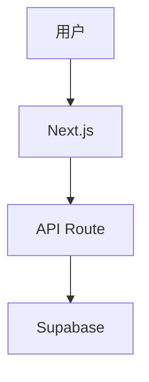
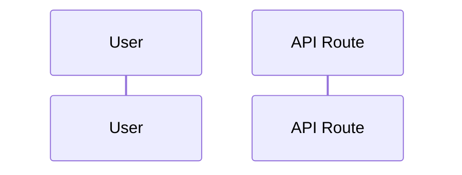

# [功能名称] — 技术设计

> **项目：** 7ai-club  
> **Feature slug：** `<slug>`  
> **迭代：** `iter-01`  
> **路线图阶段：** 1  
> **关联 PRD：** `docs/features/<slug>/01-product-requirements.md`  
> **状态：** 草稿 / 已确认  
> **技术设计确认日期：** YYYY-MM-DD  
> **文档版本：** v0.1

---

## 1. 概述

### 1.1 设计目标

[本技术方案要达成的目标，对齐 PRD]

### 1.2 架构对齐

- 编排：Vercel AI SDK（方案 B）
- 运行时：`nodejs`，`maxDuration = 300`
- 数据：Supabase + RLS

## 2. 数据库设计

### 2.1 表结构

```sql
-- 示例
-- CREATE TABLE ...
```

### 2.2 关系说明

[ER 或文字描述]

### 2.3 索引

| 表 | 索引 | 用途 |
|----|------|------|
| | | |

### 2.4 RLS 策略

| 表 | 策略 | 说明 |
|----|------|------|
| | | |

### 2.5 pgvector（若涉及知识库）

- Embedding 维度：
- 元数据过滤字段（如 `kb_id`）：

## 3. API 设计

### 3.1 端点列表

| 方法 | 路径 | 说明 | 鉴权 |
|------|------|------|------|
| POST | `/api/...` | | Supabase session |

### 3.2 请求 / 响应示例

#### `POST /api/...`

**Request:**

```json
{}
```

**Response:**

```json
{}
```

**错误码：**

| 状态码 | 场景 |
|--------|------|
| 401 | 未登录 |
| 403 | 无权限 |

## 4. 流程设计

### 4.1 主流程



### 4.2 [子流程名称]



## 5. 页面与路由

### 5.1 路由树

```
app/
  (pages)/
  admin/
```

### 5.2 页面职责

| 路由 | 组件 | Server/Client | 说明 |
|------|------|-------------|------|
| | | | |

## 6. 组件设计

### 6.1 组件树

```
Page
├── Layout
│   ├── Header
│   └── ...
```

### 6.2 关键组件

#### `ComponentName`

**职责：**

**Props:**

```typescript
interface ComponentNameProps {
  // ...
}
```

**状态 / 数据来源：**

## 7. 核心模块（lib）

| 路径 | 职责 |
|------|------|
| `lib/...` | |

### 7.1 Agent / Tools（若涉及）

- `maxSteps`：
- Tools 列表：
- MCP 建连策略：

## 8. 后台任务（若需要）

| 任务 | 触发 | 执行环境 | 说明 |
|------|------|----------|------|
| | | Inngest / Edge / Cron | |

## 9. 文件变更清单

| 操作 | 路径 | 说明 |
|------|------|------|
| 新增 | | |
| 修改 | | |

## 10. 安全与降级

| 风险 | 缓解 |
|------|------|
| Serverless 超时 | maxSteps、fetch 超时 |
| MCP 不可用 | 优雅降级 |
| | |

## 11. 测试计划

- [ ] [测试项 1]
- [ ] [测试项 2]

### 本地验证步骤

1. 
2. 

### 环境变量

| 变量 | 说明 |
|------|------|
| | |

## 12. PRD 验收映射

| 验收标准 ID | 实现要点 | 验证方式 |
|-------------|----------|----------|
| AC-01 | | |

## 13. 开放问题 / 技术债

| ID | 问题 | 决议 |
|----|------|------|
| | | |

## 14. 修订记录

| 日期 | 版本 | 迭代 | 变更 |
|------|------|------|------|
| | v0.1 | iter-01 | 初稿 |

---

*迭代索引：`docs/iterations/<iter-id>/README.md`*
