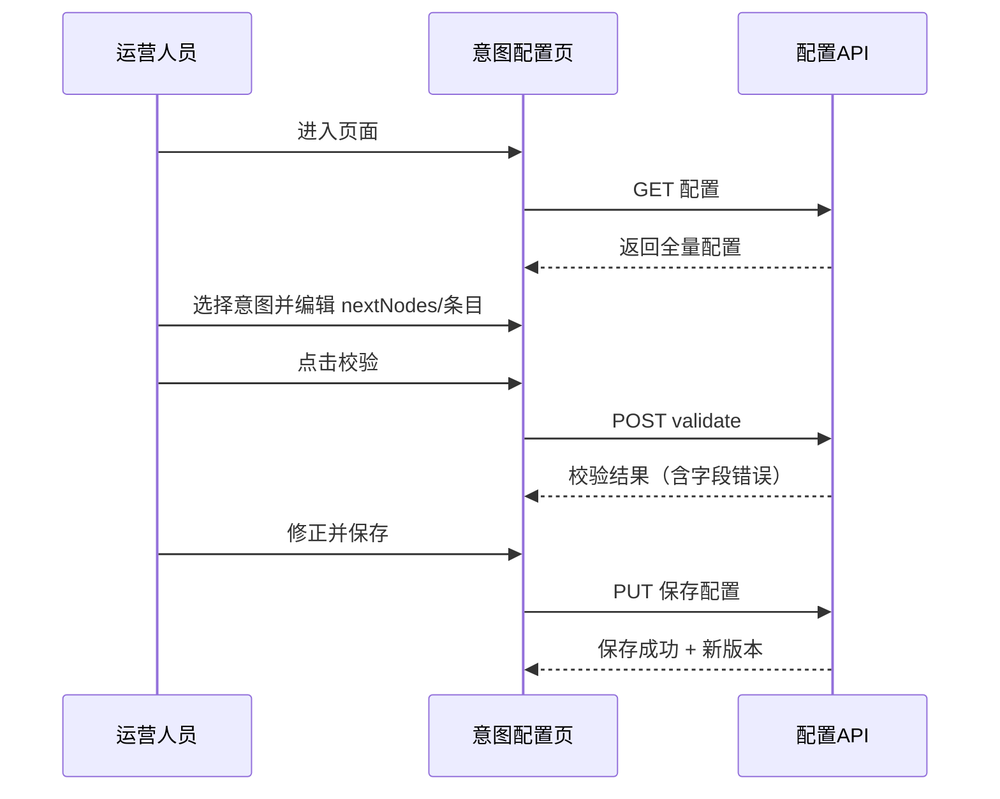

# 设计规格：意图配置独立页面（version=0.1.1）

## 1. 页面目标

为运营人员提供“意图配置”独立页面，仅负责“后续节点路由配置”，不承载全局检索参数或模型参数编辑。

目标：
- 让意图与节点流转关系可视化、可编辑、可校验；
- 在配置时强约束 `knowledge_search` 的知识库条目多选必填规则；
- 让后端可基于页面提交数据直接执行配置校验与持久化。

## 2. 信息架构与导航

### 2.1 页面入口

- 控制台导航：`/console/intent-routing/config`
- 面包屑：`控制台 / 意图配置`

### 2.2 页面分区（单页三栏）

1. **全局参数区（只读或跳转）**
   - 展示当前生效的 `confidenceThreshold`、`topN`、`scoreThreshold`；
   - 仅展示来源与版本，不允许本页直接编辑；
   - 提供“前往全局配置中心”链接。

2. **意图路由区（主编辑区）**
   - 意图列表（左侧）+ 路由编辑面板（右侧）；
   - 支持启停、后续节点选择、知识库条目多选。

3. **校验与发布区（底部操作条）**
   - `校验配置`、`保存草稿`、`发布生效`；
   - 展示字段级错误、阻断原因、最近一次发布时间。

## 3. 核心交互流程



关键规则：
- 当 `nextNodes` 包含 `knowledge_search`，界面必须立刻展示“知识库条目多选”并设为必填；
- 若用户移除 `knowledge_search`，条目选择区可折叠隐藏，但建议保留已选值用于回填（不参与当前校验）；
- 发布前必须先通过后端校验。

## 4. 表单模型与校验设计

### 4.1 表单数据结构（前端视角）

```ts
interface IntentConfigFormModel {
  intentId: string;
  enabled: boolean;
  nextNodes: Array<"knowledge_search" | "model_request" | "final_response">;
  selectedKnowledgeBaseEntryIds: string[];
}
```

### 4.2 校验规则

1. `intentId` 必填；
2. `nextNodes` 至少包含一个后继节点（允许最终节点时为空仅用于高级模式，本期建议不开放）；
3. 若 `nextNodes` 包含 `knowledge_search`：
   - `selectedKnowledgeBaseEntryIds` 必须存在；
   - 且长度 >= 1；
4. 不允许出现不存在的节点 ID；
5. 节点顺序非法（如跳过 `model_request` 直达 `final_response`）时给出结构错误提示。

### 4.3 错误展示策略

- 字段级：展示在对应控件下方（例如知识库多选框）；
- 行级：意图列表项右侧标红，提示“该意图配置未通过校验”；
- 全局级：顶部错误摘要条，提供锚点跳转到错误字段。

## 5. 可用性与体验约束

### 5.1 可用性

- 编辑态离开页面需二次确认，防止未保存丢失；
- 支持“仅查看模式”（无编辑权限用户）；
- 多意图场景下支持按关键词筛选意图；
- 长列表场景采用虚拟滚动或分页，避免渲染卡顿。

### 5.2 一致性

- 所有配置操作按钮语义统一：`校验`、`保存`、`发布`；
- `knowledge_search` 相关提示文案统一使用“知识库条目（至少选择 1 项）”；
- 命中空检索回退策略在页面说明中明确为“对用户无额外提示”。

### 5.3 可访问性

- 表单控件支持键盘可达（Tab 顺序合理）；
- 错误提示可被屏幕阅读器读取（`aria-live`）；
- 颜色对比满足基础可读性标准（错误态与正常态可区分）。

## 6. 页面与后端接口契约

### 6.1 拉取配置

- `GET /api/console/intent-routing/config`
- 页面初始化时一次性拉取：
  - 全局参数快照；
  - 节点定义；
  - 意图路由定义；
  - 可选知识库条目列表（或通过独立接口拉取）。

### 6.2 校验配置

- `POST /api/console/intent-routing/config:validate`
- 返回：
  - `valid: boolean`
  - `fieldErrors: Array<{ field: string; code: string; message: string }>`

### 6.3 保存配置

- `PUT /api/console/intent-routing/config`
- 请求体：完整配置（建议版本号并发控制，如 `ifMatchVersion`）；
- 失败时返回结构化错误码（见第 7 章）。

### 6.4 调试执行（可选入口）

- `POST /api/console/intent-routing/execute-once`
- 用于在页面内验证路由行为，不直接暴露底层提示词或敏感上下文。

## 7. 错误码/错误信息页面映射

- `CFG_KB_ENTRY_REQUIRED`：显示在知识库多选控件下，阻断保存/发布；
- `CFG_ROUTE_BROKEN`：显示全局错误摘要，提示“路由图不完整或存在悬空节点”；
- `CFG_NODE_TYPE_UNSUPPORTED`：显示在节点选择区域，提示节点类型暂不可用；
- `CFG_INVALID_THRESHOLD`：仅作为只读全局参数告警展示，引导去全局配置中心修复；
- `CONFLICT_VERSION_MISMATCH`：提示“配置已被他人更新，请刷新后重试”。

## 8. 可观测性设计（页面侧）

### 8.1 前端埋点建议

- `intent_config_page_view`：页面曝光；
- `intent_config_validate_click`：点击校验；
- `intent_config_save_click`：点击保存；
- `intent_config_publish_click`：点击发布；
- `intent_config_validation_error`：校验失败（携带错误码和字段）。

公共字段：
- `traceId`（由后端返回并透传）；
- `operatorId`；
- `configVersion`；
- `intentCount`。

### 8.2 日志关联

- 页面请求头携带 `x-trace-id`（无则前端生成）；
- 与后端节点执行日志共用 `traceId`，便于从“配置变更”追踪到“线上执行结果”。

## 9. 测试矩阵（页面实现视角）

| 用例 | 操作 | 预期 |
|---|---|---|
| 阈值命中路由 | 配置命中路径含 `knowledge_search` 并执行调试 | 调试结果显示命中并经过检索节点 |
| 阈值未命中路由 | 调试输入低 confidence 样本 | 直接进入 `model_request` |
| 命中空检索 | 配置正确但检索结果为空 | 调试结果显示回退到 `model_request`，页面不提示用户空检索 |
| 配置非法 | 选中 `knowledge_search` 但不选知识库条目 | 校验失败，字段报错 `CFG_KB_ENTRY_REQUIRED` |
| 正常保存发布 | 配置完整且通过校验 | 保存/发布成功，版本号更新 |

## 10. 与需求映射

- 独立页面与职责边界：FR-02、AC-05；
- `knowledge_search` 必选条目：FR-06、AC-07；
- 命中/未命中/空检索流程可验证：FR-01/FR-04、AC-01~AC-04；
- 统一错误语义与可观测性：NFR-02、AC-06。
