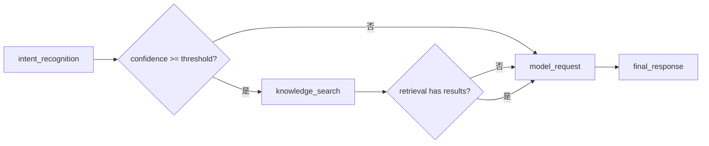
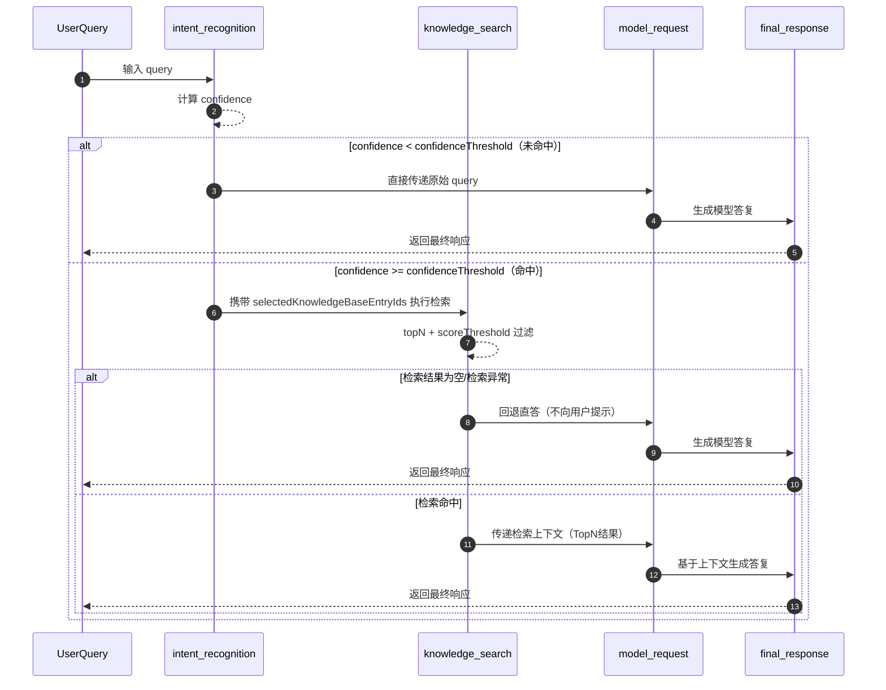

# 设计规格：Intent Routing Node Graph（version=0.1.1）

## 1. 目标与范围

本规格定义服务端 Node 化编排模型与运行规则，覆盖：
- 统一 NodeSchema 与执行器接口；
- 当前 4 个节点的默认线性编排；
- 可配置路由与命中/回退规则；
- 配置数据模型、API 契约草案、错误码策略；
- 节点可观测性与测试矩阵。

本期仅落地线性执行流，不实现 skills/tools/mcp 业务能力，仅预留扩展类型与执行器插槽。

## 2. Node 编排与统一契约

### 2.1 当前固定节点

1. `intent_recognition`
2. `knowledge_search`
3. `model_request`
4. `final_response`

默认流程：



说明：
- 命中但空检索时，无用户可见提示，直接进入 `model_request`。
- `knowledge_search` 异常时同样回退到 `model_request`，并记录内部错误原因。

### 2.1.1 当前节点运转时序图（运行态）



### 2.2 统一 NodeSchema

```ts
type NodeType =
  | "intent_recognition"
  | "knowledge_search"
  | "model_request"
  | "final_response"
  | "skills"
  | "tools"
  | "mcp";

interface NodeSchema {
  id: string;
  type: NodeType;
  input: Record<string, unknown>;
  output: Record<string, unknown>;
  nextNodes: string[]; // 可空
}
```

约束：
- `id` 全局唯一；
- `nextNodes` 可为空，表示流程终点或由调度器终止；
- 结构支持多后继，但本期调度策略按“默认线性流 + 条件分支”执行。

### 2.3 执行器接口（扩展预留）

```ts
interface NodeExecutionContext {
  traceId: string;
  requestId: string;
  runtimeConfig: GlobalIntentRoutingConfig;
  sharedState: Record<string, unknown>;
}

interface NodeExecutionResult {
  output: Record<string, unknown>;
  nextNodeId?: string;
  error?: {
    code: string;
    message: string;
    retryable: boolean;
  };
}

interface NodeExecutor {
  supports(type: NodeType): boolean;
  execute(node: NodeSchema, ctx: NodeExecutionContext): Promise<NodeExecutionResult>;
}
```

扩展机制：
- 新增 `skills/tools/mcp` 节点时，仅新增对应 `NodeExecutor`，不破坏现有编排结构；
- 调度器通过 `type -> executor` 注册表分发执行；
- 若节点类型无执行器，返回配置错误（见错误码 `CFG_NODE_TYPE_UNSUPPORTED`）。

## 3. 路由规则与校验约束

### 3.1 命中判定

- `intent_recognition` 必须输出 `confidence`；
- 命中条件：`confidence >= confidenceThreshold`；
- 未命中：直接路由 `model_request`。

### 3.2 命中后 knowledge_search 约束

- 当命中后续路径包含 `knowledge_search` 时，配置必须包含：
  - `selectedKnowledgeBaseEntryIds: string[]`；
  - 且非空（至少 1 个）。
- 若为空或缺失，配置校验失败，不允许发布/保存生效配置。

### 3.3 检索参数来源

- 全局配置统一提供：
  - `topN`（默认 `3`）；
  - `scoreThreshold`（全局可配）。
- `knowledge_search` 不维护页面级私有阈值，避免配置分裂。

### 3.4 空检索策略

- 命中但检索结果为空时：
  - 不向用户返回“未检索到内容”提示；
  - 直接流转到下一个节点（`model_request`）；
  - 内部日志记录 `fallbackReason=empty_retrieval`。

## 4. 配置实体设计

## 4.1 全局参数实体

```ts
interface GlobalIntentRoutingConfig {
  confidenceThreshold: number; // 建议默认 0.70
  topN: number; // 默认 3
  scoreThreshold: number; // 建议默认 0.50
  version: string;
  updatedAt: string;
  updatedBy: string;
}
```

### 4.2 节点定义实体

```ts
interface NodeDefinitionEntity {
  id: string;
  type: string;
  inputSchema?: Record<string, unknown>;
  outputSchema?: Record<string, unknown>;
  nextNodes: string[];
  enabled: boolean;
}
```

### 4.3 路由定义实体

```ts
interface IntentRouteEntity {
  intentId: string;
  enabled: boolean;
  thresholdOverride?: number; // 可选，本期默认走全局阈值
  nextNodes: string[]; // 本期建议 ["knowledge_search", "model_request", "final_response"]
  selectedKnowledgeBaseEntryIds: string[];
}
```

### 4.4 知识库文档关联实体

```ts
interface KnowledgeEntryBinding {
  intentId: string;
  knowledgeBaseEntryId: string;
  createdAt: string;
  createdBy: string;
}
```

## 5. API 契约草案

### 5.1 读配置

- `GET /api/console/intent-routing/config`
- 返回：全局参数 + 节点定义 + 路由定义 + 知识库文档关联。

### 5.2 保存配置

- `PUT /api/console/intent-routing/config`
- 请求体：完整配置快照（建议幂等覆盖写入）；
- 响应：`{ version, updatedAt, updatedBy }`。

### 5.3 校验配置

- `POST /api/console/intent-routing/config:validate`
- 仅校验不落库；
- 返回：`valid` 与 `fieldErrors[]`（字段级错误）。

### 5.4 执行一次流程（调试/联调用）

- `POST /api/console/intent-routing/execute-once`
- 输入：`query` + 可选 `configVersion`；
- 返回：节点执行轨迹、命中状态、最终响应摘要（不暴露敏感中间数据）。

## 6. 错误码与错误信息策略

错误返回统一结构：

```json
{
  "code": "CFG_KB_ENTRY_REQUIRED",
  "message": "当后续节点包含 knowledge_search 时，必须至少选择一个知识库文档",
  "field": "selectedKnowledgeBaseEntryIds",
  "retryable": false,
  "traceId": "tr_xxx"
}
```

建议错误码：
- `CFG_INVALID_THRESHOLD`：阈值非法（越界/类型错误）；
- `CFG_KB_ENTRY_REQUIRED`：knowledge_search 依赖文档缺失；
- `CFG_NODE_TYPE_UNSUPPORTED`：节点类型无可用执行器；
- `CFG_ROUTE_BROKEN`：路由图断裂或指向不存在节点；
- `RUNTIME_INTENT_FAILED`：意图识别执行异常；
- `RUNTIME_RETRIEVAL_FAILED`：检索执行异常（允许回退）；
- `RUNTIME_MODEL_FAILED`：模型请求失败；
- `RUNTIME_FINALIZE_FAILED`：最终响应组装失败。

策略：
- 配置类错误优先返回字段级可修复信息；
- 运行时错误默认不向终端用户暴露内部细节，仅透出 `traceId` 与可重试标记；
- 所有错误必须可被日志和指标系统聚合。

## 7. 可观测性设计

### 7.1 节点日志字段（每个节点统一）

- `traceId`、`requestId`、`nodeId`、`nodeType`；
- `startAt`、`endAt`、`durationMs`；
- `status`（success/fallback/error）；
- `inputSize`、`outputSize`（可选，避免敏感数据明文）；
- `errorCode`、`fallbackReason`（如 `empty_retrieval`）。

### 7.2 节点专属关键字段

- `intent_recognition`：`confidence`、`confidenceThreshold`、`isIntentHit`、`matchedIntentId`；
- `knowledge_search`：`topN`、`scoreThreshold`、`retrievalCountBeforeFilter`、`retrievalCountAfterFilter`；
- `model_request`：`modelName`、`promptTokenEstimate`、`completionTokenEstimate`；
- `final_response`：`responseType`、`isFallbackPath`。

### 7.3 指标建议

- 路由命中率：`intent_hit_rate`；
- 空检索率：`empty_retrieval_rate`；
- 回退率：`fallback_rate`（按原因分桶）；
- 节点耗时：`node_duration_ms{nodeType=*}`；
- 端到端延迟分位数：`e2e_latency_ms_p50/p95/p99`；
- 配置校验失败率：`config_validate_fail_rate`。

## 8. 核心测试矩阵

| 场景 | 输入条件 | 预期 |
|---|---|---|
| 阈值命中 | `confidence >= threshold` | 进入 `knowledge_search` 后再到 `model_request` |
| 阈值未命中 | `confidence < threshold` | 直接 `model_request` |
| 命中空检索 | 命中 + 检索过滤后 0 条 | 无用户提示，直达 `model_request`，日志有 `empty_retrieval` |
| 配置非法 | nextNodes 含 `knowledge_search` 且未选文档 | 保存/发布失败，返回 `CFG_KB_ENTRY_REQUIRED` |
| 正常流 | 命中 + 检索有结果 | 使用检索上下文请求模型并统一输出 |

## 9. 与需求映射

- FR-01/AC-01/AC-02：命中阈值与未命中直达规则（见第 3 章）；
- FR-03/AC-03：`topN`、`scoreThreshold` 全局参数生效（见第 3 章与第 4 章）；
- FR-04/AC-04：空检索无提示回退（见第 3.4）；
- FR-05/FR-06/AC-07：NodeSchema、路由约束与知识库文档必选（见第 2、3、5、6 章）；
- NFR-02：日志、trace 与指标（见第 7 章）。
