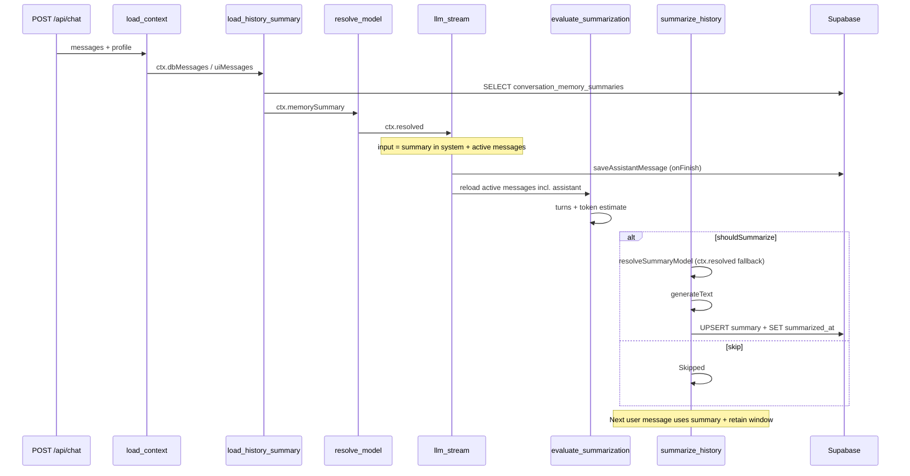

# 历史对话摘要 — 技术设计

> **English:** [history-summarization.md](./history-summarization.md)  
> **中文：** [history-summarization-cn.md](./history-summarization-cn.md)  
> **总纲：** [02-technical-design-cn.md](../02-technical-design-cn.md)  
> **PRD：** [prd/history-summarization-cn.md](../prd/history-summarization-cn.md)  
> **迭代：** iter-07

---

## 1. 设计目标

- 采用 **方案 B**：`evaluate_summarization` + `summarize_history` 在 **`llm_stream` 完成之后**（assistant 已落库）  
- `load_history_summary` 仍在 LLM **之前**，供本轮 Chat 读取已有 summary  
- 对话级 **rolling summary** + messages **软归档**（`summarized_at`）  
- Preferences 扩展 6 项（含 Summary model）；校验与默认值落库  
- LLM 上下文与聊天 UI **分离**：UI 仍展示全部 messages；LLM 仅 recent + summary  
- Clear chat / 删对话清除 memory  
- 步骤时间线 **逐步 inline 展开** 长 `summary` 文本  

**不引入：** 新页面、LangChain、后台队列、摘要版本历史。

---

## 2. 架构图（方案 B）



**LLM 输入两态（PRD §5.3）：**

| 场景 | `llm_stream` 读取 |
|------|-------------------|
| 无 prior summary | 全部 `summarized_at IS NULL` 消息 |
| 有 prior summary | system 内 memory block + 未归档 messages |

---

## 3. 数据库设计

**Migration：** `supabase/migrations/20260625000000_iter07_conversation_memory.sql`

### 3.1 `user_profiles` 扩展

| 列 | 类型 | 默认 | 说明 |
|----|------|------|------|
| `summarization_enabled` | `BOOLEAN NOT NULL` | `true` | 开关 |
| `summary_trigger_turns` | `INT NOT NULL` | `20` | `CHECK (>= 1)` |
| `summary_retain_turns` | `INT NOT NULL` | `6` | `CHECK (>= 0)` |
| `summary_trigger_tokens` | `INT NOT NULL` | `8000` | `CHECK (>= 1)` |
| `summary_retain_tokens` | `INT NOT NULL` | `4000` | `CHECK (>= 1)` |
| `summary_model_config_id` | `UUID NULL` | `NULL` | FK → `user_model_configs(id) ON DELETE SET NULL`；`NULL` = Same as chat |

**表级 CHECK：**

```sql
CHECK (summary_retain_turns <= summary_trigger_turns)
CHECK (summary_retain_tokens <= summary_trigger_tokens)
```

现有用户 migration 后自动获得 PRD 预设默认值。

### 3.2 `messages` 软归档

| 列 | 类型 | 说明 |
|----|------|------|
| `summarized_at` | `TIMESTAMPTZ NULL` | 非 NULL = 已纳入 rolling summary，**不参与 LLM** |

**索引：**

```sql
CREATE INDEX messages_conversation_active_idx
  ON public.messages (conversation_id, created_at ASC)
  WHERE summarized_at IS NULL;
```

`loadMessages` 仍返回 **全部** 行（含已归档），供聊天 UI；memory 模块单独过滤 `summarized_at IS NULL`。

### 3.3 `conversation_memory_summaries`

| 列 | 类型 | 说明 |
|----|------|------|
| `conversation_id` | `UUID PK` | FK → `conversations(id) ON DELETE CASCADE` |
| `content` | `TEXT NOT NULL` | Rolling summary 正文 |
| `token_estimate` | `INT NOT NULL DEFAULT 0` | 写入时估算，供 evaluate 复用 |
| `updated_at` | `TIMESTAMPTZ NOT NULL` | `set_updated_at` trigger |

**RLS：**

```sql
-- SELECT/INSERT/UPDATE/DELETE：conversation 属于 auth.uid()
USING (
  EXISTS (
    SELECT 1 FROM conversations c
    WHERE c.id = conversation_memory_summaries.conversation_id
      AND c.user_id = auth.uid()
  )
)
```

删对话：`conversations` CASCADE 删除 summary 行。Clear chat：显式 `DELETE FROM conversation_memory_summaries WHERE conversation_id = ?` + `DELETE FROM messages`（现有逻辑）。

---

## 4. 核心模块 `lib/memory/`

| 文件 | 职责 |
|------|------|
| `types.ts` | `MemorySummary`, `SummarizationPrefs`, `ContextStats`, `SummarizationPlan` |
| `defaults.ts` | PRD 预设常量（与 DB default 对齐） |
| `token-estimate.ts` | `estimateTextTokens(text)` → `Math.ceil(text.length / 4)` |
| `turns.ts` | `countCompleteTurns`, `partitionIntoTurns(messages)` — 连续 user+assistant 为 1 轮 |
| `evaluate.ts` | 触发判断（OR）；token 仅用于阈值比较 |
| `select-archive.ts` | **整轮原子** 选归档集：见 §4.1.1 |
| `assemble-llm-messages.ts` | `buildLlmUiMessages(activeMessages)` — 供 `convertToModelMessages` |
| `summary-prompt.ts` | `buildSummaryPrompt({ priorSummary, messagesToArchive })` — English 结构化输出 |
| `persistence.ts` | `getMemorySummary`, `upsertMemorySummary`, `markMessagesSummarized`, `clearConversationMemory` |
| `resolve-summary-model.ts` | `resolveSummaryModel(userId, profile, supabase)` — 见 §5.3 |

### 4.1 触发逻辑（`evaluate.ts` · LLM 后执行）

**调用时机：** `llm_stream` 的 `onFinish` 内 assistant 落库后，**重新加载** `ctx.dbMessages`（或 append assistant 行），再调用 `evaluateSummarization`。

```typescript
const activeMessages = messages.filter(m => m.summarized_at == null);
const completeTurns = countCompleteTurns(activeMessages); // 含本轮 user+assistant
const estimatedTokens =
  (summary?.token_estimate ?? estimateTextTokens(summary?.content ?? ""))
  + activeMessages.reduce((n, m) => n + estimateTextTokens(m.content), 0);

const shouldSummarize =
  prefs.summarization_enabled &&
  (completeTurns > prefs.summary_trigger_turns ||
   estimatedTokens > prefs.summary_trigger_tokens);

const archiveIds = shouldSummarize
  ? selectArchiveMessageIds(activeMessages, prefs.summary_retain_turns)
  : [];

// archiveIds 为空 → shouldSummarize = false → summarize Skipped
```

**Chat LLM 路径（`llm_stream` 前）：** 用 **evaluate 之前** 的 active messages + `ctx.memorySummary` 组装；**不** 等待 summarize。

#### 4.1.1 整轮归档算法（`select-archive.ts`）

```typescript
type Turn = { user: DbMessage; assistant: DbMessage };

// 1. partitionIntoTurns(activeMessages) → Turn[]（仅完整对；孤立 user 不参与归档批次）
// 2. retainTurns = turns.slice(-prefs.summary_retain_turns)   // 至少保留 1 轮（含本轮）
// 3. archiveTurns = turns.slice(0, turns.length - retainTurns.length)
// 4. 若 summary + retainTurns 估算 token > retain_tokens：
//      while (retainTurns.length > 1 && overBudget) {
//        archiveTurns.push(retainTurns.shift()!)  // 从最旧保留轮整轮移出
//      }
// 5. archiveIds = flatMap(archiveTurns, t => [t.user.id, t.assistant.id])
```

**约束：** `archiveTurns` 中每一轮必须 user+assistant **同时** 进入 summary 与 `summarized_at`；`retainTurns` 中每一轮 **同时** 保持 active。

**容差：** 整轮收缩后仍略高于 `retain_tokens` 时，允许最多 **10%**（不回头拆轮）。

### 4.2 LLM 上下文组装

**不在 messages 表插入 summary 行。** 在 `llm_stream` 合并 system：

```typescript
const memoryBlock = ctx.memorySummary?.content
  ? `\n\n## Conversation memory\n${ctx.memorySummary.content}`
  : "";

const system = ctx.assistant.system_prompt + memoryBlock;
const messages = await convertToModelMessages(ctx.llmUiMessages ?? ctx.uiMessages);
```

`ctx.llmUiMessages`：**llm_stream 前**的未归档 messages（含当前 user，**不含** 尚未生成的 assistant）。

`ctx.uiMessages`：**全部** messages + 当前 user；流式结束后 UI 通过 AI SDK merge 含新 assistant。

---

## 5. Workflow Nodes（方案 B）

**`WORKFLOW_NODE_ORDER`：**

```
validate_request → load_context → load_history_summary → resolve_model → llm_stream
→ evaluate_summarization → summarize_history
```

**`app/api/chat/route.ts` 结构：**

```typescript
await runWorkflow(
  [validateRequestNode, loadContextNode, loadHistorySummaryNode, resolveModelNode],
  ctx,
  emit,
);
await runLlmStreamNode(ctx, writer, emit, {
  onAssistantSaved: async () => {
    await reloadDbMessages(ctx);
    await runWorkflow(
      [evaluateSummarizationNode, summarizeHistoryNode],
      ctx,
      emit,
    );
  },
});
```

> **实现说明：** memory 两 Node 挂在 `llm_stream` 的 `onFinish`（assistant 落库后），与 PRD 顺序一致；步骤 SSE 在 Generate success 之后继续 emit evaluate / summarize。

### 5.1 `load_history_summary` — LLM 前

- `getMemorySummary` → `ctx.memorySummary`  
- `ctx.llmUiMessages = buildLlmUiMessages(filterActive(ctx.dbMessages))`（**不含** 本轮 assistant）  
- return：`Summary loaded (~Nk tokens)` / `No prior summary`

### 5.2 `evaluate_summarization` — LLM 后

- **前置：** assistant 已落库；`ctx.dbMessages` 已刷新  
- `ctx.summarizationPlan = evaluateSummarization(...)`  
- Enable Off → `Summarization disabled`  
- 否则 `` `${turns} turns · ~${formatTokens(estimated)} tokens` ``

### 5.3 `summarize_history` — LLM 后

| 分支 | 行为 |
|------|------|
| `!plan.shouldSummarize` | return `Skipped` |
| `plan.archiveIds.length === 0` | return `Skipped` |

**执行：**

1. `resolveSummaryModel(ctx)` — `summary_model_config_id` 或 **`ctx.resolved`**（Same as chat）  
2. `generateText`  
3. `upsertMemorySummary` + `markMessagesSummarized`  
4. step summary：`` `Summarized ${n} messages · ~${savedTokens} tokens saved` `` + 可折叠全文  

**失败：** Chat 回复保留；emit step `error`；`workflow_runs.status` 仍为 `completed`（chat 成功）；记录 step error 日志。

### 5.4 `load_context` 调整

- 扩展 profile select；`loadDbMessages` 含 `summarized_at` → `ctx.dbMessages`  
- `ctx.uiMessages` = 全量可见 + 当前 user  

### 5.5 `llm_stream` 调整

- **前：** `ctx.llmUiMessages` + memory system block → `streamText`  
- **onFinish：** `saveAssistantMessage` → 触发 post-LLM memory workflow  
- `originalMessages`：`ctx.uiMessages`（流式 merge 后含 assistant）

### 5.6 `WorkflowContext` 扩展

```typescript
export type MemorySummaryRow = {
  content: string;
  token_estimate: number;
  updated_at: string;
};

export type ProfileRow = {
  preferred_model_config_id: string | null;
  summarization_enabled: boolean;
  summary_trigger_turns: number;
  summary_retain_turns: number;
  summary_trigger_tokens: number;
  summary_retain_tokens: number;
  summary_model_config_id: string | null;
};

// WorkflowContext 新增：
dbMessages?: DbMessageWithArchive[];
memorySummary?: MemorySummaryRow | null;
summarizationPlan?: SummarizationPlan;
llmUiMessages?: UIMessage[];
```

---

## 6. Preferences API / UI

### 6.1 数据层

扩展：

- `lib/data/types.ts` — `UserProfile` + `MemoryPreferences`  
- `lib/console/profile.ts` / `lib/data/browser/profile.ts` — select/upsert 新列  
- `lib/validation/profile.ts` — `parseMemoryPreferencesPatch(body, allowedIds)`  
- `lib/services/browser/profile.ts` — `saveMemoryPreferences(body)` **或** 扩展 `savePreferences` 接受 memory 字段（同 Card 一次 Save）

**推荐：** Preferences Card 内 **Chat model + Memory 同一表单一次 Save**，避免两次 PATCH 竞态。

**Request body（部分）：**

```json
{
  "preferredModelConfigId": "uuid-or-platform-default",
  "summarizationEnabled": true,
  "summaryTriggerTurns": 20,
  "summaryRetainTurns": 6,
  "summaryTriggerTokens": 8000,
  "summaryRetainTokens": 4000,
  "summaryModelConfigId": null
}
```

`summaryModelConfigId: null` = Same as chat model。

**校验错误（English）：** `Retain turns cannot exceed trigger turns` 等。

### 6.2 UI — `components/console/preferences-card.tsx`

- View：Conversation memory 摘要块（PRD 示例）  
- Edit：Toggle + 4 number inputs + Summary model dropdown（首项 `Same as chat model`）  
- Toggle Off → number + summary model disabled  
- 沿用 C2 tokens、`ConsoleSection` busy 态  

### 6.3 `app/console/profile/page.tsx`

- `getUserProfile` 返回 memory 字段 → `ProfilePage` → `PreferencesCard` props  

---

## 7. Clear chat

**`lib/chat/conversations.ts` — `clearConversationMessages`：**

```typescript
await supabase.from("conversation_memory_summaries").delete().eq("conversation_id", id);
await supabase.from("messages").delete().eq("conversation_id", id);
// title reset — 不变
```

**`components/chat/clear-chat-dialog.tsx`：**

```text
Clear chat history? All messages and conversation memory will be removed. This cannot be undone.
```

---

## 8. 步骤 UI — inline 逐步展开

**`components/chat/workflow-step-timeline.tsx`：**

- 新增 `WorkflowStepRow`：每步独立 `expanded` state  
- 折叠：`label` + truncated `summary`（≤80 chars，`…`）  
- 展开：完整 `summary` + `max-h-48 overflow-y-auto`  
- `running` 态：Generate 流式时 running；**结束后** evaluate / summarize 步骤依次出现  
- completed turn 的 `WorkflowStepSummary` 外层折叠保留；内层每步可再展开  

**a11y：** `aria-expanded` on step button；长 summary 不截断 accessibility tree（展开后可读）。

---

## 9. 文件变更清单

| 操作 | 路径 |
|------|------|
| 新增 | `supabase/migrations/20260625000000_iter07_conversation_memory.sql` |
| 新增 | `lib/memory/**` |
| 新增 | `lib/workflow/nodes/load-history-summary.ts` |
| 新增 | `lib/workflow/nodes/evaluate-summarization.ts` |
| 新增 | `lib/workflow/nodes/summarize-history.ts` |
| 修改 | `lib/workflow/nodes/index.ts` |
| 修改 | `lib/workflow/nodes/validate-request.ts`（load_context） |
| 修改 | `lib/workflow/nodes/llm-stream.ts`（onFinish 触发 post-LLM nodes） |
| 修改 | `lib/workflow/types.ts` |
| 修改 | `app/api/chat/route.ts` |
| 修改 | `lib/chat/conversations.ts`（clear + 可选 loadDbMessages） |
| 修改 | `lib/console/profile.ts`、`lib/data/browser/profile.ts` |
| 修改 | `lib/validation/profile.ts`、`lib/services/browser/profile.ts` |
| 修改 | `lib/data/types.ts` |
| 修改 | `components/console/preferences-card.tsx`、`profile-page.tsx` |
| 修改 | `app/console/profile/page.tsx` |
| 修改 | `components/chat/workflow-step-timeline.tsx` |
| 修改 | `components/chat/clear-chat-dialog.tsx` |
| 新增 | `tests/unit/memory/*.test.ts` |
| 新增 | `tests/unit/workflow/summary-nodes.test.ts` |
| 新增 | `tests/e2e/iter07-memory.spec.ts` |

---

## 10. 实现顺序

1. Migration + `lib/memory/persistence`  
2. `turns` / `evaluate` / `select-archive` 单元测试（TDD）  
3. Pre-LLM nodes + `llm_stream` memory system 注入  
4. Post-LLM evaluate / summarize nodes（onFinish 钩子）  
5. Preferences 数据层 + UI  
6. Clear chat + dialog 文案  
7. Step UI 逐步展开  
8. E2E + iter-05/06 回归  

---

## 11. 测试计划

| 路径 | 覆盖 |
|------|------|
| `tests/unit/memory/turns.test.ts` | 轮划分、边界轮、孤立 user |
| `tests/unit/memory/select-archive.test.ts` | 整轮归档；token 触发下仍整轮移出；retain_tokens 逐轮收缩 |
| `tests/unit/memory/evaluate.test.ts` | OR 触发、disabled、空 archive |
| `tests/unit/workflow/summary-nodes.test.ts` | Skip / mock generateText / 失败中断 |
| `tests/unit/profile-validation.test.ts` | memory 字段校验 |
| `tests/e2e/iter07-memory.spec.ts` | Preferences Save；Clear 文案（mock 摘要触发可选） |
| 回归 | `pnpm test:ci` 全量 |

**手工 QA：** 长对话首次超阈值 — 先收完回复，再看到 Summarizing 步骤；下一轮 inspect context 仅 summary + recent；Clear 后重置。

---

## 12. 风险与缓解

| 风险 | 缓解 |
|------|------|
| 第一次触发轮 context 较大（无 prior summary） | 可接受；trigger 8k vs 模型窗口；答完后立即 summarize |
| 摘要 `generateText` 增加 run 尾部延迟 | 不挡流式首 token；步骤 UI 在 Generate 之后显示 Summarizing |
| Token 估算偏差 | 统一 `lib/memory/token-estimate`；容差 10% |
| summarize 失败但 chat 已成功 | step `error`；不回滚 assistant；下次仍超阈值会重试 |
| post-LLM 步骤与 SSE 时序 | evaluate/summarize emit 在 `onFinish` 内 await，仍在同一 SSE 连接内 |
| maxDuration | chat + summarize 串在同一 run；监控 P95 |

---

## 13. 修订记录

| 日期 | 变更 |
|------|------|
| 2026-06-25 | iter-07 技术设计初稿 |
| 2026-06-25 | **方案 B** — evaluate/summarize 移至 llm_stream 之后；更新架构图与失败语义 |
