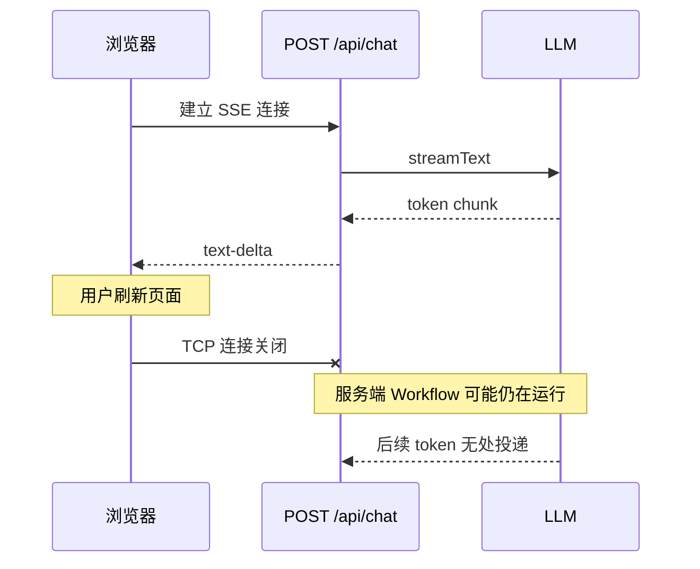
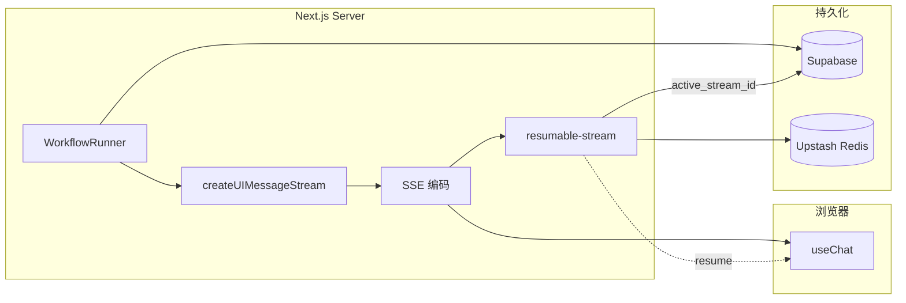
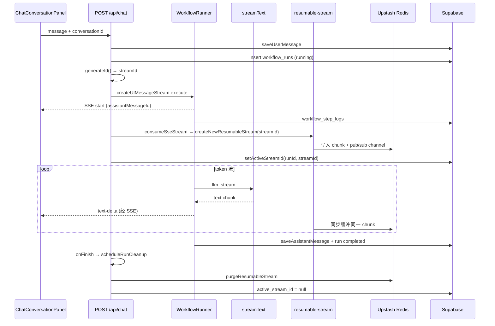
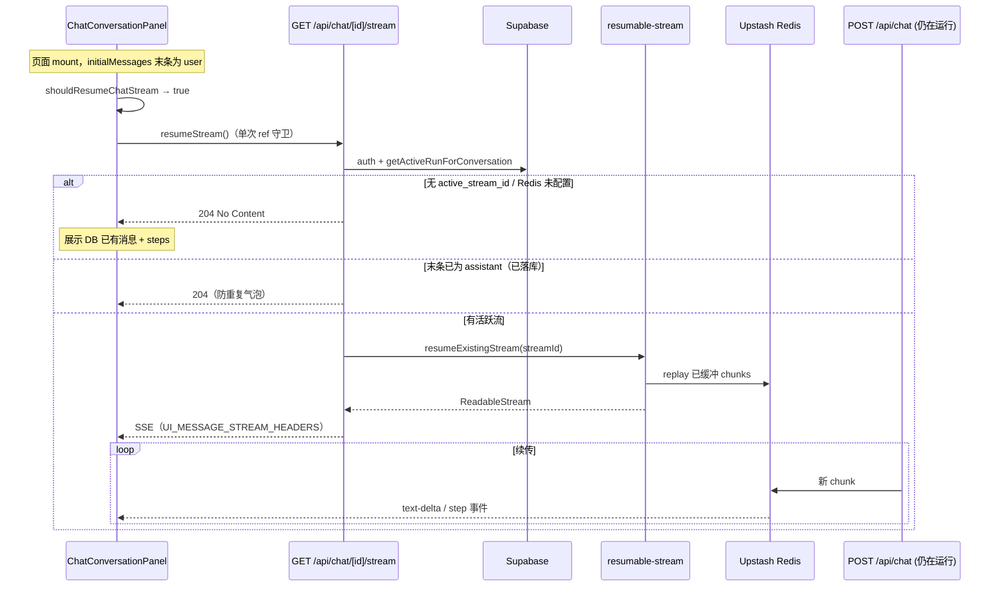
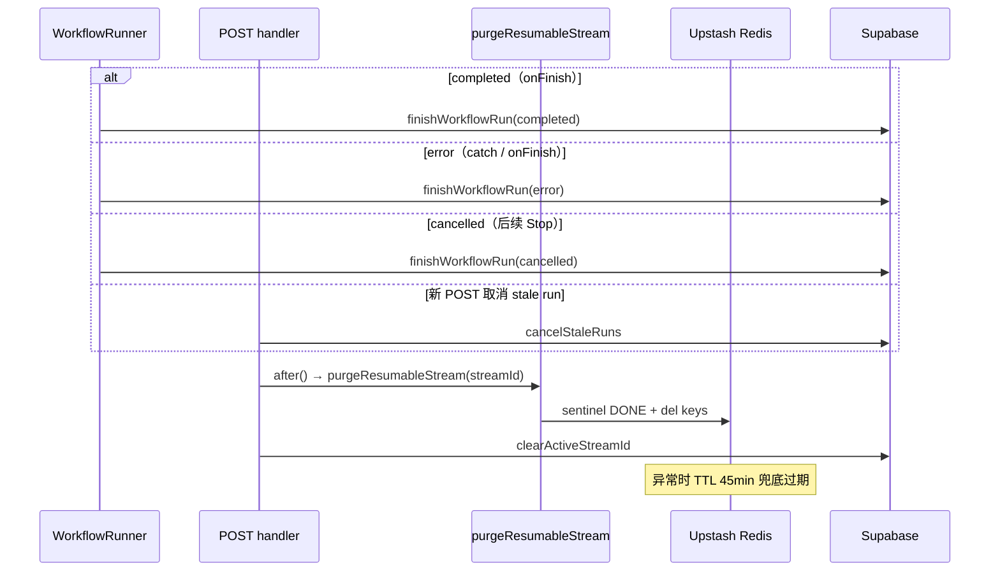

# 流式恢复与 Upstash — 技术设计

> **English:** [stream-resume.md](./stream-resume.md)  
> **中文：** [stream-resume-cn.md](./stream-resume-cn.md)  
> **总纲：** [02-technical-design-cn.md](../02-technical-design-cn.md)  
> **PRD：** [prd/stream-resume-cn.md](../prd/stream-resume-cn.md)  
> **迭代：** iter-06

---

## 1. 设计目标

- 浏览器刷新后 **resume 进行中的 SSE token 流**  
- run **completed / error / cancelled** 后 **删除该 run 在 Upstash 的全部 keys**  
- 刷新 **不** 通过 `req.signal` 取消服务端 LLM  
- Redis 仅存 SSE chunk 缓冲，不存密钥或完整消息正文

---

## 2. 流式输出原理

### 2.1 SSE 与 AI SDK UI Message Stream

聊天回复采用 **Server-Sent Events（SSE）** 长连接，而非一次性 JSON 响应：

| 层级 | 职责 |
|------|------|
| **HTTP** | `POST /api/chat` 返回 `Content-Type: text/event-stream`，连接保持打开直至生成结束 |
| **AI SDK** | `createUIMessageStream` 产出 **UI Message 协议**事件（`start`、`text-delta`、`data-workflow-step`、`finish` 等） |
| **编码** | `createUIMessageStreamResponse` 将事件序列化为 SSE 帧（`data: {...}\n\n`） |
| **客户端** | `useChat` + `DefaultChatTransport` 解析 SSE，`text-delta` 增量更新 assistant 气泡 |

一次典型 token 流的事件顺序：

```
start (messageId)
  → data-workflow-step (running / success) × N
  → text-delta × M
  → finish
```

Workflow 步骤与 LLM token **复用同一条 SSE 连接**，客户端按 `type` 分发到步骤时间线与 Markdown 渲染。

### 2.2 为何刷新会断流

普通 SSE 是 **单连接、无状态** 的：



问题：

1. 刷新关闭原 TCP 连接，**已发出但未渲染的 token 丢失**  
2. 服务端 run 可能仍为 `running`（iter-06 **不** 用 `req.signal` abort LLM）  
3. 最终消息虽会落 Supabase，但 **进行中的 partial 回复** 无法在无缓冲时续收

### 2.3 Resumable Stream 核心机制

Vercel AI SDK [Resume Streams](https://sdk.vercel.ai/docs/ai-sdk-ui/03-chatbot-resume-streams) + `resumable-stream` 包在 SSE 之上增加 **可重连的 chunk 缓冲层**：

| 概念 | 说明 |
|------|------|
| **streamId** | 每次 POST 生成的 UUID，与 `workflow_runs.active_stream_id` 一一对应 |
| **tee 写入** | `consumeSseStream` 钩子拿到编码后的 SSE 字节流，**同时**发给当前客户端并写入 Upstash |
| **offset 索引** | Redis 按序号存储 chunk，resume 时可从任意 offset 重放 |
| **pub/sub 续传** | 新 GET 连接 replay 已缓冲 chunk 后，subscribe 后续实时 chunk |
| **指针表** | Supabase 存 `active_stream_id`（哪条流可 resume）；Redis 存 chunk 正文（临时） |



**设计约束（PRD §3.4）：** Redis **仅** 缓冲 SSE chunk，不替代 Supabase 存消息/步骤；不写入 API Key 或完整用户消息正文。

---

## 3. 技术实现流程

### 3.1 首次 POST — 正常流式生成



要点：

- `consumeSseStream` 在 **SSE 编码之后** 介入，缓冲的是线上真实字节流，resume 端无需重新跑 Workflow  
- `assistantMessageId` 在 `start` 事件即固定（UUID），刷新前后同一气泡 id 一致  
- 清理在 `onFinish` / error 路径通过 `after()` 异步执行，不阻塞响应尾部

### 3.2 刷新后 — Resume 重连



客户端策略（与 PRD 初稿 `resume: true` 的差异）：

| 项 | 行为 |
|----|------|
| 触发条件 | 末条消息为 **user**（尚无 assistant 落库） |
| 调用方式 | 手动 `resumeStream()` + `resumeAttemptedRef`，避免 Strict Mode 双调用 |
| 204 处理 | 无活跃流时静默降级，展示 Supabase 历史 + workflow steps |

### 3.3 Run 终态 — Redis 清理



### 3.4 三层存储职责

| 数据 | 存储 | 生命周期 |
|------|------|----------|
| 已完成 workflow 步骤 | `workflow_step_logs` | 永久 |
| 最终 assistant / user 消息 | `messages` | 永久 |
| 进行中 SSE chunk | Upstash Redis | run 活跃期；终态 purge 或 TTL |
| 活跃流指针 | `workflow_runs.active_stream_id` | run `running` 期间；终态置 null |

刷新后的数据优先级：

1. 尝试 resume Redis 流（进行中 partial token + 步骤事件）  
2. 同时 / 否则从 DB 恢复步骤时间线与已持久化消息  

---

## 4. 依赖与配置

### 4.1 npm

```bash
pnpm add resumable-stream @upstash/redis
```

`resumable-stream` 按 [AI SDK Resume Streams](https://sdk.vercel.ai/docs/ai-sdk-ui/03-chatbot-resume-streams) 配置；若包内已封装 Upstash 连接，则 `@upstash/redis` 仅用于 **显式 purge** 辅助（实现时以包文档为准）。

### 4.2 环境变量

| 变量 | 必填 | 说明 |
|------|------|------|
| `UPSTASH_REDIS_REST_URL` | 生产必填 | Upstash Console → Redis → REST API |
| `UPSTASH_REDIS_REST_TOKEN` | 生产必填 | 同上 |

写入 `.env.example` 与 Vercel 环境。

### 4.3 能力检测

```typescript
// lib/redis/client.ts
export function isRedisConfigured(): boolean {
  return Boolean(
    process.env.UPSTASH_REDIS_REST_URL &&
      process.env.UPSTASH_REDIS_REST_TOKEN,
  );
}
```

未配置时：`resume: true` 仍可用，GET stream 恒 204；开发环境 `console.warn` 一次。

---

## 5. Resumable Stream 集成

### 5.1 创建流（POST `/api/chat`）

```typescript
import { after } from "next/server";
import { createResumableStreamContext } from "resumable-stream";
import { createUIMessageStreamResponse, generateId } from "ai";

const streamId = generateId();

return createUIMessageStreamResponse({
  stream: uiStream,
  async consumeSseStream({ stream: sseStream }) {
    if (!isRedisConfigured()) return;

    const ctx = createResumableStreamContext({ waitUntil: after });
    await ctx.createNewResumableStream(streamId, () => sseStream);
    await setActiveStreamId(runId, streamId);
  },
  // onFinish / onError → 见 §7 清理
});
```

`streamId` 与 `workflow_runs.active_stream_id` 一一对应。

### 5.2 Resume 流（GET `/api/chat/[conversationId]/stream`）

**路径选择理由：** `DefaultChatTransport` 默认 `reconnectToStream` → `GET {api}/{chatId}/stream`，与 `api: "/api/chat"` 组合为 `/api/chat/{conversationId}/stream`。

```typescript
import { UI_MESSAGE_STREAM_HEADERS } from "ai";
import { createResumableStreamContext } from "resumable-stream";

export async function GET(
  req: Request,
  { params }: { params: Promise<{ conversationId: string }> },
) {
  const { conversationId } = await params;
  const user = await getUser(); // 401 if missing
  const run = await getActiveRunForConversation(conversationId, user.id);

  if (!run?.active_stream_id || !isRedisConfigured()) {
    return new Response(null, { status: 204 });
  }

  // Dev calibration (iter-06): assistant may already be persisted while run is still
  // "running" and active_stream_id is set. Replaying the stream would push a duplicate
  // assistant bubble (stream messageId ≠ DB id before UUID alignment fix).
  const messages = await loadMessages(conversationId, supabase);
  if (messages.at(-1)?.role === "assistant") {
    return new Response(null, { status: 204 });
  }

  const ctx = createResumableStreamContext({ waitUntil: after });
  const body = await ctx.resumeExistingStream(run.active_stream_id);

  if (!body) {
    return new Response(null, { status: 204 });
  }

  return new Response(body, { headers: UI_MESSAGE_STREAM_HEADERS });
}
```

### 5.3 前端

```typescript
// lib/chat/stream-resume.ts
export function shouldResumeChatStream(messages: UIMessage[]): boolean {
  return messages.at(-1)?.role === "user";
}

// chat-conversation-panel.tsx
const canResumeStream = shouldResumeChatStream(initialMessages);
const resumeAttemptedRef = useRef(false);

const { resumeStream, ... } = useChat({
  id: conversationId,
  resume: false, // 不用内置 resume，避免 Strict Mode 双调用
  transport: new DefaultChatTransport({ api: "/api/chat", ... }),
});

useEffect(() => {
  if (!canResumeStream || resumeAttemptedRef.current) return;
  resumeAttemptedRef.current = true;
  void resumeStream();
}, [canResumeStream, conversationId, resumeStream]);
```

`conversationId` 作为 `useChat` 的 `id`，与现有实现一致。

**与 PRD 初稿差异：** 原设计 `resume: true`；实现改为条件 resume + 单次 ref 守卫。详见 [changelog/iter-06-cn.md](../changelog/iter-06-cn.md) §4.3、§5。

---

## 6. Redis Key 与 TTL

### 6.1 Key 命名

以 `resumable-stream` 库实际前缀为准；应用层额外记录：

| 逻辑 | 存储位置 |
|------|----------|
| 活跃 stream 指针 | `workflow_runs.active_stream_id` |
| chunk 缓冲 | 库内部 keys（与 `streamId` 关联） |

**辅助索引（可选）：** `workflow:run:{runId}:streamId` → 便于 purge 时查找（若库未暴露 delete API）。

### 6.2 TTL 兜底

创建 resumable stream 时配置 **最大 TTL 45 分钟**（`< maxDuration` 130s 的数倍，防泄漏）：

- 正常路径：run 终态时 **主动 delete**  
- 异常路径：TTL 到期自动过期（满足 AC-61 兜底）

具体 API 以实现时 `resumable-stream` 文档为准；若库不支持 TTL，在 `lib/redis/purge.ts` 用 `@upstash/redis` `expire` 包装。

---

## 7. Redis 清理（必做）

### 7.1 `lib/redis/purge.ts`

```typescript
export async function purgeResumableStream(streamId: string | null): Promise<void>
```

**行为：**

1. `streamId` 为空 → no-op  
2. 调用 `resumable-stream` 提供的 delete / 或 `@upstash/redis` 按 pattern 删除  
3. 失败 → `console.error` + 依赖 TTL；**不** 抛出到用户响应路径  

### 7.2 触发时机

| 事件 | 动作 |
|------|------|
| `workflow_runs.status` → `completed` | `purgeResumableStream(active_stream_id)` + `active_stream_id = null` |
| → `error` | 同上 |
| → `cancelled` | 同上 |
| 新 POST 取消 stale run | purge 旧 run 的 streamId |
| `createUIMessageStreamResponse` `onFinish` | 同上（与 `finishWorkflowRun` 合并） |

使用 `after()` 异步清理，不阻塞响应尾部：

```typescript
after(async () => {
  await purgeResumableStream(streamId);
  await clearActiveStreamId(runId);
});
```

### 7.3 与 PRD 对齐

> 每个 chat run 结束/异常后清空该 run 的 Redis 数据

实现定义：**以 `workflow_run.id` 为粒度**，清理其 `active_stream_id` 关联的全部 resumable keys；不按 conversation 长期保留缓冲。

---

## 8. 刷新 vs 取消

| 场景 | 服务端 | 客户端 |
|------|--------|--------|
| 浏览器刷新 | LLM 继续；`running` run 保留 | mount → `resume: true` + GET workflow steps |
| 关闭 tab | 同刷新（iter-06 不区分） | — |
| 用户 Stop（P1，可选） | `cancelled` + purge | `stop()` + 可选 cancel API |

**iter-06 最小实现：** 仅刷新恢复；Stop 按钮可后续迭代。

---

## 9. 错误处理

| 情况 | 行为 |
|------|------|
| Redis 不可用 | POST 正常流式；无 resume；GET 204 |
| resume 时 stream 已结束 | GET 204；UI 显示 DB 消息 + steps |
| purge 失败 | 日志 + TTL；`active_stream_id` 仍清空避免重复 resume |

---

## 10. 文件变更

| 操作 | 路径 |
|------|------|
| 新增 | `lib/redis/client.ts` |
| 新增 | `lib/redis/purge.ts` |
| 新增 | `lib/redis/stream-context.ts`（封装 `createResumableStreamContext`） |
| 新增 | `app/api/chat/[conversationId]/stream/route.ts` |
| 新增 | `lib/chat/stream-resume.ts` |
| 修改 | `app/api/chat/route.ts`（consumeSseStream + cleanup + UUID assistant `start`） |
| 修改 | `components/chat/chat-conversation-panel.tsx`（条件 `resumeStream` + ref 守卫） |
| 修改 | `lib/chat/conversations.ts`（assistant 落库 UUID id） |
| 修改 | `.env.example` |
| 修改 | `package.json` |

---

## 11. 测试计划

| AC | 验证 |
|----|------|
| AC-60 | 手工/E2E：流式中刷新，token 续收 |
| AC-61 | 单元 mock：`purgeResumableStream` 在 completed 后被调用；或 Upstash CLI 查 key 不存在 |
| AC-62 | 单元：error 路径调用 purge + `status = error` |
| AC-63 | GET stream 无 run → 204；**末条已为 assistant → 204**；页面有历史消息 |
| AC-64 | DB `active_stream_id` 终态为 null |

---

## 12. 修订记录

| 日期 | 变更 |
|------|------|
| 2026-06-24 | iter-06 技术设计草稿 |
| 2026-06-24 | §5.2–5.3 resume 防重复（assistant 已落库 204、条件 resumeStream）；§10 文件清单 |
| 2026-06-29 | 新增 §2 流式输出原理、§3 技术实现流程图（mermaid）；英文版 [stream-resume.md](./stream-resume.md) §2–§3 同步 |
