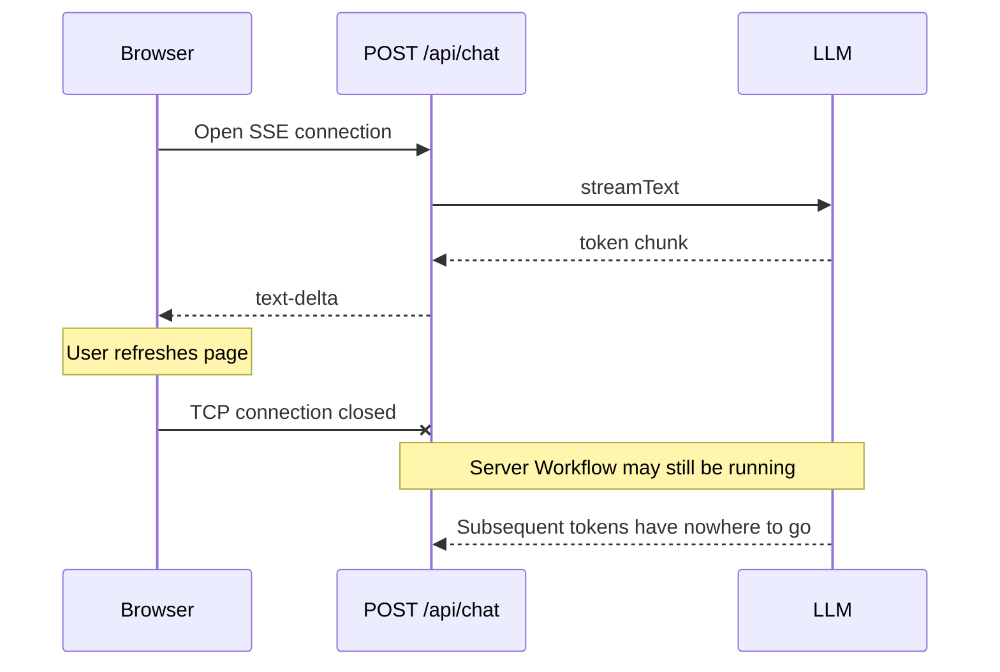
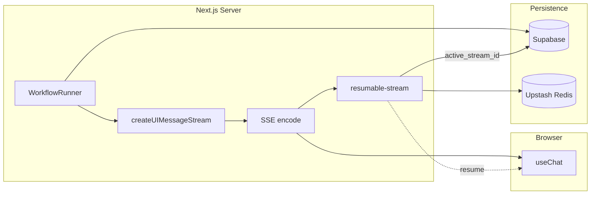
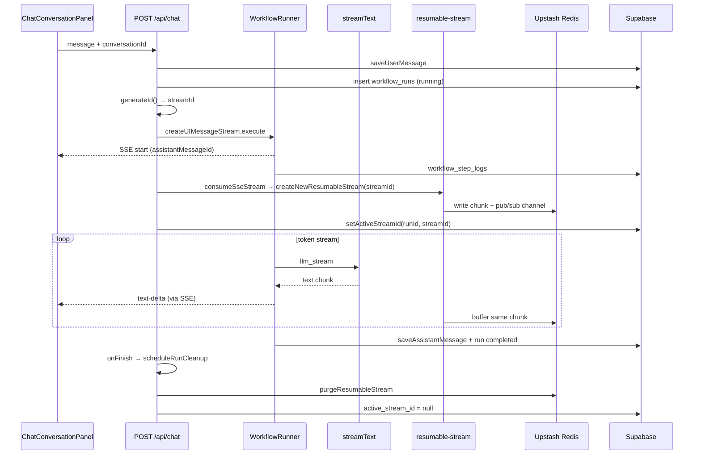
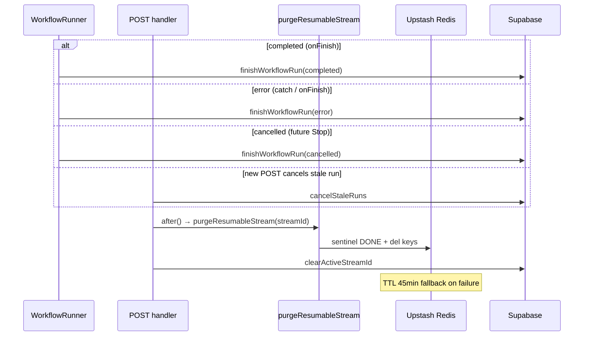

# Stream resume & Upstash — Technical design

> **English:** [stream-resume.md](./stream-resume.md)  
> **中文:** [stream-resume-cn.md](./stream-resume-cn.md)  
> **Index:** [02-technical-design.md](../02-technical-design.md)  
> **PRD:** [prd/stream-resume.md](../prd/stream-resume.md)  
> **Iteration:** iter-06

---

## 1. Goals

- Resume in-flight SSE token streams after browser refresh  
- Purge all Upstash keys for a run on **completed / error / cancelled**  
- Do **not** cancel the server-side LLM via `req.signal` on refresh  
- Redis stores SSE chunk buffers only — no API keys or full message bodies

---

## 2. Streaming fundamentals

### 2.1 SSE and AI SDK UI Message Stream

Chat replies use a **Server-Sent Events (SSE)** long-lived connection, not a one-shot JSON response:

| Layer | Responsibility |
|-------|----------------|
| **HTTP** | `POST /api/chat` returns `Content-Type: text/event-stream`; the connection stays open until generation finishes |
| **AI SDK** | `createUIMessageStream` emits **UI Message protocol** events (`start`, `text-delta`, `data-workflow-step`, `finish`, etc.) |
| **Encoding** | `createUIMessageStreamResponse` serializes events into SSE frames (`data: {...}\n\n`) |
| **Client** | `useChat` + `DefaultChatTransport` parse SSE; `text-delta` incrementally updates the assistant bubble |

Typical event order for a token stream:

```
start (messageId)
  → data-workflow-step (running / success) × N
  → text-delta × M
  → finish
```

Workflow steps and LLM tokens **share one SSE connection**; the client routes by `type` to the step timeline and Markdown renderer.

### 2.2 Why refresh breaks the stream

Plain SSE is **single-connection and stateless**:



Problems:

1. Refresh closes the TCP connection — **tokens already sent but not rendered are lost**  
2. The server run may still be `running` (iter-06 does **not** abort the LLM via `req.signal`)  
3. The final message will land in Supabase, but **in-progress partial replies** cannot be resumed without a buffer

### 2.3 Resumable Stream core mechanism

Vercel AI SDK [Resume Streams](https://sdk.vercel.ai/docs/ai-sdk-ui/03-chatbot-resume-streams) + the `resumable-stream` package add a **reconnectable chunk buffer** on top of SSE:

| Concept | Description |
|---------|-------------|
| **streamId** | UUID generated per POST; maps 1:1 to `workflow_runs.active_stream_id` |
| **Tee write** | `consumeSseStream` receives the encoded SSE byte stream and sends it to the current client **and** writes to Upstash |
| **Offset index** | Redis stores chunks by sequence number; resume can replay from any offset |
| **Pub/sub continuation** | A new GET connection replays buffered chunks, then subscribes to live chunks |
| **Pointer table** | Supabase holds `active_stream_id` (which stream is resumable); Redis holds chunk payloads (temporary) |



**Design constraint (PRD §3.4):** Redis **only** buffers SSE chunks — it does not replace Supabase for messages/steps; no API keys or full user message bodies in Redis values.

---

## 3. Implementation flows

### 3.1 Initial POST — normal streaming generation



Key points:

- `consumeSseStream` runs **after SSE encoding** — it buffers the on-the-wire byte stream, so the resume endpoint does not re-run the Workflow  
- `assistantMessageId` is fixed in the `start` event (UUID), so the same bubble id survives refresh  
- Cleanup runs asynchronously via `after()` on `onFinish` / error paths — it does not block the response tail

### 3.2 After refresh — resume reconnect

```mermaid
sequenceDiagram
  participant UI as ChatConversationPanel
  participant GET as GET /api/chat/[id]/stream
  participant DB as Supabase
  participant RS as resumable-stream
  participant RD as Upstash Redis
  participant POST as POST /api/chat (still running)

  Note over UI: Page mount; last initialMessage is user
  UI->>UI: shouldResumeChatStream → true
  UI->>GET: resumeStream() (single ref guard)

  GET->>DB: auth + getActiveRunForConversation
  alt no active_stream_id / Redis not configured
    GET-->>UI: 204 No Content
    Note over UI: Show DB messages + steps
  else last message is assistant (already persisted)
    GET-->>UI: 204 (prevent duplicate bubble)
  else active stream exists
    GET->>RS: resumeExistingStream(streamId)
    RS->>RD: replay buffered chunks
    RS-->>GET: ReadableStream
    GET-->>UI: SSE (UI_MESSAGE_STREAM_HEADERS)
    loop continuation
      POST->>RD: new chunk
      RD-->>UI: text-delta / step events
    end
  end
```

Client strategy (differs from PRD draft `resume: true`):

| Item | Behavior |
|------|----------|
| Trigger | Last message is **user** (no assistant persisted yet) |
| Invocation | Manual `resumeStream()` + `resumeAttemptedRef` to avoid Strict Mode double-call |
| 204 handling | Silent fallback — show Supabase history + workflow steps |

### 3.3 Run terminal state — Redis cleanup



### 3.4 Three-layer storage responsibilities

| Data | Storage | Lifetime |
|------|---------|----------|
| Completed workflow steps | `workflow_step_logs` | Permanent |
| Final assistant / user messages | `messages` | Permanent |
| In-flight SSE chunks | Upstash Redis | While run is active; purge or TTL on terminal state |
| Active stream pointer | `workflow_runs.active_stream_id` | While run is `running`; null after terminal state |

Priority after refresh:

1. Try to resume the Redis stream (in-progress partial tokens + step events)  
2. In parallel / otherwise, restore the step timeline and persisted messages from the DB  

---

## 4. Integration

- Packages: `resumable-stream`, `@upstash/redis`  
- Env: `UPSTASH_REDIS_REST_URL`, `UPSTASH_REDIS_REST_TOKEN`  
- POST: `consumeSseStream` + `createNewResumableStream`  
- GET: `/api/chat/[conversationId]/stream` → `resumeExistingStream` or 204  
- Client: conditional `resumeStream()` (not built-in `resume: true`)

See [stream-resume-cn.md](./stream-resume-cn.md) §4–§11 for code samples, purge triggers, TTL fallback, and file list.

---

## 5. Revision history

| Date | Change |
|------|--------|
| 2026-06-24 | iter-06 technical design draft |
| 2026-06-29 | Full §2 streaming fundamentals + §3 implementation flow diagrams (EN/CN pair) |
