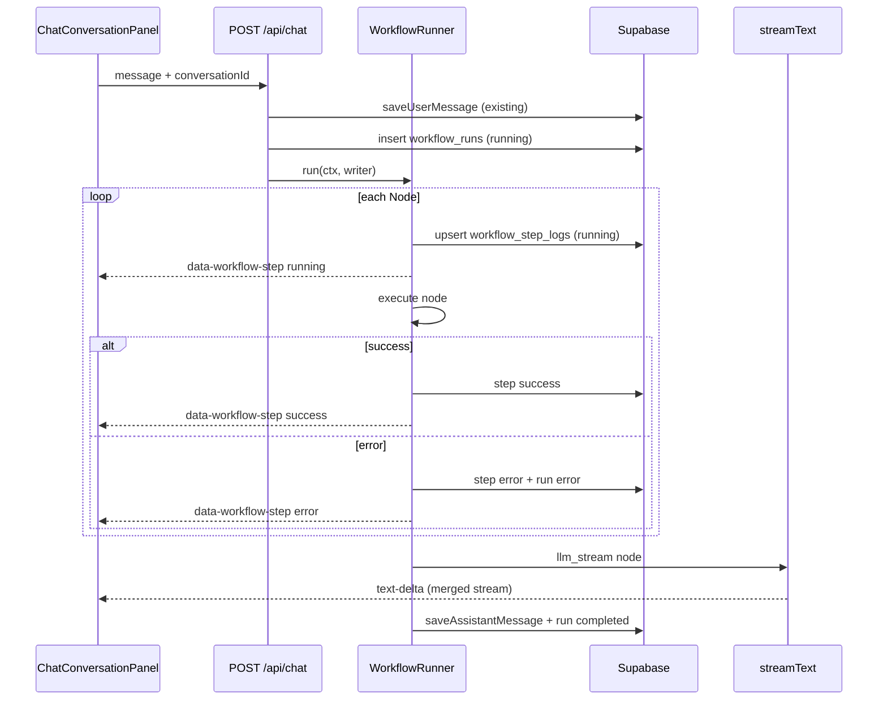

# Workflow 编排 — 技术设计

> **English:** [workflow-orchestration.md](./workflow-orchestration.md)  
> **中文：** [workflow-orchestration-cn.md](./workflow-orchestration-cn.md)  
> **总纲：** [02-technical-design-cn.md](../02-technical-design-cn.md)  
> **PRD：** [prd/workflow-orchestration-cn.md](../prd/workflow-orchestration-cn.md)  
> **迭代：** iter-06

---

## 1. 设计目标

- 将 `app/api/chat/route.ts` 重构为 **WorkflowRunner** 驱动的可观测流水线  
- 每 Node 进入/完成/失败时：**SSE `data-workflow-step`** + **Supabase step log** 双写  
- 保持 iter-05 模型解析、流式 Markdown、消息持久化语义不变  
- 为 `rag_retrieve` / `mcp_tools` / `skills` 预留 Node 注册扩展点（本迭代不实现）

---

## 2. 架构图



---

## 3. `lib/workflow/` 模块

### 3.1 类型（`types.ts`）

```typescript
export type WorkflowStepStatus = "running" | "success" | "error";

export type WorkflowRunStatus =
  | "running"
  | "completed"
  | "error"
  | "cancelled";

export type WorkflowStepEvent = {
  runId: string;
  nodeId: string;
  label: string;
  status: WorkflowStepStatus;
  summary?: string;
  error?: string;
  startedAt?: string;
  finishedAt?: string;
};

export type WorkflowContext = {
  runId: string;
  userId: string;
  conversationId: string;
  message: UIMessage;
  userText: string;
  // populated by nodes:
  conversation?: ConversationRow;
  uiMessages?: UIMessage[];
  assistant?: AssistantRow;
  profile?: ProfileRow;
  resolved?: ResolvedUserModel;
};

export type StepEmitter = (event: WorkflowStepEvent) => Promise<void>;

export type WorkflowNode = {
  id: string;
  label: string;
  run: (ctx: WorkflowContext) => Promise<void>;
};
```

### 3.2 Runner（`runner.ts`）

```typescript
export async function runWorkflow(
  nodes: WorkflowNode[],
  ctx: WorkflowContext,
  emit: StepEmitter,
): Promise<void>
```

**语义：**

1. 顺序执行 `nodes`  
2. 每 node 前后调用 `emit`（running → success/error）  
3. `run` 抛错 → emit error → **不执行后续 node** → 向上抛出  
4. 所有 node 成功则正常返回  

### 3.3 Node 实现（`nodes/`）

| 文件 | Node ID | 职责 |
|------|---------|------|
| `validate-request.ts` | `validate_request` | 已在 route 层完成的校验可 no-op；或集中校验 conversation 存在 |
| `load-context.ts` | `load_context` | `loadMessages`、`getAssistantForConversation`、`getUserProfile` |
| `resolve-model.ts` | `resolve_model` | `resolveUserModelForChat`；success summary = `resolved.label` |
| `llm-stream.ts` | `llm_stream` | `streamText` + `writer.merge(toUIMessageStream(...))` |

**`llm_stream` 注意：** 在 `createUIMessageStream.execute` 内调用，接收 `writer` 与 `UIMessageStreamWriter`，不在 Runner 的同步 `run()` 内 await 完整流——设计为 **最后一个 node**，其 `run` 启动 merge 后不阻塞 execute 回调结束（由 AI SDK 管理流生命周期）。

**推荐结构：**

```typescript
// route.ts execute({ writer })
writer.write({ type: "start", messageId: assistantMessageId }); // 单 assistant 槽位

await runWorkflow(
  [validateRequestNode, loadContextNode, resolveModelNode],
  ctx,
  makeStepEmitter({ writer, persistence }),
);

// llm node runs inside same execute after runner
await runLlmStreamNode(ctx, writer, emit); // toUIMessageStream({ sendStart: false })
```

### 3.4 步骤发射（`emit-step.ts`）

```typescript
export function makeStepEmitter(options: {
  writer: UIMessageStreamWriter;
  persistStep: (event: WorkflowStepEvent) => Promise<void>;
}): StepEmitter
```

对每个 event：

```typescript
writer.write({
  type: "data-workflow-step",
  id: `${event.runId}:${event.nodeId}`,
  data: event,
});
await persistStep(event);
```

`running` 与 `success`/`error` 使用同一 `id`，前端按 `nodeId` 合并更新。

### 3.5 持久化（`persistence.ts`）

服务端专用（`createClient` / service role 按现有模式）：

| 函数 | 说明 |
|------|------|
| `createWorkflowRun(...)` | insert `workflow_runs`，status `running` |
| `finishWorkflowRun(runId, status, error?)` | 更新终态、`finished_at` |
| `upsertWorkflowStepLog(event)` | insert 或 update 同 `run_id`+`node_id` |
| `getActiveRunForConversation(conversationId, userId)` | status `running` 的最新 run |
| `getStepLogsForRun(runId)` | 有序 step logs（刷新恢复） |

---

## 4. 数据库设计

**迁移：** `supabase/migrations/20260624000000_iter06_workflow.sql`

### 4.1 `workflow_runs`

```sql
CREATE TABLE public.workflow_runs (
  id                UUID PRIMARY KEY DEFAULT gen_random_uuid(),
  conversation_id   UUID NOT NULL REFERENCES public.conversations(id) ON DELETE CASCADE,
  user_id           UUID NOT NULL REFERENCES auth.users(id) ON DELETE CASCADE,
  status            TEXT NOT NULL CHECK (status IN ('running','completed','error','cancelled')),
  active_stream_id  TEXT,
  error_message     TEXT,
  started_at        TIMESTAMPTZ NOT NULL DEFAULT now(),
  finished_at       TIMESTAMPTZ
);

CREATE INDEX workflow_runs_conversation_started_idx
  ON public.workflow_runs (conversation_id, started_at DESC);

CREATE UNIQUE INDEX workflow_runs_one_active_per_conversation_idx
  ON public.workflow_runs (conversation_id)
  WHERE status = 'running';
```

> 同一 conversation 同时仅允许一个 `running` run（新 POST 前将旧 `running` 标为 `error` 或 `cancelled`，并清理其 Redis）。

### 4.2 `workflow_step_logs`

```sql
CREATE TABLE public.workflow_step_logs (
  id              UUID PRIMARY KEY DEFAULT gen_random_uuid(),
  run_id          UUID NOT NULL REFERENCES public.workflow_runs(id) ON DELETE CASCADE,
  node_id         TEXT NOT NULL,
  label           TEXT NOT NULL,
  status          TEXT NOT NULL CHECK (status IN ('running','success','error')),
  summary         TEXT,
  error_message   TEXT,
  started_at      TIMESTAMPTZ NOT NULL DEFAULT now(),
  finished_at     TIMESTAMPTZ,
  duration_ms     INTEGER,
  UNIQUE (run_id, node_id)
);

CREATE INDEX workflow_step_logs_run_idx
  ON public.workflow_step_logs (run_id, started_at ASC);
```

### 4.3 RLS

- `workflow_runs`：`user_id = auth.uid()` SELECT；INSERT/UPDATE 仅服务端（无客户端 policy，或 `authenticated` + `user_id` 匹配）  
- `workflow_step_logs`：通过 `run_id` 关联 `workflow_runs.user_id = auth.uid()` SELECT  

**MVP：** 客户端 **不** 直读表；刷新恢复走 `GET /api/chat/[conversationId]/workflow`（服务端鉴权后返回 JSON）。

### 4.4 摘要字段约束

- `summary` 仅允许 model label、message count 等非敏感信息  
- **禁止** 写入 API Key、完整 prompt、解密后的密钥

---

## 5. `POST /api/chat` 重构

### 5.1 请求/响应（不变）

```typescript
type ChatRequestBody = {
  conversationId?: string;
  message?: UIMessage;
};
```

响应：`createUIMessageStreamResponse`（SSE）。

### 5.2 流程

```typescript
export async function POST(req: Request) {
  // 1. getUser, parse body (existing)
  // 2. saveUserMessage, maybeUpdateConversationTitle (existing)
  // 3. cancelStaleRuns(conversationId) — 将遗留 running 标 error + purge redis
  // 4. runId = createWorkflowRun(...)
  // 5. streamId = generateId()

  const stream = createUIMessageStream({
    execute: async ({ writer }) => {
      const emit = makeStepEmitter({ writer, persistStep, runId });
      const ctx: WorkflowContext = { runId, userId, conversationId, message, userText };

      try {
        await runWorkflow([...nodes], ctx, emit);
        await runLlmStreamNode(ctx, writer); // merge streamText
      } catch (error) {
        await finishWorkflowRun(runId, "error", toUserMessage(error));
        await purgeResumableStream(streamId);
        throw error;
      }
    },
  });

  return createUIMessageStreamResponse({
    stream,
    async consumeSseStream({ stream: sseStream }) {
      const streamContext = createResumableStreamContext({ waitUntil: after });
      await streamContext.createNewResumableStream(streamId, () => sseStream);
      await setActiveStreamId(runId, streamId);
    },
    onFinish: async () => {
      await finishWorkflowRun(runId, "completed");
      await clearActiveStreamId(runId);
      await purgeResumableStream(streamId);
    },
  });
}
```

### 5.3 Abort 信号（iter-06 变更）

```typescript
// Before
abortSignal: mergeAbortSignals(req.signal, AbortSignal.timeout(llmTimeoutMs)),

// After — 刷新不取消 LLM；仅超时 abort
abortSignal: AbortSignal.timeout(llmTimeoutMs),
```

`req.signal` 不传入 `streamText`。用户 Stop（P1）留接口：未来 `POST /api/chat/runs/[id]/cancel`。

### 5.4 `llm_stream` node

```typescript
const result = streamText({
  model: getChatModelForResolvedConfig(ctx.resolved!),
  system: ctx.assistant!.system_prompt,
  messages: await convertToModelMessages(ctx.uiMessages!),
  providerOptions: getStreamTextProviderOptions(),
  abortSignal: AbortSignal.timeout(llmTimeoutMs),
  timeout: { totalMs: llmTimeoutMs, chunkMs: getChatChunkTimeoutMs() },
});

writer.merge(
  toUIMessageStream({
    stream: result.stream,
    originalMessages: ctx.uiMessages!,
    onFinish: async ({ responseMessage }) => {
      await saveAssistantMessage(conversationId, responseMessage);
    },
  }),
);
```

---

## 6. 前端设计

### 6.1 状态模型（`lib/chat/turn-workflow.ts`）

Workflow 步骤 UI **不再**使用 conversation 级 `workflowSteps[]` + 多处 phase 推导。改为 **turn 级状态机**：

```typescript
type TurnWorkflowPhase = "idle" | "running" | "settled";

type TurnWorkflowLiveState = {
  runId: string | null;
  userMessageId: string;   // 绑定到触发本轮的用户消息
  steps: WorkflowStepEvent[];
  phase: TurnWorkflowPhase;
};

type TurnWorkflowStore = {
  live: TurnWorkflowLiveState | null;              // 当前进行中的 turn
  completed: Record<string, CompletedTurnWorkflow>; // userMessageId → 已完成步骤
};
```

**Phase 推导（单一函数 `deriveTurnWorkflowPhase`）：**

| phase | 条件 |
|-------|------|
| `running` | 任意 step 为 `running`，或 turn 刚开始 |
| `settled` | `llm_stream` 为 `success`/`error`，且无 running step |
| `idle` | 无 step 且非 busy |

UI 映射：`running` → 展开列表；`settled` → 收起为「N steps completed」。

### 6.2 `useTurnWorkflow`（`lib/chat/use-turn-workflow.ts`）

| 事件 | 行为 |
|------|------|
| `chatStatus → submitted` | `beginTurnWorkflow(userMessageId)`，递增 `restoreGeneration`（P0 防 stale API） |
| SSE `data-workflow-step` | `applyLiveWorkflowStep` → 完成后自动 `settleLiveTurn` |
| mount / `status → ready` | `GET /workflow` **仅** restore `running` run；`completed` run 仅当最后一轮已有 assistant 回复 |
| clear chat | 重置 store |

**P0 关键规则：** 异步 restore 响应若 `generation` 已变（用户已发新消息），直接丢弃；**绝不**把上一轮 completed steps merge 进 live turn。

### 6.3 渲染（`chat-messages.tsx` + `assistant-turn.tsx`）

**单 assistant 槽位（服务端）：** `execute` 开头 `writer.write({ type: "start", messageId })` 创建唯一 assistant 消息（`messageId` 使用 UUID，与 DB 持久化 id 一致）；`llm_stream` 合并流时使用 `toUIMessageStream({ sendStart: false })`，避免 LLM 流再创建第二条空 assistant。

**Resume 防重复（刷新）：**

| 场景 | 行为 |
|------|------|
| 末条为 user（LLM 尚未落库） | 客户端 `resumeStream()` 一次；重放 Redis 流 |
| 末条为 assistant（LLM 已落库、run 清理前） | 客户端 **不** resume；GET stream 返回 **204** |
| React Strict Mode 双 mount | `resumeAttemptedRef` 保证只 resume 一次 |

客户端**不再**渲染 `pendingAssistantTurn` 假气泡。

- 每条 assistant 消息通过 `findUserMessageIdBeforeAssistant` 找到对应的 `userMessageId`
- `getTurnStepsView(store, userMessageId)` 返回该 turn 的步骤（live 或 completed）
- 无步骤绑定的历史 assistant 消息 → 普通 `AssistantMessage`（无 workflow UI）
- workflow 步骤显示在 `start` 事件创建的真实 assistant 气泡内（validate/load 阶段即可见）

`AssistantTurn` 仅负责展示，**不含** phase 推导逻辑。

### 6.4 `WorkflowStepTimeline`

**路径：** `components/chat/workflow-step-timeline.tsx`

| 组件 | 用途 |
|------|------|
| `WorkflowStepList` | phase=`running` 时展开 |
| `WorkflowStepSummary` | phase=`settled` 时可折叠摘要 |

样式：C2 tokens、`font-mono text-xs`、嵌于 `AssistantTurn` 单气泡内。

### 6.5 刷新恢复（AC-55）

**`GET /api/chat/[conversationId]/workflow`**

```typescript
{ run: { id, status, startedAt } | null, steps: WorkflowStepEvent[] }
```

| run.status | 恢复策略 |
|------------|----------|
| `running` | 写入 `live`（绑定 last user message） |
| `completed` / `error` | 仅当 messages 末条为 assistant → 写入 `completed[userMessageId]` |
| 其他 / 非最后一轮 | 忽略 |

与 `useChat({ resume: true })` 并行：token 走 Redis resume，步骤走 turn-workflow store。

### 6.6 步骤状态约定

| 节点 | running | success |
|------|---------|---------|
| validate / load / resolve | 节点执行中 | 节点完成 |
| **Generate response** | **LLM 流式输出中** | 流结束 + 消息落库后 |

---

## 7. 文件变更

| 操作 | 路径 |
|------|------|
| 新增 | `supabase/migrations/20260624000000_iter06_workflow.sql` |
| 新增 | `lib/workflow/types.ts` |
| 新增 | `lib/workflow/runner.ts` |
| 新增 | `lib/workflow/emit-step.ts` |
| 新增 | `lib/workflow/persistence.ts` |
| 新增 | `lib/workflow/nodes/validate-request.ts` |
| 新增 | `lib/workflow/nodes/load-context.ts` |
| 新增 | `lib/workflow/nodes/resolve-model.ts` |
| 新增 | `lib/workflow/nodes/llm-stream.ts` |
| 新增 | `lib/workflow/nodes/index.ts` |
| 新增 | `lib/workflow/merge-step.ts`（纯函数，前后端可测） |
| 修改 | `app/api/chat/route.ts` |
| 新增 | `app/api/chat/[conversationId]/workflow/route.ts` |
| 新增 | `lib/chat/turn-workflow.ts` |
| 新增 | `lib/chat/use-turn-workflow.ts` |
| 修改 | `components/chat/chat-conversation-panel.tsx` |
| 修改 | `components/chat/chat-messages.tsx` |
| 修改 | `components/chat/assistant-turn.tsx` |
| 新增 | `components/chat/workflow-step-timeline.tsx` |
| 新增 | `tests/unit/chat/turn-workflow.test.ts` |

stream/resume 相关见 [stream-resume-cn.md](./stream-resume-cn.md)。

---

## 8. 测试计划

| AC | 验证方式 |
|----|----------|
| AC-50–52 | E2E：发消息后 DOM 含 4 步英文 label；失败路径 mock 502 |
| AC-51 | 单元：emit 在 node 开始后立即调用；E2E 粗测 |
| AC-53 | 集成：插入 run 后 RLS 拒绝其他 user（SQL 或 Supabase test） |
| AC-54 | 现有 E2E chat 套件全绿 |
| AC-55 | E2E 或手工：刷新后 GET workflow 恢复 steps |

---

## 9. 风险与缓解

| 风险 | 缓解 |
|------|------|
| 双 `running` run | UNIQUE partial index + POST 前 cancel stale |
| step 写库慢于 SSE | 先 `writer.write` 再 async persist（running 可 fire-and-forget with await on terminal） |
| `llm_stream` 与 Runner 边界 | 文档化：前 3 node 在 Runner，LLM 在 execute 末尾 |

---

## 10. 修订记录

| 日期 | 变更 |
|------|------|
| 2026-06-24 | iter-06 技术设计草稿 |
| 2026-06-24 | 前端 turn-workflow 状态机重构（P0–P3） |
| 2026-06-24 | 单 assistant 槽位 + resume 防重复（UUID id、条件 resume、GET 204 守卫） |
