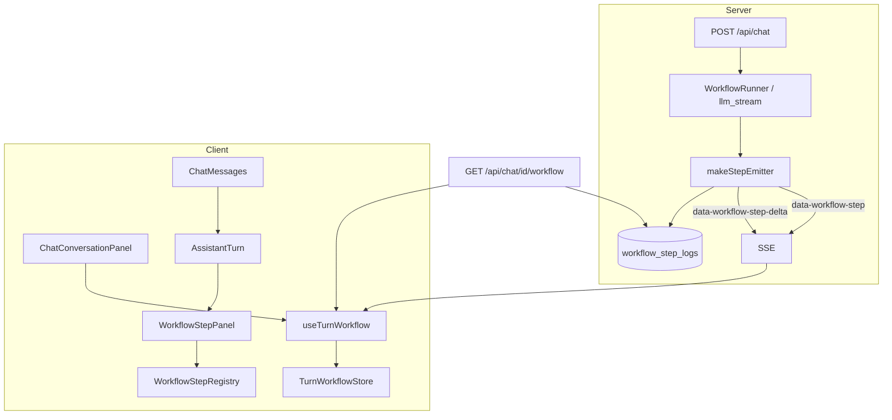
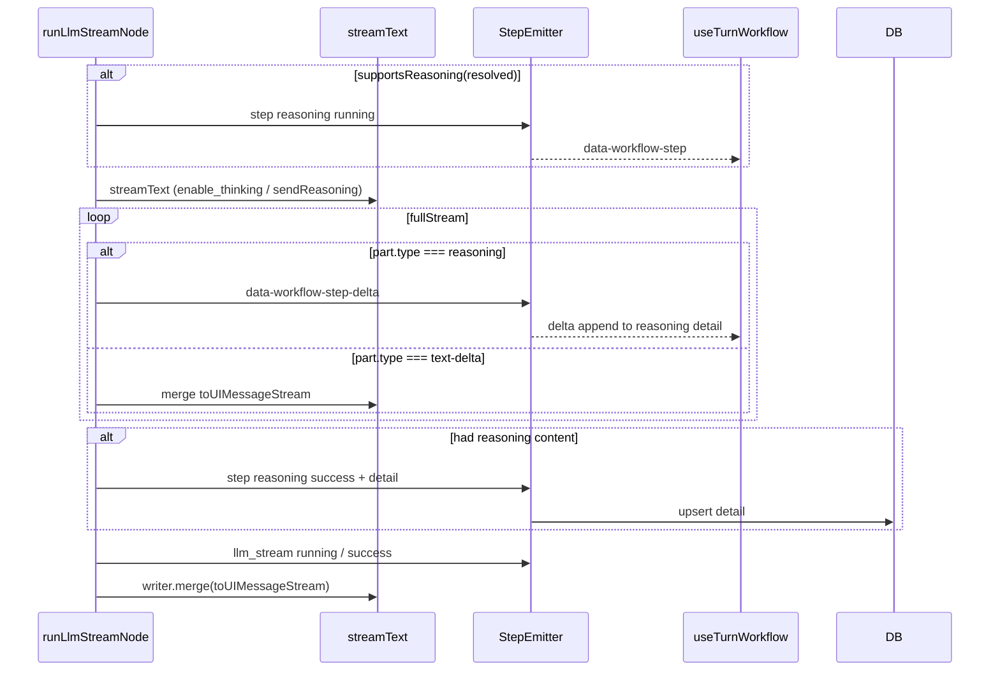
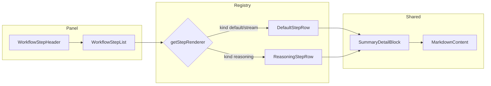

# Workflow 步骤 UI 重构 — 技术设计

> **English:** [workflow-step-ui.md](./workflow-step-ui.md)  
> **中文：** [workflow-step-ui-cn.md](./workflow-step-ui-cn.md)  
> **总纲：** [02-technical-design-cn.md](../02-technical-design-cn.md)  
> **PRD：** [prd/workflow-step-ui-cn.md](../prd/workflow-step-ui-cn.md)  
> **迭代：** iter-08

---

## 1. 设计目标

| 目标 | 手段 |
|------|------|
| 默认折叠、折叠头显示当前步骤 | `WorkflowStepPanel` + `computeStepPanelHeader()` |
| 摘要 Markdown 弱化 | `summary` / `detail` 分离 + `SummaryDetailBlock` |
| Reasoning 流式节点 | `llm_stream` 内桥接 AI SDK `reasoning` stream → step delta + DB |
| Registry 可扩展 UI | `workflow-step-registry.tsx` + `nodes/*` |
| 动态节点协议 | StepEvent 扩展字段；后端 catalog 填 `order`/`kind` |
| 三态统一 | 保留 `TurnWorkflowStore`；简化 normalize；同一 Panel |
| API/DB 整理 | migration + persistence 读写新列 |

**非目标：** 旧 4 步 run 回填；Preferences reasoning 开关；RAG/MCP 节点实现。

---

## 2. 架构总览



### 2.1 Reasoning 时序（iter-08 新增）



---

## 3. 数据库设计

### 3.1 Migration — `20260626000000_iter08_workflow_step_ui.sql`

```sql
-- Extend workflow_step_logs for iter-08 step UI protocol

ALTER TABLE public.workflow_step_logs
  ADD COLUMN IF NOT EXISTS detail TEXT,
  ADD COLUMN IF NOT EXISTS detail_format TEXT NOT NULL DEFAULT 'markdown'
    CHECK (detail_format IN ('plain', 'markdown')),
  ADD COLUMN IF NOT EXISTS kind TEXT NOT NULL DEFAULT 'default'
    CHECK (kind IN ('default', 'reasoning', 'stream')),
  ADD COLUMN IF NOT EXISTS sort_order INTEGER;

-- Replace status CHECK to include 'skipped'
ALTER TABLE public.workflow_step_logs
  DROP CONSTRAINT IF EXISTS workflow_step_logs_status_check;

ALTER TABLE public.workflow_step_logs
  ADD CONSTRAINT workflow_step_logs_status_check
  CHECK (status IN ('running', 'success', 'error', 'skipped'));

CREATE INDEX IF NOT EXISTS workflow_step_logs_run_order_idx
  ON public.workflow_step_logs (run_id, sort_order ASC NULLS LAST, started_at ASC);
```

### 3.2 字段说明

| 列 | 类型 | 说明 |
|----|------|------|
| `summary` | TEXT | 一行 headline（现有） |
| `detail` | TEXT | 正文；摘要 Markdown、Reasoning 全文 |
| `detail_format` | TEXT | `plain` \| `markdown` |
| `kind` | TEXT | `default` \| `reasoning` \| `stream` — 前端 renderer 键 |
| `sort_order` | INTEGER | 展示顺序；emit 时从 catalog 写入 |
| `status` | TEXT | + `skipped` |

### 3.3 兼容策略

| 场景 | 行为 |
|------|------|
| 旧行无 `detail` | REST 返回 `detail: undefined`；前端 `parseStepDetail()` 回退 `\n\n` 拆分 `summary` |
| 旧行无 `sort_order` | 排序用 `started_at ASC` |
| 旧行 `Skipped` 在 summary | 迁移 **不** 改历史；新 emit 用 `status: skipped` + `summary: Skipped` |

### 3.4 RLS

无变更；沿用 iter-06 `workflow_step_logs_*` policies。

---

## 4. 类型与协议

### 4.1 `WorkflowStepStatus`

```typescript
export type WorkflowStepStatus =
  | "running"
  | "success"
  | "error"
  | "skipped";
```

### 4.2 `WorkflowStepEvent`（扩展）

```typescript
export type WorkflowStepDetailFormat = "plain" | "markdown";
export type WorkflowStepKind = "default" | "reasoning" | "stream";

export type WorkflowStepEvent = {
  runId: string;
  nodeId: string;
  label: string;
  status: WorkflowStepStatus;
  summary?: string;
  detail?: string;
  detailFormat?: WorkflowStepDetailFormat;
  kind?: WorkflowStepKind;
  order?: number;
  error?: string;
  startedAt?: string;
  finishedAt?: string;
};
```

### 4.3 Stream data parts

| type | id | data | 用途 |
|------|-----|------|------|
| `data-workflow-step` | `{runId}:{nodeId}` | `WorkflowStepEvent` | 步骤状态变更（现有） |
| `data-workflow-step-delta` | `{runId}:{nodeId}` | `{ runId, nodeId, delta: string }` | Reasoning 流式增量（新增） |

客户端 `useChat` / `handleWorkflowData` 扩展处理 `data-workflow-step-delta` → `applyLiveStepDelta()`。

### 4.4 后端 Node Catalog — `lib/workflow/node-catalog.ts`

**单一来源**定义 pipeline 元数据（非 UI 硬编码顺序）：

```typescript
export const WORKFLOW_NODE_CATALOG: Record<
  string,
  { order: number; kind: WorkflowStepKind; label: string }
> = {
  validate_request: { order: 10, kind: "default", label: "Validating request" },
  load_context: { order: 20, kind: "default", label: "Loading conversation" },
  load_history_summary: { order: 30, kind: "default", label: "Loading memory summary" },
  resolve_model: { order: 40, kind: "default", label: "Resolving model" },
  reasoning: { order: 45, kind: "reasoning", label: "Reasoning" },
  llm_stream: { order: 50, kind: "default", label: "Generate response" },
  evaluate_summarization: { order: 60, kind: "default", label: "Evaluating context size" },
  summarize_history: { order: 70, kind: "stream", label: "Summarizing history" },
};
```

`makeStepEmitter` / `runner` emit 时合并 catalog 默认值（`order`、`kind`、`label`）。

**注意：** `reasoning` 节点 **不在** 固定 `runWorkflow` 数组中；由 `runLlmStreamNode` 按 capability 条件 emit。

### 4.5 Summary 拆分约定

| Node | summary | detail | detailFormat | status |
|------|---------|--------|--------------|--------|
| `summarize_history` · 执行 | `Summarized N turns · …` | Markdown 摘要正文 | markdown | success |
| `summarize_history` · 跳过 | `Skipped` | — | — | **skipped** |
| `load_history_summary` | `Summary loaded (…)` | 可选：summary 全文预览 | markdown | success |
| `reasoning` | — 或 `Thinking…` | 流式 reasoning 全文 | plain | running→success |

**实现：** 新增 `lib/workflow/step-payload.ts`：

```typescript
export function buildStepPayload(
  nodeId: string,
  partial: Partial<WorkflowStepEvent>,
): WorkflowStepEvent;

export function splitSummaryAndDetail(
  raw: string,
): { summary: string; detail?: string };
```

`post-llm-memory` 跳过路径改为 `status: "skipped"`，不再用 `success + summary: Skipped`。

---

## 5. API 设计

### 5.1 `GET /api/chat/[conversationId]/workflow`

**无路径变更。** 响应 steps 增加字段：

```json
{
  "runs": [
    {
      "run": { "id": "…", "status": "completed", "startedAt": "…" },
      "userMessageId": "…",
      "steps": [
        {
          "runId": "…",
          "nodeId": "resolve_model",
          "label": "Resolving model",
          "status": "success",
          "summary": "qwen-plus (bailian)",
          "detail": null,
          "detailFormat": "markdown",
          "kind": "default",
          "order": 40,
          "startedAt": "…",
          "finishedAt": "…"
        }
      ]
    }
  ]
}
```

`getStepLogsForRun` select 扩展新列；`stepLogToEvent` 映射。

### 5.2 `POST /api/chat`

无路由签名变更。Stream 内新增 `data-workflow-step-delta`（见 §4.3）。

### 5.3 Reasoning capability — `lib/llm/model-capabilities.ts`

```typescript
export function supportsReasoning(resolved: ResolvedUserModel): boolean;

export function getStreamTextProviderOptions(resolved: ResolvedUserModel): ProviderOptions | undefined;
```

**iter-08 首版规则（可扩展）：**

| Provider | 条件 |
|----------|------|
| bailian | model id 匹配已知 thinking 模型列表 **或** 配置表 `supports_reasoning`（可选列，首版 hardcode 列表） |
| 其他 | 返回 false；不 emit reasoning 节点 |

`getStreamTextProviderOptions` 改为接收 `resolved`：bailian + supports → `{ openai: { enable_thinking: true } }`。

### 5.4 `runLlmStreamNode` 变更要点

1. `resolve_model` 完成后 `ctx.resolved` 已知  
2. 若 `supportsReasoning(ctx.resolved)`：  
   - emit `reasoning` running（catalog 元数据）  
   - `streamText` + 消费 `result.fullStream`：  
     - `reasoning` / `reasoning-delta` → `writer.write({ type: 'data-workflow-step-delta', … })` + 内存累积  
     - 其余仍 `writer.merge(toUIMessageStream({ sendReasoning: false }))` — **避免 reasoning 重复出现在 assistant 正文区**  
   - 有累积内容 → emit `reasoning` success + `detail`  
   - 无内容 → **不** 写 reasoning step log（或 omit 节点）  
3. 现有 `llm_stream` step emit 不变  

---

## 6. 前端设计

### 6.1 组件树

```
ChatMessages
└── AssistantTurn
    ├── WorkflowStepPanel          # 默认 collapsed
    │   ├── WorkflowStepHeader     # 折叠头 + spinner/check/warning
    │   └── WorkflowStepList       # expanded 时
    │       └── WorkflowStepRow (via registry)
    │           ├── DefaultStepRow
    │           ├── ReasoningStepRow   # kind=reasoning
    │           └── SummaryDetailBlock # detail 子折叠
    ├── CompactThinking            # 无 steps 且无正文
    └── MarkdownContent            # 主回复
```

### 6.2 组件职责

| 组件 | 职责 |
|------|------|
| `WorkflowStepPanel` | `defaultExpanded={false}`；管理展开态；`aria-expanded` |
| `WorkflowStepHeader` | `computeStepPanelHeader(steps, phase)` → 文案 + 图标 |
| `WorkflowStepList` | 按 `sortSteps(steps)` 渲染；调 registry |
| `WorkflowStepRegistry` | `getStepRenderer(step)` → 组件 |
| `DefaultStepRow` | 图标 + label + summary headline |
| `SummaryDetailBlock` | Show/Hide summary；`MarkdownContent` + `text-xs text-muted` |
| `ReasoningStepRow` | 同 Default + 展开区流式/打字机 `detail` |

**删除 /  deprecate：** `components/chat/workflow-step-timeline.tsx`（迁移后移除或 re-export 兼容）。

### 6.3 折叠头算法 — `lib/workflow/step-panel-header.ts`

```typescript
export type StepPanelHeader = {
  title: string;       // e.g. "Workflow · Resolving model…"
  variant: "running" | "success" | "error";
};

export function computeStepPanelHeader(
  steps: WorkflowStepEvent[],
  options: { isSettled: boolean },
): StepPanelHeader;
```

| 优先级 | 条件 | title |
|--------|------|-------|
| 1 | 存在 `status === running'`（非 skipped） | `Workflow · {label}…` |
| 2 | `isSettled` 且有 error | `Workflow · {n} steps · {e} failed` |
| 3 | `isSettled` | `Workflow · {n} steps completed` |
| 4 | 否则最后一条 `success` 非 skipped | `Workflow · {label}…`（步骤间隙） |

`skipped` **不参与** running 头选取。

### 6.4 步骤排序 — `lib/workflow/sort-steps.ts`

```typescript
export function sortSteps(steps: WorkflowStepEvent[]): WorkflowStepEvent[];
```

1. 有 `order` → 升序  
2. 否则 `startedAt` 升序  
3. 同 order 用 `startedAt` tie-break  

**移除** `WORKFLOW_NODE_ORDER` 作为展示排序来源。  
**保留** `WORKFLOW_FINAL_NODE_ID` + `POST_LLM_NODE_IDS` **仅用于** `isTurnWorkflowSettled()`（结算检测，文档化待 iter-09 改为 run.status 驱动）。

### 6.5 `AssistantTurn` 变更

```typescript
// Before
const showStepsExpanded = hasSteps && phase === "active";
const showStepsCollapsed = hasSteps && phase === "completed";

// After
{hasSteps ? (
  <WorkflowStepPanel
    steps={steps}
    phase={phase}
    defaultExpanded={false}
  />
) : null}
```

进行中 / 完成后 **同一组件**，均默认折叠。

### 6.6 状态机 — `turn-workflow.ts` 增量

| 函数 | 变更 |
|------|------|
| `applyLiveStepDelta` | **新增** — 合并 delta 到 `step.detail` |
| `normalizeTurnSteps` | 改用 `sortSteps`；legacy running 修复保留 |
| `mergeWorkflowStep` | 合并时保留 `detail` 追加（delta 路径） |
| `parseStepDetail(step)` | **新增** — legacy `\n\n` 回退 |

`useTurnWorkflow.handleWorkflowData` 分支：

```typescript
if (dataPart.type === "data-workflow-step-delta") { … }
if (dataPart.type === "data-workflow-step") { … }
```

### 6.7 三态数据流

| 场景 | store | Panel 头 | 展开 |
|------|-------|----------|------|
| Live stream | `live.steps` | running 步骤 | 用户手动 |
| 刷新 · run running | restore merge + resume | 同 live | 不自动展开 |
| 历史 | `completed[userMsgId]` | settled 摘要 | 用户手动 |

`ChatConversationPanel` 无需改 key；`useTurnWorkflow` 在 mount / status ready 时 restore 不变。

### 6.8 样式

- 折叠头：`font-mono text-xs text-muted`（延续 iter-06）  
- Detail：`MarkdownContent className="text-xs text-[var(--text-muted)] max-h-48 overflow-auto"`  
- Skipped row：`opacity-60` + `StepIcon` 用 dash 或 minus  
- 遵循 `design-system/pages/chat.md`（若存在）

---

## 7. 后端文件变更

### 7.1 新增

| 路径 | 说明 |
|------|------|
| `supabase/migrations/20260626000000_iter08_workflow_step_ui.sql` | DB 扩展 |
| `lib/workflow/node-catalog.ts` | order / kind / label |
| `lib/workflow/step-payload.ts` | buildStepPayload / splitSummaryAndDetail |
| `lib/workflow/sort-steps.ts` | 共享排序（server 测试可复用） |
| `lib/llm/model-capabilities.ts` | supportsReasoning |
| `components/chat/workflow/*` | UI 模块 |

### 7.2 修改

| 路径 | 说明 |
|------|------|
| `lib/workflow/types.ts` | 扩展类型；export sort 工具 re-export |
| `lib/workflow/emit-step.ts` | catalog 合并；delta writer  helper |
| `lib/workflow/persistence.ts` | 读写新列 |
| `lib/workflow/nodes/llm-stream.ts` | reasoning bridge |
| `lib/workflow/nodes/post-llm-memory.ts` | skipped status；summary/detail 拆分 |
| `lib/workflow/nodes/summarize-history.ts` | 返回 `{ summary, detail }` |
| `lib/llm/stream-options.ts` | 接受 resolved |
| `lib/chat/turn-workflow.ts` | delta + sort + parseStepDetail |
| `lib/chat/use-turn-workflow.ts` | handle delta part |
| `components/chat/assistant-turn.tsx` | 使用 WorkflowStepPanel |
| `tests/unit/**` | 新工具函数 + 回归 |

---

## 8. 实现顺序

1. Migration + `types.ts` + `persistence.ts`  
2. `node-catalog` + `step-payload` + runner/emit 集成  
3. `post-llm-memory` skipped + summarize detail 拆分  
4. `sort-steps` + `step-panel-header` 单元测试  
5. 前端 `components/chat/workflow/` + `AssistantTurn`  
6. `turn-workflow` delta + restore 字段  
7. `model-capabilities` + `llm-stream` reasoning bridge  
8. E2E 更新（折叠默认态、展开、回归 iter-06/07）  

---

## 9. 测试计划（§11）

| 层级 | 范围 |
|------|------|
| Unit | `sortSteps`, `computeStepPanelHeader`, `parseStepDetail`, `applyLiveStepDelta`, `buildStepPayload`, skipped emit |
| Unit | `turn-workflow` normalize + settled 回归 |
| E2E | 发送消息 → 面板默认折叠 → 头含步骤名 → 可展开 |
| E2E | 长对话摘要步骤 → detail Markdown muted |
| E2E | 刷新 mid-run → 头恢复（现有 stream-resume 用例扩展） |
| Manual | Reasoning 模型（Bailian thinking 模型）流式 + 历史展开 |

---

## 10. 风险与缓解

| 风险 | 缓解 |
|------|------|
| Reasoning provider 差异 | 首版 bailian thinking 列表 + manual QA；无内容 omit 节点 |
| Delta 丢包 / 乱序 | delta 仅 append；finalize 以 success event 的 detail 为准 |
| 旧 E2E 断言展开列表 | 更新 selector：先点折叠头再断言步骤 |
| `isTurnWorkflowSettled` 仍依赖 nodeId | 文档化；iter-08 不改为 run.status-only |

---

## 11. 组件关系图（Registry）



---

## 12. PRD 验收映射

| AC ID | 实现要点 | 验证方式 |
|-------|----------|----------|
| AC-80 | `WorkflowStepPanel defaultExpanded={false}` + `computeStepPanelHeader` running 分支 | e2e + unit |
| AC-81 | header settled 分支：`N steps completed` / error 计数 | e2e + unit |
| AC-82 | Header button toggles `expanded` state | e2e |
| AC-83 | `SummaryDetailBlock` + `detailFormat: markdown` + muted classes | e2e + manual |
| AC-84 | `llm-stream` reasoning emit + delta + `ReasoningStepRow` typewriter | manual + unit delta |
| AC-85 | `supportsReasoning` false → 无 reasoning emit | unit |
| AC-86 | restore API 新字段 + merge；resume 不变 | e2e（现有 workflow refresh） |
| AC-87 | `completed` store + Panel 默认折叠；REST detail | e2e |
| AC-88 | `status: skipped` + muted row；header 忽略 skipped | unit + e2e |
| AC-89 | 全量 `pnpm test` + `CI=1 pnpm test:e2e` | automated |

---

## 13. 修订记录

| 日期 | 变更 |
|------|------|
| 2026-06-26 | iter-08 技术设计初稿 |
