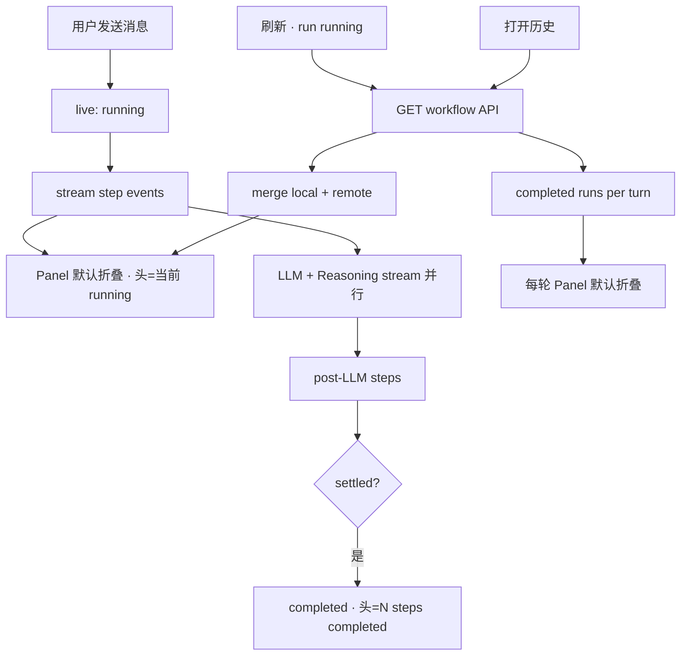

# Workflow 步骤 UI 重构

> **English:** [workflow-step-ui.md](./workflow-step-ui.md)  
> **中文：** [workflow-step-ui-cn.md](./workflow-step-ui-cn.md)  
> **总纲：** [01-product-requirements-cn.md](../01-product-requirements-cn.md)  
> **迭代：** iter-08  
> **关联：** [workflow-orchestration-cn.md](./workflow-orchestration-cn.md) · [history-summarization-cn.md](./history-summarization-cn.md)

---

## 1. 范围

| ID | 功能 | 优先级 |
|----|------|--------|
| F-63 | 默认折叠步骤面板 | P0 |
| F-64 | 摘要 Markdown 弱化展示 | P0 |
| F-65 | Reasoning 流式节点 | P1 |
| F-66 | 前端组件 Registry 分层 | P0 |
| F-67 | 动态节点协议（API 驱动） | P0 |
| F-68 | 三态展示统一（live / 刷新 / 历史） | P0 |
| F-69 | API & DB 步骤 schema 整理 | P0 |

---

## 2. 背景与目标

### 2.1 背景

iter-06/07 建立了 Workflow 编排与 7 步节点链路，步骤 UI 在 `AssistantTurn` 内实现：进行中 **默认展开** 完整步骤列表，完成后折叠为「N steps completed」。摘要 detail 通过 `\n\n` 拆分后以 `<pre>` 纯文本展示。节点顺序在前端 `WORKFLOW_NODE_ORDER` 硬编码，组件集中在单文件，新增节点需改多处，状态合并逻辑（live / completed / restore）分散且易出边界 bug。

### 2.2 目标

- 降低步骤 UI 对用户的注意力干扰：**默认折叠**，折叠头显示当前步骤与状态
- 提升摘要可读性：**Markdown + 弱化样式**
- 为支持 thinking 的模型提供 **Reasoning 流式节点**
- 前端 **Registry 驱动** 渲染，后端 **协议驱动** 节点列表，便于后续 RAG/MCP 等节点扩展
- 统一 **对话中 / 刷新恢复 / 历史** 三种场景的展示与状态机

### 2.3 非目标（Out of Scope）

- Workflow 可视化编辑器
- 用户 Preferences「Show reasoning」开关（首版按模型能力自动决定）
- Reasoning 进行中自动展开（与整体一致，默认折叠）
- 历史 iter-06 仅 4 步 run 的数据回填
- RAG / MCP / Skills 新节点实现（仅预留 registry 插槽）
- 摘要多版本 Drawer

---

## 3. 用户故事

| ID | 故事 | 优先级 |
|----|------|--------|
| US-63 | 作为用户，AI 回复过程中步骤面板默认折叠，折叠头显示当前正在执行的步骤，避免步骤列表分散注意力 | P0 |
| US-64 | 作为用户，回复完成后步骤面板仍默认折叠，可点击展开查看每步详情 | P0 |
| US-65 | 作为用户，展开步骤后摘要正文以 Markdown 呈现且视觉弱于主回复 | P0 |
| US-66 | 作为用户，使用支持推理的模型时能看到 Reasoning 步骤流式更新，展开时有打字机效果 | P1 |
| US-67 | 作为用户，对话进行中刷新页面后，折叠头仍正确反映当前步骤 | P0 |
| US-68 | 作为用户，打开历史对话时每轮 assistant 步骤默认折叠且与 DB 一致 | P0 |
| US-69 | 作为开发者，新增 workflow 节点时只需后端 emit + 前端 registry 注册，无需改 Panel/List 核心 | P1 |

---

## 4. 产品决策（iter-08 已确认）

| 项 | 决策 |
|----|------|
| Q1 折叠头信息密度 | **仅当前步骤** — 如 `Resolving model…`（不含 N/M 进度） |
| Q2 Skipped 步骤 | **仍显示** — muted + `skipped` 状态；不占折叠头「当前步骤」 |
| Q3 Reasoning 触发 | **模型 capability 自动** — 无 reasoning 内容则不 emit / 不显示 |
| Q4 Reasoning 默认展开 | **默认折叠** — 折叠头在 reasoning 阶段显示 `Reasoning…` |
| Q5 Reasoning 持久化 | **持久化全文** — 写入 `workflow_step_logs`，历史可展开查看 |
| Q6 旧 4 步 run | **不回填** — 按现有 DB 展示 |

---

## 5. 功能需求

### 5.1 F-63 默认折叠步骤面板

**位置：** `/chat/[conversationId]`，assistant 回复气泡内步骤区（与 iter-06 同区域）。

**折叠头（Collapsed Header）— English 示例：**

| 场景 | 文案示例 |
|------|----------|
| 进行中 · 某步 running | `Workflow · Resolving model…` + spinner |
| 进行中 · reasoning | `Workflow · Reasoning…` + spinner |
| 全部成功 | `Workflow · 7 steps completed` + check |
| 含 error | `Workflow · 6 steps · 1 failed` + warning |

**规则：**

- 有步骤时 **始终** 渲染折叠头；**默认 collapsed**
- 折叠头显示 **当前 running 步骤的 label**；若无 running，显示 **最后完成的步骤 label** 或完成摘要（`N steps completed` / error 计数）
- **Skipped 步骤** 不参与折叠头「当前步骤」选取
- 用户点击折叠头可展开/收起完整步骤列表
- 进行中与完成后 **交互一致**（均默认折叠）
- 用户可见文案 **English**

**与 iter-06 差异：**

| iter-06/07 | iter-08 |
|------------|---------|
| 进行中展开完整列表 | 进行中默认折叠 |
| 完成后折叠 | 完成后仍默认折叠（不变） |

---

### 5.2 F-64 摘要 Markdown 弱化展示

**现状：** `summary` 字段内 `\n\n` 前为 headline、之后为 detail；detail 用 `<pre>` 纯文本。

**目标：**

- 后端 emit **`summary`（headline）** 与 **`detail`（正文）** 分离字段（技术设计定 migration；过渡期可兼容 `\n\n` 拆分）
- `detailFormat: markdown` 时前端用 Markdown 渲染
- 视觉：**小号字体 + muted 色**（弱于 assistant 主回复）
- 每步 detail 仍 **子折叠**（Show summary / Hide summary），不默认展开 detail

---

### 5.3 F-65 Reasoning 流式节点

**触发：** 当前 resolved 模型 **capability 含 reasoning/thinking** 且 provider 返回 reasoning 内容时，workflow 在 `llm_stream` 之前或并行 emit **`reasoning`** 节点（技术设计定时序）。

**展示：**

| 状态 | UI |
|------|-----|
| `running` | 折叠头 `Reasoning…`；展开后流式文本 + 打字机效果 |
| `success` | 折叠头不再停留 Reasoning；展开可查看完整 reasoning 文本 |
| 无内容 | **不 emit** 该节点 |

**流式：**

- Reasoning 内容与 LLM 回复 token **并行** stream（经 AI SDK custom data part 或等价机制）
- 展开态使用与主回复类似的 **逐字/逐块** 更新（typewriter）

**持久化：**

- Reasoning 全文写入 `workflow_step_logs`（`detail` 或专用列，技术设计定）
- 历史对话展开 Reasoning 步骤可查看已持久化全文（只读，无 replay stream）

**首版不做：** Preferences 开关；Bailian 等 provider 的 `enable_thinking` 由 capability 决定（支持则 true）。

---

### 5.4 F-66 前端组件 Registry 分层

**目标结构（产品层）：**

```
components/chat/workflow/
  workflow-step-panel.tsx      # 折叠头 + 展开容器
  workflow-step-list.tsx       # 有序步骤列表
  workflow-step-registry.tsx   # nodeId / kind → renderer
  nodes/
    default-step-row.tsx
    summary-detail-block.tsx   # Markdown muted
    reasoning-step-row.tsx     # stream typewriter
```

**Registry 规则：**

- 已知 `nodeId` 或 `kind` → 专用 renderer
- 未知 → `DefaultStepRow`
- 新增节点 = 后端 emit +（可选）registry 注册；**不修改** Panel/List 核心循环

**交付物（设计阶段）：** 组件关系图（mermaid 或等价）写入 `design/workflow-step-ui-cn.md`。

---

### 5.5 F-67 动态节点协议

前端 **不包含**「本轮会出现哪些 nodeId」的业务分支；仅包含「如何渲染每种 kind」。

**StepEvent 扩展（产品层字段）：**

| 字段 | 必填 | 说明 |
|------|------|------|
| `runId` | ✓ | 同 iter-06 |
| `nodeId` | ✓ | 节点标识 |
| `label` | ✓ | English 展示名 |
| `status` | ✓ | `running` \| `success` \| `error` \| **`skipped`**（新增） |
| `summary` | | 一行 headline |
| `detail` | | 可选正文（Markdown） |
| `detailFormat` | | `plain` \| `markdown`（默认 markdown 当 detail 存在） |
| `kind` | | `default` \| `reasoning` \| `stream` — 决定 renderer |
| `order` | | 可选排序权重；缺省时按 emit 顺序 |
| `error` | | error 时用户友好 English |
| `startedAt` / `finishedAt` | | ISO 时间 |

**顺序：**

- 后端 runner 按流水线 emit；前端按 **`order` 或收到顺序** 排列
- 移除前端硬编码 `WORKFLOW_NODE_ORDER` 作为 **展示顺序的唯一来源**（normalize 逻辑可保留为兼容层，技术设计定）

---

### 5.6 F-68 三态展示统一

三种场景 **同一套** `WorkflowStepPanel` + `TurnWorkflowStore`：



| 场景 | 折叠头 | 步骤数据来源 |
|------|--------|--------------|
| 对话进行中 | 当前 running 步骤 | live stream + store |
| 对话中刷新 | 恢复后当前 running | API restore + resume stream |
| 历史对话 | `N steps completed` | API restore → completed |

**规则：**

- 刷新后 **不** 自动展开步骤列表
- 历史消息 **不** 重复展示无 workflow 绑定的 assistant 消息步骤区
- error run：折叠头含 failed 计数；展开可见失败步骤

---

### 5.7 F-69 API & DB 整理

**API：**

- `GET /api/chat/[conversationId]/workflow` 返回步骤含新字段（`detail`、`detailFormat`、`kind`、`status: skipped`）
- stream 中 `data-workflow-step` 与 reasoning delta 事件 schema 与 REST 一致（技术设计定 reasoning part 类型）

**DB（`workflow_step_logs`）：**

- 扩展列或 JSON metadata 存 `detail`、`detail_format`、`kind`、reasoning 全文（技术设计 + migration）
- `status` 枚举增加 `skipped`（若当前 CHECK 约束需 migration）

**Out of Scope：** 旧 run 数据 migration 回填。

---

## 6. 页面与交互

### 6.1 路由

无新增页面；变更限于 `/chat/[conversationId]` assistant 气泡内。

### 6.2 关键 UI 状态

| 状态 | 表现 |
|------|------|
| 无步骤 | 不渲染 Panel（与现网一致） |
| 有步骤 · 折叠 | 折叠头 + spinner/check/warning |
| 有步骤 · 展开 | 纵向时间线 + 各步 renderer |
| 步骤 detail 子折叠 | Show summary → Markdown muted 区 |
| Reasoning 展开 | 流式/打字机文本区 |
| 全局 Thinking | 无步骤且无正文时仍显示 CompactThinking（iter-06 行为保留） |

### 6.3 无障碍

- 折叠头 `aria-expanded`
- 进行中折叠头 `role="status"` + `aria-live="polite"`

---

## 7. 验收标准

> 定义态 `[ ]`；测试通过后由 **qa-engineer** 勾选 [changelog/iter-08-cn.md](../changelog/iter-08-cn.md) §5。

- [ ] **AC-80** — 助手回复进行中，步骤面板 **默认折叠**；折叠头显示当前 running 步骤名 + loading
- [ ] **AC-81** — 步骤全部完成后，面板 **默认折叠**；折叠头显示「N steps completed」或 error 计数
- [ ] **AC-82** — 用户可点击折叠头展开/收起完整步骤列表
- [ ] **AC-83** — 摘要 detail 以 **Markdown** 渲染，视觉弱于正文（小字号或 muted）
- [ ] **AC-84** — 支持 reasoning 的模型：出现 **Reasoning** 步骤，内容流式更新；展开时有打字机效果
- [ ] **AC-85** — 不支持 reasoning 的模型：不出现 Reasoning 步骤
- [ ] **AC-86** — 对话进行中刷新：折叠头正确反映恢复后的当前步骤；后续 stream 继续
- [ ] **AC-87** — 历史对话：每轮 assistant 步骤默认折叠，展开后与 DB 一致
- [ ] **AC-88** — Skipped 步骤（如 Summarizing history: Skipped）在列表中 muted 显示，不占折叠头当前步骤
- [ ] **AC-89** — iter-06/07 workflow 相关 E2E 回归通过

---

## 8. 修订记录

| 日期 | 变更 |
|------|------|
| 2026-06-26 | 初稿 — 用户确认按推荐默认值 |
