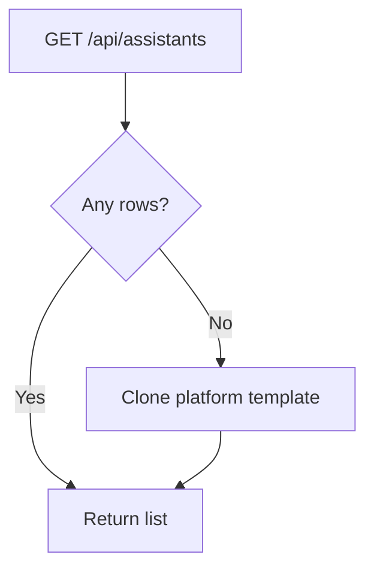

# Assistants — Technical Design

> **English:** [assistants.md](./assistants.md)  
> **中文:** [assistants-cn.md](./assistants-cn.md)  
> **Index:** [02-technical-design.md](../02-technical-design.md)  
> **Iteration:** iter-03

---

## 1. Schema Migration

File: `supabase/migrations/20260617000000_console_user_profiles_assistants.sql`

### 1.1 Alter `assistants`

```sql
ALTER TABLE public.assistants
  ADD COLUMN user_id UUID REFERENCES auth.users(id) ON DELETE CASCADE;

-- Drop global single-default index; per-user default optional later
DROP INDEX IF EXISTS assistants_single_default_idx;

CREATE INDEX assistants_user_id_idx ON public.assistants (user_id);

-- Platform template row keeps user_id NULL (existing seed)
```

### 1.2 RLS updates

Replace broad `assistants_select_authenticated` with:

| Policy | Op | Rule |
|--------|-----|------|
| `assistants_select_own` | SELECT | `user_id = auth.uid()` |
| `assistants_insert_own` | INSERT | `user_id = auth.uid()` |
| `assistants_update_own` | UPDATE | `user_id = auth.uid()` |
| `assistants_delete_own` | DELETE | `user_id = auth.uid()` |

Platform templates (`user_id IS NULL`): not selectable by RLS for normal users.

### 1.3 `updated_at` trigger on assistants

Reuse `set_updated_at` trigger on `assistants`.

---

## 2. Seed Helper

`lib/console/assistants.ts`:

```typescript
export async function ensureUserAssistants(userId: string): Promise<AssistantRow[]>
```

1. SELECT assistants WHERE `user_id = userId`
2. If count > 0, return list
3. Else SELECT platform template WHERE `user_id IS NULL AND is_default = true`
4. INSERT copy: same `name`, `system_prompt`, `model`; `user_id = userId`, `is_default = false`
5. Return user's assistants

Called from `GET /api/assistants` and optionally before picker.

---

## 3. API

### `GET /api/assistants`

- Auth required
- Runs `ensureUserAssistants`
- Returns `{ assistants: [{ id, name, system_prompt, updated_at }] }`

### `POST /api/assistants`

```json
{ "name": "Code helper", "systemPrompt": "You are..." }
```

- Validate name 1–64 chars, prompt non-empty
- INSERT with `user_id = auth.uid()`

### `PATCH /api/assistants/[id]`

```json
{ "name": "...", "systemPrompt": "..." }
```

- Verify `user_id = auth.uid()`

### `DELETE /api/assistants/[id]`

- Count conversations WHERE `assistant_id = id AND user_id = auth.uid()`
- If count > 0 → **409** `{ error, chatCount }`
- Else DELETE

---

## 4. UI

`app/console/assistants/page.tsx` + `components/console/assistants-manager.tsx`:

- List with Edit / Delete actions
- Modal or inline form for Create / Edit
- Delete uses confirm dialog; show API error on 409

Async mutations (including initial load) use **page-level busy** — [console-shell.md](./console-shell.md) §8.

---

## 5. Flow



---

## 6. Legacy Data

- Existing conversations may reference global assistant (`user_id NULL`)
- No migration of old rows; chat still resolves assistant by id
- New conversations must use user's own assistant ids only

---

## 7. Files

| Action | Path |
|--------|------|
| Add | `supabase/migrations/20260617000000_console_user_profiles_assistants.sql` |
| Add | `lib/console/assistants.ts` |
| Add | `app/api/assistants/route.ts`, `app/api/assistants/[id]/route.ts` |
| Add | `components/console/assistants-manager.tsx`, `assistant-form-dialog.tsx` |
| Add | `app/console/assistants/page.tsx` |
| Mod | Drop/replace old assistants RLS in migration |

---

## 8. Revision History

| Date | Change |
|------|--------|
| 2026-06-16 | Initial |
| 2026-06-17 | §4 — console-shell §8 page-level busy |
