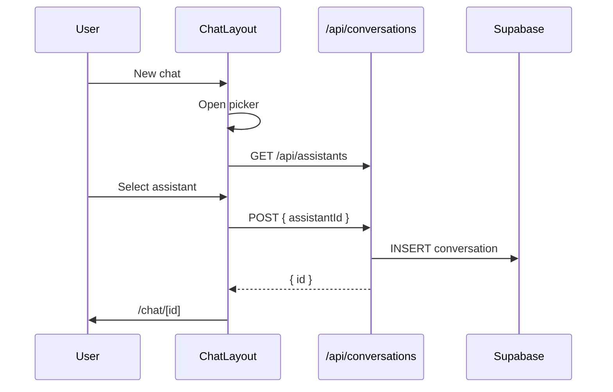

# Chat Integration

> **English:** [chat-integration.md](./chat-integration.md)  
> **中文:** [chat-integration-cn.md](./chat-integration-cn.md)  
> **Index:** [02-technical-design.md](../02-technical-design.md)  
> **Iteration:** iter-03

---

## 1. New Chat Picker

`components/chat/assistant-picker-dialog.tsx` (client):

```typescript
interface AssistantPickerDialogProps {
  open: boolean;
  onOpenChange: (open: boolean) => void;
  onSelect: (assistantId: string) => void;
}
```

- On open: `GET /api/assistants`
- Radio/list of assistant names
- **Create chat** disabled until selection
- Cancel closes without navigation

**`chat-layout.tsx` changes:**

- `handleNewChat` opens picker instead of immediate POST
- On select: `POST /api/conversations` `{ assistantId }` → navigate

---

## 2. Conversations API

`POST /api/conversations`:

```typescript
const body = await req.json().catch(() => ({}));
const { assistantId } = body;

if (!assistantId) {
  return NextResponse.json({ error: "assistantId is required" }, { status: 422 });
}

// Verify assistant belongs to user
const { data: assistant } = await supabase
  .from("assistants")
  .select("id")
  .eq("id", assistantId)
  .eq("user_id", user.id)
  .single();

if (!assistant) return 404;
```

`lib/chat/conversations.ts`:

```typescript
export async function createConversation(userId: string, assistantId: string)
```

Remove `getDefaultAssistant()` from create path.

---

## 3. Chat Index `/chat`

`app/chat/page.tsx` currently auto-creates conversation. Options:

**Chosen:** Redirect to latest conversation OR show empty chat shell with picker on first message / New chat only.

- Keep: if latest exists → redirect
- If no conversations: render empty state with **New chat** CTA (opens picker), do not auto-create with global assistant

---

## 4. Model + Prompt in Chat Route

`app/api/chat/route.ts`:

```typescript
const profile = await getUserProfile(user.id);
const model = getChatModel(assistant.model, profile?.preferred_model);
// system: assistant.system_prompt (unchanged)
```

---

## 5. Sequence



---

## 6. Files

| Action | Path |
|--------|------|
| Add | `components/chat/assistant-picker-dialog.tsx` |
| Mod | `components/chat/chat-layout.tsx` |
| Mod | `app/api/conversations/route.ts` |
| Mod | `lib/chat/conversations.ts` |
| Mod | `app/chat/page.tsx` |
| Mod | `app/api/chat/route.ts` |

---

## 7. Revision History

| Date | Change |
|------|--------|
| 2026-06-16 | Initial |
