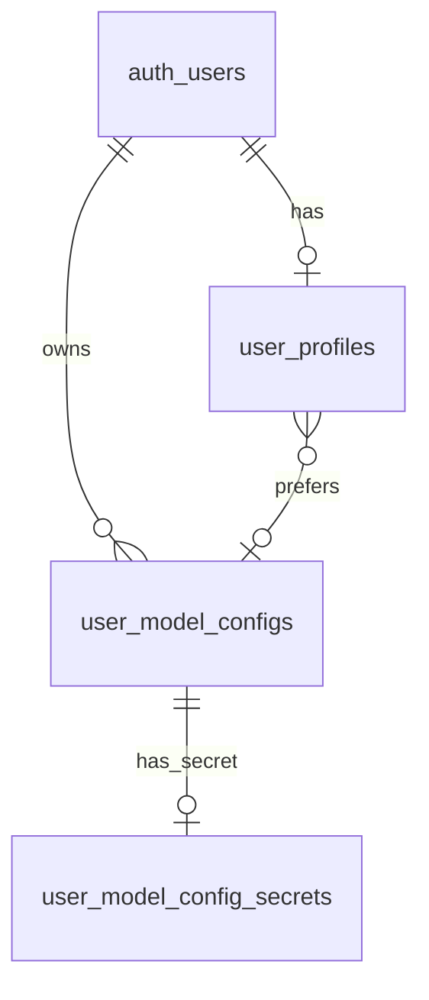
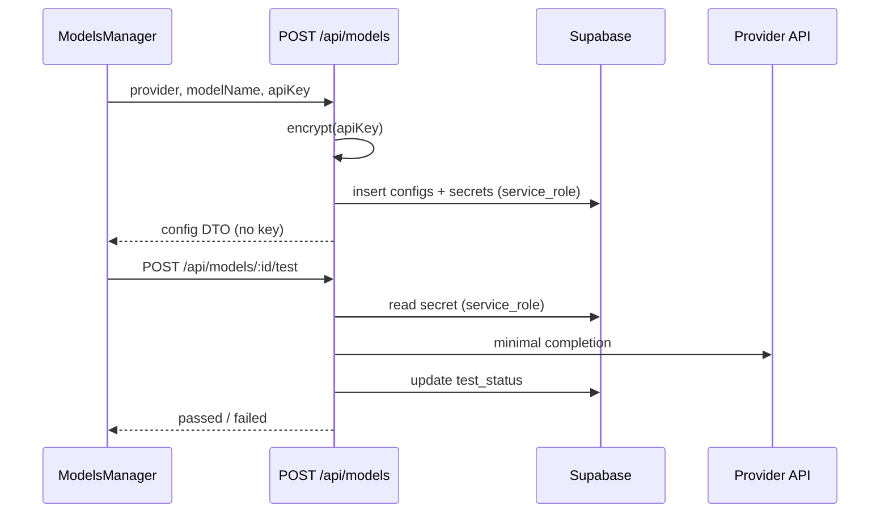

# Models — 技术设计

> **English:** [models.md](./models.md)  
> **中文：** [models-cn.md](./models-cn.md)  
> **总纲：** [02-technical-design-cn.md](../02-technical-design-cn.md)  
> **PRD：** [prd/models-cn.md](../prd/models-cn.md)  
> **迭代：** iter-05

---

## 1. 设计目标

- 用户 BYOK：每 Model 独立 API Key，**服务端加密**存储，浏览器永不读取密文
- Models 元数据 CRUD 走 iter-04 浏览器分层；**含 Key 的写操作**走 Node API
- 模型测试走 Node API；仅 `passed` 可被 Profile / Chat 消费
- 平台默认 Bailian `qwen3.6-plus` 为**虚拟行**（不入库），Key 来自 env `BAILIAN_API_KEY`

---

## 2. 开放问题决议

| ID | 决议 |
|----|------|
| OQ-01 | **应用层 AES-256-GCM**，密钥 env `LLM_ENCRYPTION_KEY`（32 字节，base64）；密文存独立表，仅 `service_role` 服务端读写 |
| OQ-02 | **虚拟平台默认行**：服务层合并注入，固定 sentinel ID；`user_profiles.preferred_model_config_id IS NULL` 表示选用平台默认 |
| OQ-03 | **禁止重复**：`UNIQUE (user_id, provider, model_name)` |

---

## 3. 数据库

### 3.1 新表 `user_model_configs`

```sql
CREATE TABLE public.user_model_configs (
  id            UUID PRIMARY KEY DEFAULT gen_random_uuid(),
  user_id       UUID NOT NULL REFERENCES auth.users(id) ON DELETE CASCADE,
  provider      TEXT NOT NULL
                CHECK (provider IN ('bailian', 'deepseek', 'siliconflow', 'openai')),
  model_name    TEXT NOT NULL CHECK (char_length(trim(model_name)) BETWEEN 1 AND 128),
  test_status   TEXT NOT NULL DEFAULT 'untested'
                CHECK (test_status IN ('untested', 'passed', 'failed')),
  tested_at     TIMESTAMPTZ,
  test_error    TEXT CHECK (test_error IS NULL OR char_length(test_error) <= 500),
  api_key_set   BOOLEAN NOT NULL DEFAULT false,
  created_at    TIMESTAMPTZ NOT NULL DEFAULT now(),
  updated_at    TIMESTAMPTZ NOT NULL DEFAULT now(),
  CONSTRAINT user_model_configs_unique_model
    UNIQUE (user_id, provider, model_name)
);

CREATE INDEX user_model_configs_user_id_idx
  ON public.user_model_configs (user_id);

CREATE TRIGGER user_model_configs_updated_at
  BEFORE UPDATE ON public.user_model_configs
  FOR EACH ROW EXECUTE FUNCTION public.set_updated_at();
```

### 3.2 新表 `user_model_config_secrets`（仅服务端）

```sql
CREATE TABLE public.user_model_config_secrets (
  config_id           UUID PRIMARY KEY
                      REFERENCES public.user_model_configs(id) ON DELETE CASCADE,
  api_key_ciphertext  TEXT NOT NULL,
  updated_at          TIMESTAMPTZ NOT NULL DEFAULT now()
);

-- 启用 RLS，不为 authenticated 建策略 → 浏览器 anon/authenticated 无法访问
ALTER TABLE public.user_model_config_secrets ENABLE ROW LEVEL SECURITY;
```

服务端使用 `createServiceClient()`（`service_role`）读写密文。

### 3.3 `user_profiles` 变更

```sql
ALTER TABLE public.user_profiles
  ADD COLUMN preferred_model_config_id UUID
    REFERENCES public.user_model_configs(id) ON DELETE SET NULL;

ALTER TABLE public.user_profiles
  DROP COLUMN preferred_model;
```

- `preferred_model_config_id IS NULL` → 平台默认 Bailian `qwen3.6-plus`
- 删除被引用的 config 时 FK `ON DELETE SET NULL` → 回退平台默认

### 3.4 RLS — `user_model_configs`

| 策略 | 操作 | 条件 |
|------|------|------|
| `user_model_configs_select_own` | SELECT | `user_id = auth.uid()` |
| `user_model_configs_insert_own` | INSERT | `user_id = auth.uid()` |
| `user_model_configs_update_own` | UPDATE | `user_id = auth.uid()` |
| `user_model_configs_delete_own` | DELETE | `user_id = auth.uid()` |

浏览器 `SELECT` 列：`id, user_id, provider, model_name, test_status, tested_at, test_error, api_key_set, created_at, updated_at`（**不含** secrets 表）。

### 3.5 ER



---

## 4. Provider 常量

扩展 `lib/llm/provider.ts`：

| Provider ID | Base URL（默认） | 平台 env Key（仅平台默认） |
|-------------|------------------|---------------------------|
| `bailian` | `https://dashscope.aliyuncs.com/compatible-mode/v1` | `BAILIAN_API_KEY` |
| `deepseek` | `https://api.deepseek.com/v1` | — |
| `siliconflow` | `https://api.siliconflow.cn/v1` | — |
| `openai` | `https://api.openai.com/v1` | — |

展示名映射：`lib/constants/model-providers.ts`（新建）

```typescript
export const PLATFORM_DEFAULT_CONFIG_ID =
  "00000000-0000-0000-0000-000000000001" as const;

export const PLATFORM_DEFAULT = {
  id: PLATFORM_DEFAULT_CONFIG_ID,
  provider: "bailian" as const,
  modelName: "qwen3.6-plus",
  testStatus: "passed" as const,
  isPlatformDefault: true,
  apiKeySet: true, // derived from env at runtime
};
```

---

## 5. API Key 加密

`lib/llm/encryption.ts`（新建）：

| 项 | 选择 |
|----|------|
| 算法 | AES-256-GCM |
| 密钥 | `LLM_ENCRYPTION_KEY` — 32 字节 random，base64 编码存入 env |
| 存储格式 | `base64(iv):base64(ciphertext):base64(authTag)` |
| 解密 | 仅 `lib/llm/secrets.ts` 服务端调用 |

**禁止：** 浏览器、Supabase anon client、任何 `SELECT` 返回密文。

### 5.1 服务端环境变量：`LLM_ENCRYPTION_KEY` vs `SUPABASE_SERVICE_ROLE_KEY`

两者解决不同问题，**缺一不可**（添加/更新用户模型 Key、测试、Chat 解密用户 Key 时均需）。

| 变量 | 类型 | 职责 | 类比 |
|------|------|------|------|
| `SUPABASE_SERVICE_ROLE_KEY` | Supabase 项目 **service_role** secret | 服务端以管理员身份访问 Supabase；读写 `user_model_config_secrets`（该表对 `authenticated` 无 RLS 策略） | 保险柜的**管理员钥匙** — 谁能打开存密文的表 |
| `LLM_ENCRYPTION_KEY` | 应用自生成（`openssl rand -base64 32`，base64 存入 env） | AES-256-GCM 加密/解密用户 LLM API Key；密文存 `api_key_ciphertext` | 保险柜内文件的**加密密码** — 即使读到密文也无法还原明文 |

**与现有 env LLM Key 的区别：**

| 变量 | 用途 |
|------|------|
| `BAILIAN_API_KEY` 等 | **平台级**密钥；平台默认 Bailian 模型、部署兜底 |
| 用户 BYOK Key | 经 `LLM_ENCRYPTION_KEY` 加密后存 DB；**不**写入 env |

**添加模型时的数据流：**

```
用户提交 API Key
  → POST /api/models（Node，getUser 鉴权）
  → LLM_ENCRYPTION_KEY：加密明文 Key
  → SUPABASE_SERVICE_ROLE_KEY：写入 user_model_config_secrets
  → 用户 JWT + anon：写入 user_model_configs 元数据（无密文列）
```

Chat / 测试：service_role 读密文 → `LLM_ENCRYPTION_KEY` 解密 → 调用 provider。

**配置：**

```bash
# .env.local / Vercel（服务端 only，禁止 NEXT_PUBLIC_ 前缀）
SUPABASE_SERVICE_ROLE_KEY=...   # Dashboard → Settings → API → service_role secret
LLM_ENCRYPTION_KEY=...          # openssl rand -base64 32
```

| 规则 | 说明 |
|------|------|
| 禁止暴露给浏览器 | 不得使用 `NEXT_PUBLIC_` 前缀 |
| 禁止提交 git | 仅 `.env.local`、Vercel 环境变量 |
| 修改后 | 须重启 dev server / 重新部署 |
| 缺任一变量 | `/api/models*` 返回 503 + 明确英文提示 |

---

## 6. API 设计（Node Route Handlers）

### 6.1 端点

| 方法 | 路径 | 鉴权 | 说明 |
|------|------|------|------|
| POST | `/api/models` | `getUser()` | 创建配置 + 加密存 Key |
| PATCH | `/api/models/[id]/key` | `getUser()` | 仅更新 Key；重置 `test_status → untested` |
| POST | `/api/models/[id]/test` | `getUser()` | 最小 completion 测试 |

**浏览器 Supabase（无新 BFF）：**

| 操作 | 层 |
|------|-----|
| 列表 | `lib/data/browser/model-configs.ts` |
| 更新 provider / model_name | 同上；变更时 `test_status = untested` |
| 删除 | 同上；校验非当前 preference |

### 6.2 `POST /api/models`

**Request:**

```json
{
  "provider": "deepseek",
  "modelName": "deepseek-chat",
  "apiKey": "sk-..."
}
```

**Response 201:**

```json
{
  "id": "uuid",
  "provider": "deepseek",
  "modelName": "deepseek-chat",
  "testStatus": "untested",
  "apiKeySet": true
}
```

**错误码:**

| 状态码 | 场景 |
|--------|------|
| 401 | 未登录 |
| 422 | 校验失败 / 重复 provider+modelName |
| 500 | 加密或 DB 失败 |

### 6.3 `PATCH /api/models/[id]/key`

**Request:** `{ "apiKey": "sk-..." }`  
**Response 200:** `{ "id", "testStatus": "untested", "apiKeySet": true }`

### 6.4 `POST /api/models/[id]/test`

**行为:**

1. 校验 `config.user_id === user.id`
2. `service_role` 读取并解密 Key
3. `generateText` / `streamText` 最小请求：`messages: [{ role: 'user', content: 'Hi' }]`, `maxTokens: 16`
4. 非空文本 → `test_status = passed`, `test_error = null`, `tested_at = now()`
5. 失败 → `failed` + `classifyLlmError` 映射英文摘要

**超时:** `min(LLM_TIMEOUT_MS, 30000)` 用于测试

**Response 200:**

```json
{
  "testStatus": "passed",
  "testedAt": "2026-06-17T12:00:00Z",
  "testError": null
}
```

---

## 7. 流程

### 7.1 创建 + 测试



### 7.2 Chat 消费

见 [mvp-chat/design/chat-model-config-cn.md](../../mvp-chat/design/chat-model-config-cn.md)。

---

## 8. 浏览器分层

```
components/console/models-manager.tsx
  → lib/services/browser/model-configs.ts
    → lib/data/browser/model-configs.ts  (Supabase, no secrets)
    → fetch POST /api/models, PATCH key, POST test
```

### 8.1 DTO

```typescript
export type ModelConfigDto = {
  id: string;
  provider: LlmProviderId;
  modelName: string;
  providerLabel: string;
  testStatus: "untested" | "passed" | "failed";
  testedAt: string | null;
  testError: string | null;
  apiKeySet: boolean;
  isPlatformDefault: boolean;
};

export type ModelConfigOption = {
  id: string; // PLATFORM_DEFAULT_CONFIG_ID or uuid
  label: string; // "Bailian — qwen3.6-plus"
};
```

### 8.2 列表合并虚拟行

`listModelConfigs()`:

1. 查询 `user_model_configs` where `user_id = auth.uid()`
2. 头部插入 `PLATFORM_DEFAULT` 虚拟 DTO（`isPlatformDefault: true`）
3. 平台默认 `apiKeySet` = 服务端 RSC 传入或客户端不展示 Key 状态（固定 Passed）

---

## 9. UI 组件

### 9.1 组件树

```
app/console/models/page.tsx (RSC: optional platformKeyConfigured flag)
└── ModelsManager (client)
    ├── ModelConfigList
    │   └── ModelConfigRow (badges + actions)
    ├── ModelConfigFormDialog (Add / Edit provider+modelName)
    └── UpdateApiKeyDialog
```

### 9.2 `ModelConfigRow` 操作

| 配置类型 | Edit | Test | Update key | Delete |
|----------|------|------|------------|--------|
| Platform default | 否 | 否 | 否 | 否 |
| User config | 是 | 是 | 是 | 是（若非当前 preference） |

### 9.3 视觉

沿用 Console C2 tokens；复用 `Button`, `Input`, `Label`, `Badge`, `Dialog`（shadcn）。

异步 mutation 使用 **页面级 busy** — 见 [console-shell-cn.md](./console-shell-cn.md) §8（`ConsolePage` + `usePageBusy`）。

---

## 10. 文件清单

| 操作 | 路径 |
|------|------|
| 新增 | `supabase/migrations/20260619000000_iter05_user_model_configs.sql` |
| 新增 | `lib/constants/model-providers.ts` |
| 新增 | `lib/llm/encryption.ts`, `lib/llm/secrets.ts`, `lib/llm/user-model.ts` |
| 新增 | `lib/data/browser/model-configs.ts` |
| 新增 | `lib/services/browser/model-configs.ts` |
| 新增 | `lib/validation/model-config.ts` |
| 新增 | `app/api/models/route.ts` |
| 新增 | `app/api/models/[id]/key/route.ts` |
| 新增 | `app/api/models/[id]/test/route.ts` |
| 新增 | `components/console/models-manager.tsx` |
| 新增 | `components/console/model-config-row.tsx` |
| 新增 | `components/console/model-config-form-dialog.tsx` |
| 新增 | `components/console/update-api-key-dialog.tsx` |
| 修改 | `app/console/models/page.tsx` — 替换占位页 |
| 修改 | `lib/llm/provider.ts` — deepseek/openai；`getChatModelForConfig()` |
| 修改 | `lib/supabase/server.ts` 或新增 `lib/supabase/service.ts` — service_role client |
| 修改 | `.env.example` — `LLM_ENCRYPTION_KEY` |

---

## 11. 测试计划

| AC | 单元 | E2E |
|----|------|-----|
| AC-40 | `model-config-validation.test.ts` | `iter05-models.spec.ts` — CRUD, no key in network |
| AC-41 | API route mocks | Update key dialog |
| AC-42 | test status transitions | Test passed/failed |
| AC-47/48 | `user-model.test.ts` resolve + gate | Chat blocked on untested |

**单测重点:**

- `encrypt` / `decrypt` round-trip
- `mergePlatformDefault()` 虚拟行
- provider/model 变更重置 `untested`
- duplicate insert → 422

---

## 12. 风险

| 风险 | 缓解 |
|------|------|
| `LLM_ENCRYPTION_KEY` 轮换 | 文档注明需 re-encrypt 脚本（后续）；MVP 单密钥 |
| 测试调用真实 provider | E2E 可 mock `/api/models/*/test`；单测 mock `generateText` |
| service_role 泄露 | 仅 server import；永不 `NEXT_PUBLIC_` |

---

## 13. 修订记录

| 日期 | 变更 |
|------|------|
| 2026-06-17 | iter-05 初稿 |
| 2026-06-17 | §5.1 补充 `LLM_ENCRYPTION_KEY` 与 `SUPABASE_SERVICE_ROLE_KEY` 分工说明 |
| 2026-06-17 | §9.3 引用 console-shell §8 busy loading |

---

## 14. iter-12 增量（admin 交叉）

> **主设计：** [admin/design/platform-models-cn.md](../../admin/design/platform-models-cn.md) · [admin/design/integration-cn.md](../../admin/design/integration-cn.md)  
> **Changelog：** [changelog/iter-12-cn.md](../changelog/iter-12-cn.md)

### 14.1 数据与列表

| 变更 | 说明 |
|------|------|
| 新增 `platform_model_configs` | 平台免费模型元数据；authenticated `SELECT`（passed+enabled） |
| 移除 `mergePlatformDefault()` | 不再注入虚拟 `PLATFORM_DEFAULT_CONFIG_ID` 行 |
| `listModelConfigsForUser` | 合并用户 BYOK + 平台只读行；平台行 `readOnly: true`、**Platform** 徽章 |

### 14.2 UI / API

| 文件 | 变更 |
|------|------|
| `components/console/models-manager.tsx` | 平台行隐藏 Edit/Delete/Test/Update key |
| `components/console/preferences-card.tsx` | 下拉含平台 UUID；移除哨兵 ID 分支 |
| `lib/services/browser/profile.ts` | `allowedIds` 含平台 passed 配置 |
| `/api/models/*` | **不变** — 仍仅操作用户 BYOK |

### 14.3 废弃

- env `BAILIAN_API_KEY`
- 常量 `PLATFORM_DEFAULT_CONFIG_ID` 在 UI/resolve 中的特殊分支

### 14.4 回归 AC

AC-129、AC-130、AC-133 — 见 [admin/02-technical-design-cn.md](../../admin/02-technical-design-cn.md) §9。

| 日期 | 变更 |
|------|------|
| 2026-07-12 | iter-12 交叉增量（admin 平台模型） |
