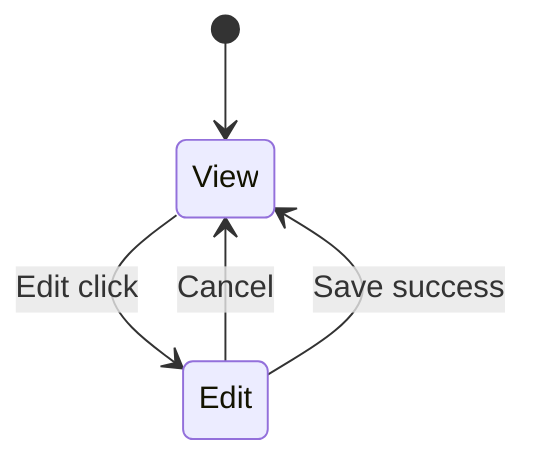

# Profile — 技术设计

> **English:** [profile.md](./profile.md)  
> **中文：** [profile-cn.md](./profile-cn.md)  
> **总纲：** [02-technical-design-cn.md](../02-technical-design-cn.md)  
> **PRD：** [prd/profile-cn.md](../prd/profile-cn.md)  
> **迭代：** iter-03（基础）· **iter-05（Preferences 重构）**

---

## 1. iter-03 已交付（摘要）

- `user_profiles.nickname`
- 单表单 `ProfileForm` + 浏览器 `saveProfile`
- 静态 `modelOptions` from env `LLM_PROVIDER`

---

## 2. iter-05 变更

### 2.1 数据库

```sql
-- 见 design/models-cn.md §3.3
ALTER TABLE public.user_profiles
  ADD COLUMN preferred_model_config_id UUID
    REFERENCES public.user_model_configs(id) ON DELETE SET NULL;

ALTER TABLE public.user_profiles
  DROP COLUMN preferred_model;
```

| 值 | 含义 |
|----|------|
| `preferred_model_config_id = NULL` | 平台默认 Bailian `qwen3.6-plus` |
| `preferred_model_config_id = <uuid>` | 用户 Models 配置（须 `test_status = passed`） |

### 2.2 校验

`lib/validation/profile.ts` 修订：

```typescript
// preferredModelConfigId: null → platform default (allowed)
// uuid → must exist, owned by user, test_status === 'passed'
// PLATFORM_DEFAULT_CONFIG_ID sentinel → normalize to null on save
```

`parseAccountPatch({ nickname })` 与 `parsePreferencesPatch({ preferredModelConfigId })` **拆分**。

### 2.3 浏览器服务

`lib/services/browser/profile.ts`:

| 函数 | 职责 |
|------|------|
| `saveAccount({ nickname })` | 仅 upsert nickname |
| `savePreferences({ preferredModelConfigId })` | 仅 upsert preference FK |
| `getProfilePageData()` | email + nickname + current preference label + passed options |

`getPassedModelOptions()` 委托 `listModelConfigs()` 过滤 `testStatus === 'passed'`（含虚拟平台默认）。

---

## 3. UI 组件

### 3.1 组件树

```
app/console/profile/page.tsx (RSC)
└── ProfilePage (client) 或保留 page 组合
    ├── AccountCard
    │   ├── AccountDetailView
    │   └── AccountEditForm
    └── PreferencesCard
        ├── PreferencesDetailView
        └── PreferencesEditForm (select)
```

### 3.2 状态机（每 Card）



| Card | View 展示 | Edit 字段 |
|------|-----------|-----------|
| Account | email（只读）、nickname | nickname |
| Preferences | `{Provider} — {modelName}` | select（Passed only） |

各 Card 保存时使用 **区块级 busy** — 见 [console-shell-cn.md](./console-shell-cn.md) §8（`ConsoleSection`）。

### 3.3 Props

```typescript
type ProfilePageProps = {
  email: string;
  nickname: string | null;
  preferredConfigId: string | null; // null = platform default
  preferredLabel: string;           // e.g. "Bailian — qwen3.6-plus"
  modelOptions: ModelConfigOption[]; // Passed only
};
```

### 3.4 保存行为

- **Account Save:** `saveAccount({ nickname })` → `router.refresh()`；不触碰 preference
- **Preferences Save:** `savePreferences({ preferredModelConfigId })` → `router.refresh()`；不触碰 nickname
- 空 patch：显示 **Saved.**（与 iter-04 一致）

---

## 4. RSC 数据加载

`app/console/profile/page.tsx`:

```typescript
const profile = await getUserProfile(user.id);
const passedOptions = await listPassedModelConfigOptions(user.id); // server helper
const preferredLabel = resolvePreferenceLabel(profile, passedOptions);
```

服务端 helper 复用 `PLATFORM_DEFAULT` 常量与 DB 查询（RSC 可用 `createClient` server，无需 service_role）。

---

## 5. 与 Models 的耦合

| 场景 | 行为 |
|------|------|
| 用户删除当前 preference 配置 | DB `ON DELETE SET NULL`；UI 删除前阻止并提示（models PRD §3.9） |
| 配置从 passed → untested（改 key/name） | Profile View 仍显示旧 FK，但 Chat 服务端拒绝；Preferences 下拉移除该项 |
| 无 Passed 用户配置 | 下拉仅平台默认（若 env Key 存在） |

---

## 6. 文件清单

| 操作 | 路径 |
|------|------|
| 新增 | `components/console/profile-page.tsx` |
| 新增 | `components/console/account-card.tsx` |
| 新增 | `components/console/preferences-card.tsx` |
| 修改 | `app/console/profile/page.tsx` |
| 删除/替换 | `components/console/profile-form.tsx` → 拆分为上述组件 |
| 修改 | `lib/data/browser/profile.ts` — `preferred_model_config_id` |
| 修改 | `lib/services/browser/profile.ts` — split save |
| 修改 | `lib/validation/profile.ts` |
| 修改 | `lib/data/types.ts` — `UserProfile`, `ProfileDto` |

---

## 7. 验收映射

| AC | 实现要点 |
|----|----------|
| AC-43 | `getPassedModelOptions()` 过滤 |
| AC-44 | 独立 `saveAccount` / `savePreferences` |
| AC-45 | Card View/Edit 状态机 |

---

## 8. 修订记录

| 日期 | 变更 |
|------|------|
| 2026-06-16 | iter-03 初稿 |
| 2026-06-17 | iter-05 — 双 Card、FK preference、拆分校验与服务 |
| 2026-06-17 | §3.2 引用 console-shell §8 区块级 busy |
