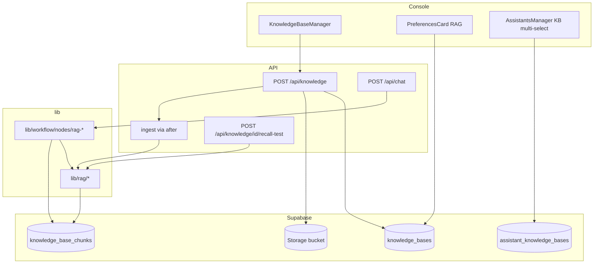
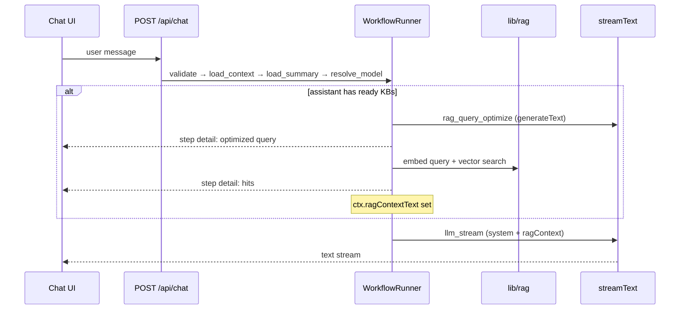

# 知识库 RAG — 技术设计总纲

> **English:** [02-technical-design.md](./02-technical-design.md)  
> **中文：** [02-technical-design-cn.md](./02-technical-design-cn.md)

> **项目：** 7ai-club  
> **Feature slug：** `knowledge-base`  
> **迭代：** `iter-09`  
> **路线图阶段：** 2 — 知识库  
> **关联 PRD：** [01-product-requirements-cn.md](./01-product-requirements-cn.md)  
> **状态：** 草稿  
> **文档版本：** v0.2

---

## 1. 概述

### 1.1 设计目标

- Console 知识库 CRUD + 单 source + 异步入库（`doc-to-md-rag` → 混合分片 → embedding → pgvector）
- Profile RAG Preferences；Assistants 多 KB 绑定
- Chat Workflow 条件插入 `rag_query_optimize` / `rag_retrieve`；召回注入 LLM system prompt
- 复用 iter-06–08 WorkflowRunner、步骤 UI（`DefaultStepRow` + detail）；复用 Console 分层（Manager + browser data/service）

### 1.2 架构对齐

| 项 | 选择 |
|----|------|
| 编排 | Vercel AI SDK + 自建 WorkflowRunner（方案 B） |
| 运行时 | `nodejs`；ingest route `maxDuration = 300`；chat 保持 130s |
| 数据 | Supabase Postgres + **pgvector** + Storage + RLS |
| 入库 | **Next.js API + `after()`** 触发 ingest（不引入 Inngest / Edge Functions） |
| Embedding | OpenAI-compatible `/embeddings`；默认 **SiliconFlow · BAAI/bge-m3 · 1024 维** |

### 1.3 模块索引

| 模块 | 设计文档 | 职责 |
|------|----------|------|
| Schema & RPC | [design/kb-schema-cn.md](./design/kb-schema-cn.md) | 表、pgvector、RLS、delete RPC |
| 入库 | [design/kb-ingestion-cn.md](./design/kb-ingestion-cn.md) | parse/chunk/embed、async job |
| Console | [design/kb-console-cn.md](./design/kb-console-cn.md) | 列表/表单/召回测试 UI + API |
| Workflow RAG | [design/chat-rag-nodes-cn.md](./design/chat-rag-nodes-cn.md) | 两节点、retrieve lib、prompt 注入 |
| Console 集成 | [design/console-rag-integration-cn.md](./design/console-rag-integration-cn.md) | Preferences + Assistants 绑定 |

---

## 2. 端到端架构

---

## 3. Chat RAG 流程（挂载 KB 时）

---

## 4. 文件变更清单（索引）

| 操作 | 路径 | 模块 |
|------|------|------|
| 新增 | `supabase/migrations/20260630000000_iter09_knowledge_base.sql` | schema |
| 新增 | `lib/rag/{parse,chunk,embed,retrieve,ingest,types}.ts` | ingest + retrieve |
| 新增 | `lib/workflow/nodes/rag-query-optimize.ts` | workflow |
| 新增 | `lib/workflow/nodes/rag-retrieve.ts` | workflow |
| 新增 | `app/api/knowledge/route.ts` | API |
| 新增 | `app/api/knowledge/[id]/route.ts` | API |
| 新增 | `app/api/knowledge/[id]/recall-test/route.ts` | API |
| 新增 | `app/console/knowledge/**` | UI |
| 新增 | `components/console/knowledge-*` | UI |
| 新增 | `lib/data/browser/knowledge-bases.ts` 等 | data layer |
| 修改 | `lib/workflow/node-catalog.ts`, `types.ts` | workflow |
| 修改 | `app/api/chat/route.ts` | workflow |
| 修改 | `lib/workflow/nodes/llm-stream.ts` | RAG context |
| 修改 | `lib/workflow/nodes/validate-request.ts` | load KB bindings |
| 修改 | `components/console/preferences-card.tsx` | RAG prefs |
| 修改 | `components/console/assistants-manager.tsx` | KB multi-select |
| 修改 | `.env.example` | env vars |
| 新增 | `tests/unit/rag/**`, `tests/e2e/knowledge-base.spec.ts` | tests |

完整路径见各子文档 §9。

入库异步机制详见 [design/kb-ingestion-cn.md](./design/kb-ingestion-cn.md) §8。

---

## 5. 安全与降级

| 风险 | 缓解 |
|------|------|
| Ingest 超时 | 独立 ingest 函数 + `maxDuration=300`；`after()` 异步 |
| Query optimize 失败 | fallback 原始 `userText` |
| Retrieve 失败 / 无命中 | step success + 空 context；LLM 无 KB 继续 |
| 多 KB 不同 embedding 模型 | 按 KB 分别 embed query + 搜索；合并排序 |
| API Key | ingest/recall/chat embed 均服务端；Storage 私有 bucket |
| 维度不匹配 | MVP pgvector 固定 **1024** 维；Preferences 白名单；KB 创建时校验 |

---

## 6. 环境变量

| 变量 | 说明 | 默认 |
|------|------|------|
| `RAG_CHUNK_SIZE` | 单 chunk 最大 token 估算 | `512` |
| `RAG_CHUNK_OVERLAP` | 相邻 chunk overlap token | `64` |
| `RAG_EMBEDDING_PROVIDER` | 默认 embedding 供应商 | `siliconflow` |
| `RAG_EMBEDDING_MODEL` | 默认 embedding 模型 | `BAAI/bge-m3` |
| `RAG_EMBEDDING_DIMENSIONS` | pgvector 列维度 | `1024` |

Provider API Key 复用现有 env（**默认 `SILICONFLOW_API_KEY`**；亦支持 `OPENAI_API_KEY`、`BAILIAN_API_KEY` 等 OpenAI-compatible 供应商）。

---

## 7. 测试计划（摘要）

| 类型 | 覆盖 |
|------|------|
| unit | `lib/rag/chunk.ts`, `retrieve.ts`（mock embed）；workflow 条件节点 |
| e2e | KB CRUD、ingest 状态、recall test、assistant 绑定、chat RAG 步骤可见 |
| manual | pdf/docx 解析质量；多 KB 召回；embedding 模型变更对话框 |
| 回归 | 无 KB 助理 iter-06–08 workflow E2E |

---

## 8. 开放问题 / 技术债

| ID | 问题 | 决议 |
|----|------|------|
| TD-01 | 非 1024 维 embedding 模型 | MVP pgvector 列固定 1024；Preferences 白名单仅列兼容模型 |
| TD-02 | Ingest 进度百分比 | MVP 仅 processing/ready/error；无进度条 |
| TD-03 | 用户 BYOK embedding | MVP 用平台 env Key；后续可接 user_model_configs |

---

## 12. PRD 验收映射（必填 · C0 输入）

| 验收标准 ID | 实现要点 | 验证方式 |
|-------------|----------|----------|
| AC-90 | `POST /api/knowledge` + 创建 dialog（text/file 二选一） | e2e |
| AC-91 | `after(runKnowledgeBaseIngest)`；status processing→ready | e2e + manual（pdf） |
| AC-92 | env `RAG_CHUNK_*` 快照 + `lib/rag/chunk.ts` 算法 | unit |
| AC-93 | `RecallTestPanel` + `POST .../recall-test` | e2e |
| AC-94 | `preferences-card` RAG 区块 + embedding 变更 ConfirmDialog | e2e + manual |
| AC-95 | Assistants checkbox + `set_assistant_knowledge_bases` RPC | e2e |
| AC-96 | `rag_query_optimize` node + markdown detail | e2e + manual |
| AC-97 | `rag_retrieve` + hits detail table | e2e + manual |
| AC-98 | `buildSystemPrompt` 注入 `## Retrieved knowledge` | manual |
| AC-99 | RLS policies；`delete_knowledge_base` 409；Retry ingest | e2e + Supabase MCP |
| AC-100 | 无 KB 时不注册 RAG nodes；iter-06–08 E2E 回归 | e2e |

---

## 9. 修订记录

| 日期 | 版本 | 变更 |
|------|------|------|
| 2026-06-30 | v0.1 | iter-09 初稿 |
| 2026-06-30 | v0.2 | 默认 embedding：SiliconFlow · BAAI/bge-m3 · 1024 维；补充 after() 详述 |

---

*子文档 §12 验收映射汇总见 [changelog/iter-09-cn.md](./changelog/iter-09-cn.md)；各模块 design 文档含实现要点。*
