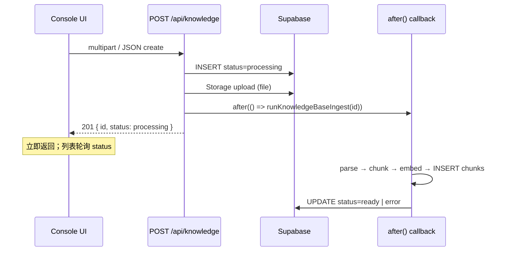
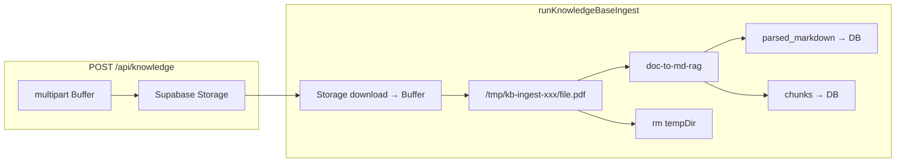

# 知识库 — 入库流水线

> **English:** [kb-ingestion.md](./kb-ingestion.md)  
> **中文：** [kb-ingestion-cn.md](./kb-ingestion-cn.md)  
> **总纲：** [02-technical-design-cn.md](../02-technical-design-cn.md)  
> **PRD：** [prd/kb-ingestion-cn.md](../prd/kb-ingestion-cn.md)  
> **迭代：** iter-09

---

## 1. 设计目标

- 创建 KB 后立即 **异步 ingest**（不在 chat route）
- PDF/DOCX → `doc-to-md-rag`；md/txt 直读
- **混合分片**：Markdown 结构边界 + token 窗口 + env overlap
- Embedding → pgvector；失败 `error` + Retry

---

## 2. 依赖

```json
"doc-to-md-rag": "^1.0.1"
```

`runtime = "nodejs"`（PDF 解析需 Node）。

---

## 3. 模块 `lib/rag/`

| 文件 | 职责 |
|------|------|
| `types.ts` | `IngestResult`, `ChunkDraft`, `EmbeddingConfig` |
| `parse.ts` | `parseSourceToMarkdown(kb, serviceClient)` |
| `chunk.ts` | `chunkMarkdown(markdown, { size, overlap })` |
| `embed.ts` | `embedTexts(texts, config)` → `number[][]` |
| `ingest.ts` | `runKnowledgeBaseIngest(kbId)` 编排 |
| `retrieve.ts` | `retrieveChunks({ kbIds, query, config, threshold, topK })` |

---

## 4. 解析 `parse.ts`

| source_type | 逻辑 |
|-------------|------|
| `text` | 使用 `source_text`；若像 HTML 则 pass-through |
| `file` + `.md`/`.txt` | Storage download → UTF-8 |
| `file` + `.pdf`/`.docx` | Storage download → 内存 `Buffer` → **`/tmp` 临时文件** → `doc-to-md-rag` → 解析后删除临时目录（见 §8.8） |

```typescript
// lib/rag/parse.ts — 实际实现（doc-to-md-rag 需文件路径，非 Buffer API）
import { mkdtemp, rm, writeFile } from "node:fs/promises";
import { tmpdir } from "node:os";

async function parseFileBuffer(buffer: Buffer, filename: string): Promise<string> {
  const ext = path.extname(filename).toLowerCase();
  if (ext === ".md" || ext === ".txt") {
    return buffer.toString("utf-8");
  }
  if (ext === ".pdf" || ext === ".docx") {
    const tempDir = await mkdtemp(join(tmpdir(), "kb-ingest-"));
    const tempPath = join(tempDir, sanitize(filename));
    try {
      await writeFile(tempPath, buffer);
      const { convertToMarkdown } = await import("doc-to-md-rag");
      return await convertToMarkdown(tempPath);
    } finally {
      await rm(tempDir, { recursive: true, force: true });
    }
  }
  throw new Error(`Unsupported file type: ${ext}`);
}
```

**上传 API（`POST /api/knowledge`）** 不落本地盘：multipart → 内存 `Buffer` → 直接 `storage.upload()` 到 Supabase（路径 `{userId}/{kbId}/{filename}`，bucket `knowledge-base-files`）。

解析结果写入 `knowledge_bases.parsed_markdown`。

---

## 5. 分片 `chunk.ts`

**算法（A + B）：**

1. 按 `/^#{1,6}\s/m` 与双换行拆 **section**
2. 对每个 section：若 `estimateTextTokens(section) <= RAG_CHUNK_SIZE` → 单 chunk
3. 否则 **滑动窗口**：步长 `size - overlap`（token 估算用 `lib/memory/token-estimate.ts`）
4. 记录 `heading_path`（向上追踪最近 heading）、`char_start`/`char_end`（相对 `parsed_markdown`）

```typescript
export function chunkMarkdown(
  markdown: string,
  options: { maxTokens: number; overlapTokens: number },
): ChunkDraft[];
```

**Env：**

- `RAG_CHUNK_SIZE` → default 512
- `RAG_CHUNK_OVERLAP` → default 64

---

## 6. Embedding `embed.ts`

```typescript
export async function embedTexts(
  texts: string[],
  config: { provider: string; model: string; dimensions?: number },
): Promise<number[][]> {
  // POST {baseUrl}/embeddings  （SiliconFlow: https://api.siliconflow.cn/v1/embeddings）
  // body: { model: "BAAI/bge-m3", input: texts, encoding_format: "float" }
  // 复用 lib/llm/provider.ts 的 provider base URL + env API key
}
```

- MVP pgvector 列固定 **1024 维**；embed 响应须与 `RAG_EMBEDDING_DIMENSIONS` 一致，否则 ingest 失败
- 默认：`siliconflow` + `BAAI/bge-m3`（1024）
- 批量请求（每批 ≤ 64 条 — 可配置 `RAG_EMBED_BATCH_SIZE`）避免 rate limit

---

## 7. Ingest 编排 `ingest.ts`

```typescript
export async function runKnowledgeBaseIngest(kbId: string): Promise<void> {
  const service = createServiceClient();
  // 1. load kb; if not processing (retry) set processing + clear error
  // 2. parse → update parsed_markdown
  // 3. chunk → drafts
  // 4. DELETE existing chunks for kb_id
  // 5. batch embed → INSERT chunks
  // 6. status = ready | error + error_message
}
```

**并发：** ingest 开始前 `UPDATE knowledge_bases SET status='processing' WHERE id=$1 AND status IN ('processing','error')`；ingest 内用 advisory lock 或 `status` 检查防双跑。

---

## 8. 异步触发 — `after()` 机制（详述）

### 8.1 为何用 `after()` 而非 Inngest / Edge Functions

| 方案 | iter-09 不选原因 |
|------|------------------|
| Inngest / Trigger.dev | 新增托管依赖、env、部署面；MVP 入库频率低 |
| Supabase Edge Functions | 需 Deno 运行时；`doc-to-md-rag` 为 Node 包 |
| 同步阻塞 create API | 大 PDF 解析 + 批量 embed 易超 60s，阻塞 UI |
| Chat route 内 ingest | PRD 明确禁止；污染对话延迟 |

**选择 `next/server` 的 `after()`**：与 iter-06 chat route 清理 Redis 相同模式（`app/api/chat/route.ts` 已用 `after()`），零新基础设施。

### 8.2 `after()` 工作原理（Vercel + Next.js App Router）



1. **响应先返回**：`after()` 注册回调后，Route Handler 立刻 `return Response.json(..., 201)`，浏览器不等待 ingest 完成。  
2. **后台延续执行**：Vercel 通过 `waitUntil`（Next 内部）延长**同一 Serverless invocation** 生命周期，在响应发送后继续跑 `runKnowledgeBaseIngest`。  
3. **超时共享**：后台任务与上传共用该 Route 的 **`maxDuration`** 预算（从请求开始计时）。因此 **`POST /api/knowledge` 必须设 `maxDuration = 300`**（与 ingest retry 一致），否则大文件会在 60s 被平台强杀。  
4. **失败可见**：`runKnowledgeBaseIngest` 内 `try/catch` 写 `status='error'` + `error_message`；`after()` 外层仅 `console.error` 兜底，避免 unhandled rejection。

### 8.3 代码模式

**创建（异步）：**

```typescript
import { after } from "next/server";

export const runtime = "nodejs";
export const maxDuration = 300; // 上传 + after(ingest) 共享窗口

export async function POST(req: Request) {
  // 1. auth + validate
  // 2. insert knowledge_bases (processing)
  // 3. storage upload if file
  const kbId = row.id;

  after(async () => {
    try {
      await runKnowledgeBaseIngest(kbId);
    } catch (error) {
      console.error("[kb-ingest] after() failed:", kbId, error);
      // runKnowledgeBaseIngest 内部应已写 error 状态；此处仅日志
    }
  });

  return Response.json({ id: kbId, status: "processing" }, { status: 201 });
}
```

**Retry（同步 await，用户显式等待）：**

```typescript
// POST /api/knowledge/[id]/ingest
export const maxDuration = 300;

export async function POST(_req: Request, { params }: { params: { id: string } }) {
  // auth owner; kb status in (error, ready?) — 仅 error/retry 允许
  await runKnowledgeBaseIngest(params.id);
  return Response.json({ status: "ready" }); // 或读 DB 最新 status
}
```

### 8.4 与 UI 的配合

| 阶段 | UI 行为 |
|------|---------|
| 创建提交 | `usePageBusy("Creating…")` 至 201 返回（通常 < 5s） |
| processing | 列表每 **3s** refetch；行内 *Processing…* |
| ready | 停止轮询；Recall test 可用 |
| error | 展示 `error_message` + **Retry ingestion** → 调 ingest route |

不在 create 阶段阻塞等待 ingest 完成。

### 8.5 并发与重入

| 场景 | 处理 |
|------|------|
| 重复点击 Retry | ingest 入口 `UPDATE ... SET status='processing' WHERE id=$1 AND status IN ('error','ready')` + 应用层 mutex（同 kbId 内存锁，单实例足够；多实例靠 status 条件更新） |
| create 后立即 Retry | 若仍 processing，ingest route 返回 **409** *Ingest already in progress* |
| after() 与 Retry 并行 | status 条件更新失败则 skip / 409 |

### 8.6 本地开发注意

- `next dev` 下 `after()` 同样执行，但无 Vercel 硬超时；大 PDF 可本地测完全链路  
- 无 `SILICONFLOW_API_KEY` 时 create 可成功但 ingest → `error`（便于 UI 测 error 态）  
- 可选：`RAG_INGEST_SYNC=1` dev-only env 在 create route **await** ingest（调试，不用于生产）

### 8.7 未来升级路径（非 iter-09）

若入库量或文件体积导致 300s 不够：  
→ 改为 `after()` 内 **fetch 自调用** ingest route（独立 invocation 各 300s）或接入 Inngest；表结构与 `runKnowledgeBaseIngest` 签名不变。

### 8.8 文件存储与 Vercel `/tmp` 约束

#### 8.8.1 存储分层

| 阶段 | 存储位置 | 字段 / 路径 | 是否持久 |
|------|----------|-------------|----------|
| 文件上传 | **Supabase Storage** | bucket `knowledge-base-files` · `{userId}/{kbId}/{filename}` | ✅ |
| 粘贴文本 | **Postgres** | `knowledge_bases.source_text` | ✅ |
| 解析结果 | **Postgres** | `knowledge_bases.parsed_markdown` | ✅ |
| 向量分片 | **Postgres** | `knowledge_base_chunks` | ✅ |
| PDF/DOCX 解析 | **本地临时目录** | `os.tmpdir()` + `kb-ingest-*`（Vercel 上为 `/tmp`） | ❌ 解析完即删 |

**设计原则：** 原文件与解析结果均不依赖 Serverless 本地盘；`/tmp` 仅作为 `doc-to-md-rag` 的**短生命周期输入**（该库 API 要求文件路径，当前无法接受纯 `Buffer`）。

#### 8.8.2 Vercel Serverless 约束

参考 [Vercel Functions Runtimes — File system support](https://vercel.com/docs/functions/runtimes)：

| 平台约束 | 说明 | iter-09 应对 |
|----------|------|--------------|
| 文件系统只读 | 除 `/tmp` 外不可写 | `parse.ts` 使用 `os.tmpdir()`（Vercel 映射为 `/tmp`） |
| `/tmp` 容量 | 约 **500 MB** / invocation | 单文件上限 **10 MB**（`KB_MAX_FILE_BYTES`），余量充足 |
| `/tmp`  ephemeral | 不跨 invocation 共享；实例销毁后清空 | 每次 ingest 从 Storage 重新 download；`finally` 递归删除临时目录 |
| 不可项目目录写盘 | 部署包只读 | 上传直写 Supabase Storage，不写 repo 路径 |

#### 8.8.3 入库数据流



- **md/txt**：Storage download → UTF-8 字符串，**不写 `/tmp`**。
- **create + Retry ingest**：均走同一 `parseKnowledgeBaseSource` 路径。

#### 8.8.4 生产环境注意

| 风险 | 说明 | 缓解 |
|------|------|------|
| `doc-to-md-rag` 写 `/tmp` 外路径 | 第三方库若在 `node_modules` 相对路径写盘 → Vercel **EROFS** | `next.config.ts` — `serverExternalPackages`（`doc-to-md-rag`、`pdf.js-extract` 等）；`parse.ts` 动态 `import("doc-to-md-rag")` |
| 库内部额外临时文件 | 除我们写入的一份外，解析库可能再占 `/tmp` | 10 MB 上限 + 500 MB 配额，通常足够；超大 PDF 需监控 |
| 内存峰值 | upload 与 ingest 各持有一份 Buffer | 10 MB 上限；峰值约 2× 文件大小 + 解析开销 |
| `after()` 超时 | 上传 + parse + embed 共用 create route **300s** | 见 §8.2；不够时走 §8.7 独立 invocation |

#### 8.8.5 未来：完全避免 `/tmp`

若需消除 Serverless 落盘：换支持 `Buffer`/Stream 的解析库，或将 ingest 迁至常驻 worker（Inngest / 自建 Node 服务）。iter-09 不纳入。

---

## 9. 异步触发（索引）

- 创建：`after(runKnowledgeBaseIngest)` — 见 §8  
- Retry：同步 `POST .../ingest` — 见 §8.3  

---

## 10. 文件清单

| 操作 | 路径 |
|------|------|
| 新增 | `lib/rag/*.ts` |
| 新增 | `app/api/knowledge/[id]/ingest/route.ts` |
| 修改 | `package.json` — `doc-to-md-rag` |

---

## 12. PRD 验收映射

| AC ID | 实现要点 | 验证方式 |
|-------|----------|----------|
| AC-91 | `runKnowledgeBaseIngest` 全链路 | e2e + manual（pdf/docx） |
| AC-92 | env → `chunk_size_tokens` 快照 + chunk 算法 | unit |
| AC-99 | catch → status error + message | unit + e2e |

---

## 13. 修订记录

| 日期 | 变更 |
|------|------|
| 2026-06-30 | 初稿 |
| 2026-06-30 | §8 补充 after() 详述；默认 SiliconFlow BAAI/bge-m3 1024 维 |
| 2026-06-30 | §4 对齐 `parse.ts` 实现；§8.8 文件存储分层与 Vercel `/tmp` 约束 |
