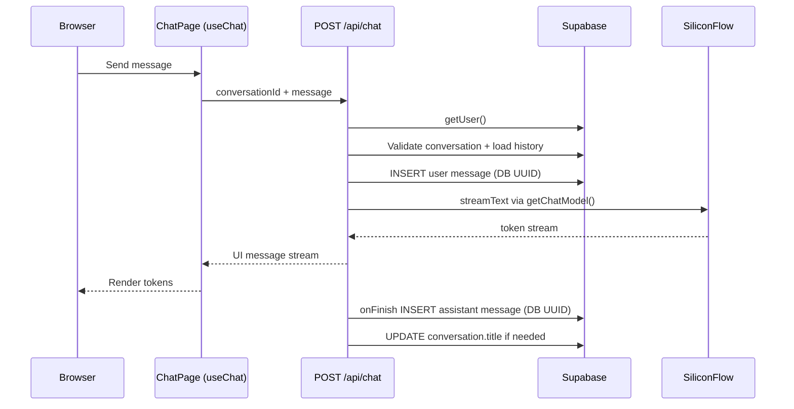
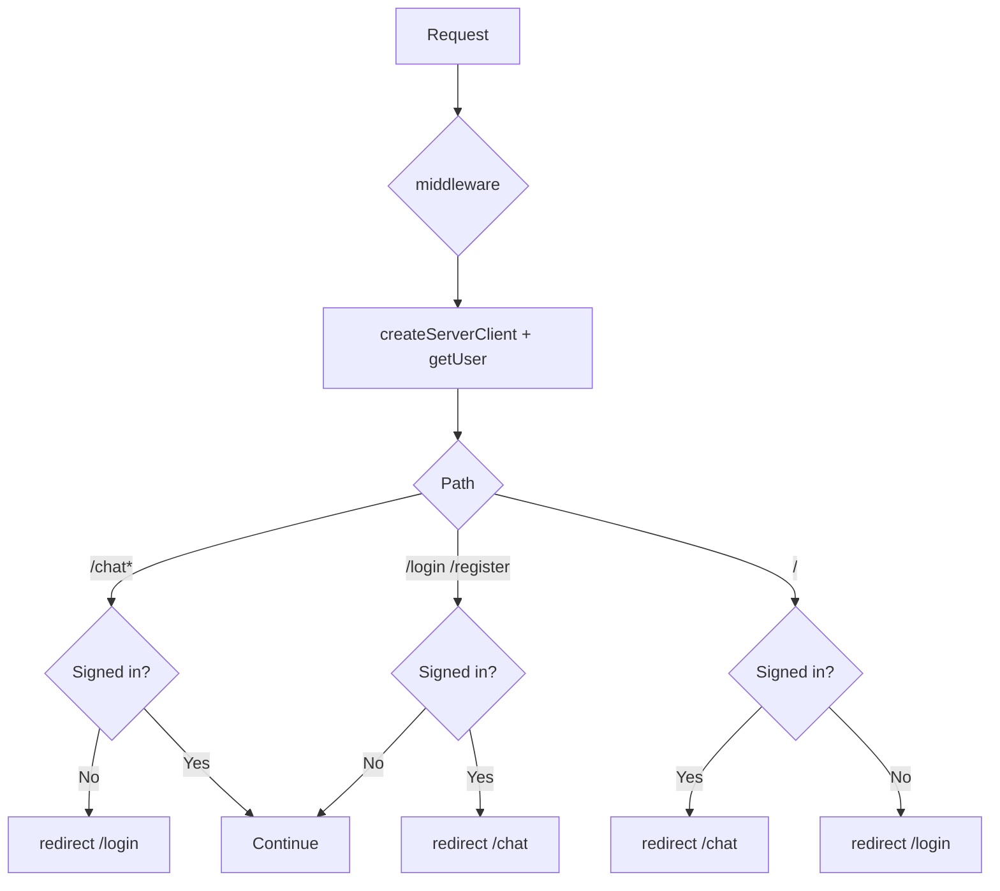
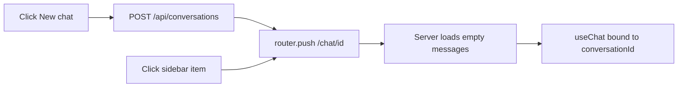

# MVP Chat — Technical Design

> **English:** [02-technical-design.md](./02-technical-design.md)  
> **中文：** [02-technical-design-cn.md](./02-technical-design-cn.md)

> **Project:** 7ai-club  
> **Feature slug:** `mvp-chat`  
> **Iteration:** `iter-01` (see [`docs/iterations/iter-01/README.md`](../../iterations/iter-01/README.md))  
> **Roadmap phase:** 1 — MVP Chat  
> **Related PRD:** [`docs/features/mvp-chat/01-product-requirements.md`](./01-product-requirements.md)  
> **Status:** Confirmed  
> **Technical design confirmed:** 2026-06-14  
> **Document version:** v0.1

---

## 1. Overview

### 1.1 Design Goals

Scaffold a Next.js application in a greenfield repo and deliver the minimal chat loop defined in the PRD:

- Supabase Auth (email/password) + middleware route protection
- Fixed default assistant + conversation/message persistence (RLS isolation)
- SiliconFlow OpenAI-compatible endpoint + `Qwen/Qwen2.5-7B-Instruct` streaming replies
- Dark-theme chat UI (sidebar history + message stream)

**User-facing UI copy is English** (labels, empty states, errors, buttons). DB seed defaults (assistant name, system prompt, conversation title) are also English.

### 1.2 Architecture Alignment

| Item | Choice |
|------|--------|
| Orchestration | Vercel AI SDK `streamText` + `useChat` (Option B; **no** ToolLoopAgent) |
| Runtime | `export const runtime = 'nodejs'` |
| Timeout | `maxDuration = 300` (Vercel Hobby) |
| LLM | `@ai-sdk/openai` + `createOpenAI({ baseURL: 'https://api.siliconflow.cn/v1' })` via **`getChatModel()` → `siliconflow.chat()`** (Chat Completions; SiliconFlow does **not** support the Responses API) |
| Data | Supabase PostgreSQL + RLS |
| Auth | `@supabase/ssr` cookie session + Route Handler `getUser()` |
| Frontend | Next.js App Router, Tailwind, shadcn/ui |
| Visual | `ui-ux-pro-max` → `design-system/7ai-club/MASTER.md` + `design-system/7ai-club/pages/chat.md` |

**Out of scope this iteration:** pgvector, MCP, agent tools, background jobs.

---

## 2. Database Design

### 2.1 Schema

```sql
-- Extension reserved for phase 2; no vector tables this iteration
-- CREATE EXTENSION IF NOT EXISTS vector;

-- Default assistant (MVP seeds one row; no admin UI)
CREATE TABLE public.assistants (
  id            UUID PRIMARY KEY DEFAULT gen_random_uuid(),
  name          TEXT NOT NULL,
  system_prompt TEXT NOT NULL,
  model         TEXT NOT NULL DEFAULT 'Qwen/Qwen2.5-7B-Instruct',
  is_default    BOOLEAN NOT NULL DEFAULT false,
  created_at    TIMESTAMPTZ NOT NULL DEFAULT now(),
  updated_at    TIMESTAMPTZ NOT NULL DEFAULT now()
);

-- At most one is_default = true (partial unique index)
CREATE UNIQUE INDEX assistants_single_default_idx
  ON public.assistants (is_default) WHERE is_default = true;

-- Conversations
CREATE TABLE public.conversations (
  id            UUID PRIMARY KEY DEFAULT gen_random_uuid(),
  user_id       UUID NOT NULL REFERENCES auth.users(id) ON DELETE CASCADE,
  assistant_id  UUID NOT NULL REFERENCES public.assistants(id) ON DELETE RESTRICT,
  title         TEXT NOT NULL DEFAULT 'New Chat',
  created_at    TIMESTAMPTZ NOT NULL DEFAULT now(),
  updated_at    TIMESTAMPTZ NOT NULL DEFAULT now()
);

-- Messages (content is plain text; phase 3 may extend to parts/jsonb)
CREATE TABLE public.messages (
  id              UUID PRIMARY KEY DEFAULT gen_random_uuid(),
  conversation_id UUID NOT NULL REFERENCES public.conversations(id) ON DELETE CASCADE,
  role            TEXT NOT NULL CHECK (role IN ('user', 'assistant', 'system')),
  content         TEXT NOT NULL,
  created_at      TIMESTAMPTZ NOT NULL DEFAULT now()
);

-- updated_at trigger (conversations)
CREATE OR REPLACE FUNCTION public.set_updated_at()
RETURNS TRIGGER AS $$
BEGIN
  NEW.updated_at = now();
  RETURN NEW;
END;
$$ LANGUAGE plpgsql;

CREATE TRIGGER conversations_updated_at
  BEFORE UPDATE ON public.conversations
  FOR EACH ROW EXECUTE FUNCTION public.set_updated_at();

-- Bump conversation.updated_at when a message is inserted
CREATE OR REPLACE FUNCTION public.touch_conversation_updated_at()
RETURNS TRIGGER AS $$
BEGIN
  UPDATE public.conversations SET updated_at = now() WHERE id = NEW.conversation_id;
  RETURN NEW;
END;
$$ LANGUAGE plpgsql;

CREATE TRIGGER messages_touch_conversation
  AFTER INSERT ON public.messages
  FOR EACH ROW EXECUTE FUNCTION public.touch_conversation_updated_at();
```

### 2.2 Seed Data

```sql
INSERT INTO public.assistants (name, system_prompt, model, is_default)
VALUES (
  '7ai Assistant',
  'You are the AI assistant for 7ai-club. Answer clearly and concisely. Match the language the user writes in.',
  'Qwen/Qwen2.5-7B-Instruct',
  true
);
```

Conversation default title: `'New Chat'` (column default + `DEFAULT_CONVERSATION_TITLE` in `lib/constants.ts`).

### 2.3 Relationships

```
auth.users 1 ── * conversations * ── 1 assistants
conversations 1 ── * messages
```

- Each conversation binds one `assistant_id` (MVP: always the default assistant)
- Messages link only via `conversation_id`; user ownership is enforced through `conversations.user_id`

### 2.4 Indexes

| Table | Index | Purpose |
|-------|-------|---------|
| `conversations` | `(user_id, updated_at DESC)` | Sidebar history list |
| `messages` | `(conversation_id, created_at ASC)` | Load conversation messages |
| `assistants` | `(is_default) WHERE is_default` | Fetch default assistant quickly |

### 2.5 RLS Policies

| Table | Policy | Notes |
|-------|--------|-------|
| `assistants` | `SELECT` for authenticated users | MVP assistant is read-only; `auth.uid() IS NOT NULL` |
| `assistants` | No INSERT/UPDATE/DELETE for authenticated | Service role / migration seed only |
| `conversations` | `SELECT/INSERT/UPDATE/DELETE` | `user_id = auth.uid()` |
| `messages` | `SELECT/INSERT` | Related conversation exists and `conversations.user_id = auth.uid()` |
| `messages` | No UPDATE/DELETE | MVP: history is immutable |

**messages INSERT policy (example):**

```sql
CREATE POLICY "messages_insert_own"
  ON public.messages FOR INSERT TO authenticated
  WITH CHECK (
    EXISTS (
      SELECT 1 FROM public.conversations c
      WHERE c.id = conversation_id AND c.user_id = auth.uid()
    )
  );
```

### 2.6 pgvector

**Not used this iteration.** Phase 2 adds `knowledge_bases`, `document_chunks`, etc., and enables the `vector` extension.

---

## 3. API Design

### 3.1 Endpoints

| Method | Path | Description | Auth |
|--------|------|-------------|------|
| POST | `/api/chat` | Streaming chat (persists user/assistant messages) | Session JWT |
| POST | `/api/conversations` | Create empty conversation | Session JWT |
| GET | `/api/conversations` | List current user's conversations | Session JWT |

**Auth pages** call Supabase Client directly (`signUp` / `signInWithPassword` / `signOut`) via shared form components — no dedicated REST auth API.

### 3.2 `POST /api/chat`

**Request:**

```json
{
  "conversationId": "uuid",
  "message": {
    "id": "client-sdk-temporary-id",
    "role": "user",
    "parts": [{ "type": "text", "text": "Hello" }]
  }
}
```

The client `message.id` comes from the AI SDK (`useChat`) for in-flight UI correlation only. **It is not written to the database.** Inserts omit `id`; PostgreSQL assigns `gen_random_uuid()`. After reload, message IDs are always DB UUIDs returned by `loadMessages()`.

**Response:** `200` — `toUIMessageStreamResponse()` (AI SDK UI message stream)

**Processing flow:**

1. `getUser()` → 401
2. Validate `conversationId` belongs to current user
3. Load assistant config for the conversation
4. Load history from DB → build `UIMessage[]` (DB UUIDs)
5. Append incoming user message to UI list; persist user message (DB-generated UUID)
6. Update conversation title if still default (`maybeUpdateConversationTitle`)
7. `streamText({ model: getChatModel(assistant.model), system, messages })`
8. `onFinish` → persist assistant reply (DB-generated UUID)

**Error codes:**

| Status | Scenario |
|--------|----------|
| 401 | Not signed in |
| 403 | Conversation not owned by current user |
| 404 | Conversation not found |
| 422 | Invalid body / empty message |
| 502 | SiliconFlow call failed |

### 3.3 `POST /api/conversations`

**Request:** `{}` (always uses default assistant in MVP)

**Response:**

```json
{ "id": "uuid" }
```

Client navigates to `/chat/{id}`; title defaults to `"New Chat"` until the first user message.

### 3.4 `GET /api/conversations`

**Response:**

```json
{
  "conversations": [
    {
      "id": "uuid",
      "title": "Question about Next.js",
      "updated_at": "ISO8601"
    }
  ]
}
```

Sorted by `updated_at DESC`, limit 50.

---

## 4. Flow Design

### 4.1 Main Chat Flow



### 4.2 Auth and Route Protection



### 4.3 New / Switch Conversation



---

## 5. Pages and Routes

### 5.1 Route Tree

```
app/
  layout.tsx                 # Root layout, dark theme, fonts
  page.tsx                   # / → redirect
  login/page.tsx             # Sign in
  register/page.tsx          # Sign up
  chat/
    page.tsx                 # /chat → latest conversation or create new
    [conversationId]/
      page.tsx               # Chat UI (Server prefetch messages + list)
  api/
    chat/route.ts
    conversations/route.ts

middleware.ts                # Session refresh + route protection

components/
  chat/
    chat-layout.tsx          # useChat host + responsive shell
    chat-sidebar.tsx         # History + New chat + Sign out
    chat-messages.tsx        # Message list + streaming display
    chat-input.tsx           # Input field
  auth/
    auth-form.tsx            # Shared login/register form shell
  ui/                        # shadcn components

lib/
  supabase/client.ts
  supabase/server.ts
  supabase/middleware.ts
  llm/siliconflow.ts         # getChatModel(), siliconflow.chat()
  chat/conversations.ts      # Conversations + messages (single module)
  constants.ts

supabase/migrations/
  20260614000000_mvp_chat.sql
```

### 5.2 Page Responsibilities

| Route | Component | Server/Client | Notes |
|-------|-----------|---------------|-------|
| `/` | `page.tsx` | Server | `redirect` based on session |
| `/login` | `LoginPage` | Client form | `signInWithPassword` |
| `/register` | `RegisterPage` | Client form | `signUp` then auto sign-in |
| `/chat` | `ChatIndexPage` | Server | Latest conversation or create new |
| `/chat/[id]` | `ChatPage` | Server shell + Client chat | Prefetch messages, sidebar list |

All user-visible strings on these pages are **English** (e.g. "New chat", "Sign out", "No conversations yet").

---

## 6. Component Design

### 6.1 Component Tree

```
ChatPage (Server)
└── ChatLayout (Client)
    ├── ChatSidebar
    │   ├── NewChatButton
    │   ├── ConversationList
    │   └── LogoutButton
    └── ChatPanel
        ├── ChatMessages          # useChat.messages
        ├── ChatEmptyState
        └── ChatInput             # useChat.sendMessage
```

### 6.2 Key Components

#### `ChatLayout`

**Responsibility:** Owns the `useChat` instance; passes messages / status / sendMessage to children.

**Props:**

```typescript
interface ChatLayoutProps {
  conversationId: string;
  initialMessages: UIMessage[];
  conversations: ConversationSummary[];
}
```

**State / data:**

- `useChat({ id: conversationId, messages: initialMessages, transport: ... })`
- `DefaultChatTransport({ api: '/api/chat', prepareSendMessagesRequest: ... })`

#### `ChatSidebar`

**Responsibility:** Conversation list, active highlight, new conversation, sign out.

#### `ChatMessages`

**Responsibility:** Render user/assistant bubbles; stream updates the last assistant message; show `error.message` on failure.

---

## 7. Core Modules (lib)

| Path | Responsibility |
|------|----------------|
| `lib/llm/siliconflow.ts` | `createOpenAI` singleton; `getChatModel()` wraps `siliconflow.chat(model)` |
| `lib/chat/conversations.ts` | **Single module** for conversation CRUD **and** message helpers (no separate `messages.ts`) |
| `lib/supabase/server.ts` | Supabase client for Route Handlers / Server Components |
| `lib/supabase/client.ts` | Browser client for auth forms |
| `lib/supabase/middleware.ts` | Middleware-specific `createServerClient` |
| `lib/constants.ts` | `DEFAULT_CONVERSATION_TITLE`, `TITLE_MAX_LENGTH` |

### 7.1 `lib/chat/conversations.ts` Exports

| Function | Purpose |
|----------|---------|
| `getTextFromUIMessage` | Extract plain text from `UIMessage.parts` |
| `dbMessageToUIMessage` | Map DB row → `UIMessage` (id = DB UUID) |
| `loadMessages` | Fetch ordered messages for a conversation |
| `saveUserMessage` | INSERT user row (no client id; DB assigns UUID) |
| `saveAssistantMessage` | INSERT assistant row after stream completes |
| `maybeUpdateConversationTitle` | Set title from first user message when title is still `"New Chat"` |
| `listConversations` | Sidebar list for user |
| `getConversationForUser` | Ownership check |
| `createConversation` | Insert conversation with default assistant |
| `getLatestConversationId` | `/chat` index redirect |
| `getDefaultAssistant` | Seed assistant lookup |
| `getAssistantForConversation` | Assistant config for LLM call |

### 7.2 LLM Integration

SiliconFlow exposes an OpenAI-compatible **Chat Completions** API only. The default AI SDK model constructor targets the Responses API, which SiliconFlow rejects. Use an explicit chat model:

```typescript
// lib/llm/siliconflow.ts
import { createOpenAI } from '@ai-sdk/openai';

export const DEFAULT_MODEL = 'Qwen/Qwen2.5-7B-Instruct';

export const siliconflow = createOpenAI({
  baseURL: process.env.SILICONFLOW_BASE_URL ?? 'https://api.siliconflow.cn/v1',
  apiKey: process.env.SILICONFLOW_API_KEY,
});

/** SiliconFlow only supports Chat Completions, not the Responses API. */
export function getChatModel(model: string = DEFAULT_MODEL) {
  return siliconflow.chat(model);
}
```

```typescript
// app/api/chat/route.ts (conceptual)
const result = streamText({
  model: getChatModel(assistant.model),
  system: assistant.system_prompt,
  messages: await convertToModelMessages(uiMessages),
  abortSignal: req.signal,
});

return result.toUIMessageStreamResponse({
  originalMessages: uiMessages,
  onFinish: async ({ responseMessage }) => {
    await saveAssistantMessage(conversationId, responseMessage);
  },
});
```

### 7.3 Message ID Strategy

| Stage | ID source |
|-------|-----------|
| Client in-flight (useChat) | Temporary AI SDK id for UI only |
| DB INSERT | `DEFAULT gen_random_uuid()` — client id **not** stored |
| Server prefetch / reload | DB UUID via `loadMessages()` → `dbMessageToUIMessage()` |
| Assistant after stream | New DB UUID on `saveAssistantMessage` |

This keeps persistence authoritative in PostgreSQL and avoids coupling to client-generated identifiers.

### 7.4 Agent / Tools

**Not used this iteration.** Phase 3 extends via `lib/agents/assistant-agent.ts` (ToolLoopAgent, tools, MCP).

---

## 8. Background Jobs

**None this iteration.** Document upload and embeddings arrive in phase 2 (Inngest / Edge Functions).

---

## 9. Visual / Design System

Executed during implementation (Phase B):

```bash
python3 .cursor/skills/ui-ux-pro-max/scripts/search.py \
  "SaaS AI chat assistant platform professional minimal dark" \
  --design-system --persist -p "7ai-club" -f markdown

python3 .cursor/skills/ui-ux-pro-max/scripts/search.py \
  "chat messaging streaming realtime dark sidebar" \
  --design-system --persist -p "7ai-club" --page "chat" -f markdown
```

Read `design-system/7ai-club/pages/chat.md` (or `MASTER.md`) before UI work. Apply **Minimal + Professional + Dark** for color, background, and typography.

---

## 10. File Change List

| Action | Path | Notes |
|--------|------|-------|
| Add | `package.json`, etc. | `create-next-app` + dependencies |
| Add | `middleware.ts` | Auth refresh + route protection |
| Add | `supabase/migrations/*.sql` | Tables + RLS + English seed |
| Add | `app/api/chat/route.ts` | Streaming chat |
| Add | `app/api/conversations/route.ts` | Conversation CRUD |
| Add | `app/chat/**` | Chat pages |
| Add | `app/login/**`, `app/register/**` | Auth pages |
| Add | `components/chat/**` | UI components (English copy) |
| Add | `lib/**` | Supabase, LLM, consolidated chat logic |
| Add | `.env.example` | Environment variable template |
| Add | `design-system/**` | UI skill output |
| Update | `README.md` | Local development steps |

---

## 11. Security and Degradation

| Risk | Mitigation |
|------|------------|
| Serverless timeout | Single-turn `streamText` without tools; `maxDuration=300` |
| SiliconFlow unavailable | try/catch → 502 + frontend error UI; user message already persisted |
| API key leak | `SILICONFLOW_API_KEY` server-only; never in `NEXT_PUBLIC_*` |
| RLS bypass | Chat route uses user-scoped Supabase client, not service_role for reads |
| Duplicate submit | Disable send when `useChat` status !== `ready` |
| Fetch hang | `streamText` + `AbortSignal`; optional 60s upstream timeout (phase 5) |

---

## 12. Test Plan

- [ ] Register → auto sign-in → land on `/chat`
- [ ] Unauthenticated `/chat` → `/login`
- [ ] Send message → stream renders → refresh preserves messages
- [ ] New conversation → URL changes → empty state
- [ ] Sidebar switch → loads correct history
- [ ] Two-user RLS: user A cannot access user B's `conversationId` via API
- [ ] Invalid API key → readable error in UI
- [ ] Narrow mobile viewport: sidebar collapses (sheet or drawer)

### Local Verification

1. Create Supabase project; run `supabase db push` or MCP `apply_migration`
2. Configure `.env.local` (Supabase + SiliconFlow)
3. `pnpm dev` → register → chat
4. Supabase Dashboard: confirm `messages` rows with DB UUIDs

### Environment Variables

| Variable | Description |
|----------|-------------|
| `NEXT_PUBLIC_SUPABASE_URL` | Supabase project URL |
| `NEXT_PUBLIC_SUPABASE_ANON_KEY` | Anonymous public key |
| `SILICONFLOW_API_KEY` | SiliconFlow API key (server only) |
| `SILICONFLOW_BASE_URL` | Optional; default `https://api.siliconflow.cn/v1` |

---

## 13. PRD Acceptance Mapping

| AC ID | Implementation | Verification |
|-------|----------------|--------------|
| AC-01 | Middleware protects `/chat` | Unauthenticated redirect |
| AC-02 | Register + `signUp` redirect | Manual E2E |
| AC-03 | `streamText` + `useChat` | Observe token streaming |
| AC-04 | `messages` persistence + Server prefetch | Page refresh |
| AC-05 | `ChatSidebar` + GET conversations | Multi-conversation switch |
| AC-06 | POST conversations + empty messages | Empty state after create |
| AC-07 | API 502 + useChat error UI | Bad key test |
| AC-08 | RLS + route ownership check | Two accounts + foreign ID |
| AC-09 | `getChatModel('Qwen/Qwen2.5-7B-Instruct')` | Logs / response check |

---

## 14. Open Questions / Technical Debt

| ID | Question | Decision |
|----|----------|----------|
| TD-01 | Message format: TEXT vs JSONB parts | MVP uses TEXT; migrate to parts in phase 3 |
| TD-02 | `/chat` with no conversations: auto-create vs empty shell | **Auto-create** and redirect |
| TD-03 | When to update conversation title | On first user message (`maybeUpdateConversationTitle` before stream) |
| TD-04 | shadcn init | `npx shadcn@latest init` dark theme |
| TD-05 | Client vs DB message IDs | **DB UUID authoritative**; client SDK ids not persisted |
| TD-06 | LLM model constructor | **`siliconflow.chat()`** via `getChatModel()`; not default Responses API |

---

## 15. Revision History

| Date | Version | Iteration | Changes |
|------|---------|-----------|---------|
| 2026-06-14 | v0.1 | iter-01 | Initial draft (English); aligned with implemented codebase |

---

*Iteration index: [`docs/iterations/iter-01/README.md`](../../iterations/iter-01/README.md)*
