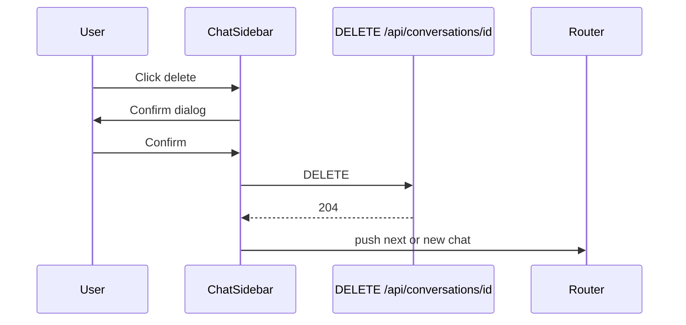
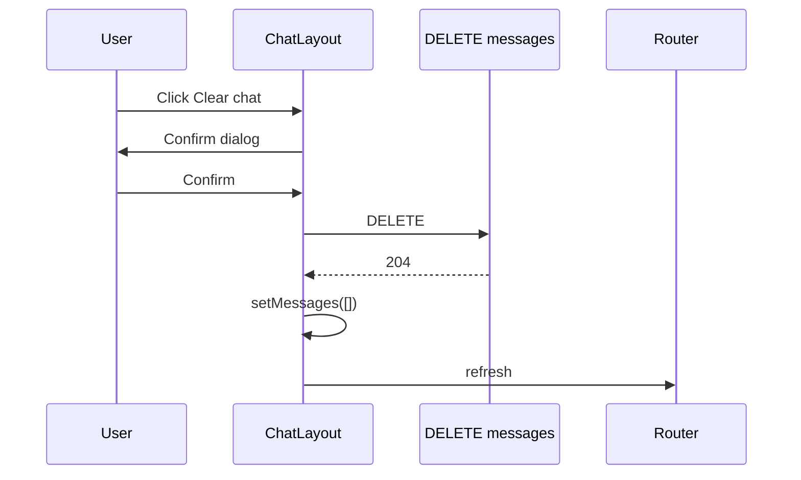

# Chat 体验 — 技术设计（删除 · Markdown · Prompt）

> **English:** [chat-experience.md](./chat-experience.md)  
> **中文：** [chat-experience-cn.md](./chat-experience-cn.md)  
> **设计总纲：** [02-technical-design-cn.md](../02-technical-design-cn.md)  
> **关联 PRD：** [prd/chat-experience-cn.md](../prd/chat-experience-cn.md)  
> **迭代：** iter-02  
> **状态：** 已实现（本地）  
> **文档版本：** v0.3

---

## 1. 设计目标

- `DELETE /api/conversations/[id]` + 侧边栏确认删除
- `DELETE /api/conversations/[id]/messages` + 子栏 Clear chat 确认
- 用户与 AI 消息 Markdown 渲染（流式结束后切换 MD）
- migration 更新默认助理 `system_prompt`
- Chat 子栏：助理名/模型左对齐；右侧 Clear chat

---

## 2. 数据库

### 2.1 无需新表

`conversations` 已有 RLS `conversations_delete_own`；`messages.conversation_id` **ON DELETE CASCADE**，删对话自动删消息。

### 2.2 新迁移

`supabase/migrations/20260615000000_iter02_assistant_markdown_prompt.sql` — 更新 `system_prompt`。

`supabase/migrations/20260616000000_messages_delete_own.sql` — 允许用户删除本人对话下的消息（清空聊天记录）：

```sql
CREATE POLICY "messages_delete_own"
  ON public.messages FOR DELETE TO authenticated
  USING (
    EXISTS (
      SELECT 1 FROM public.conversations c
      WHERE c.id = conversation_id AND c.user_id = auth.uid()
    )
  );
```

---

## 3. API 设计

### 3.1 `DELETE /api/conversations/[id]`

| 项 | 说明 |
|----|------|
| 鉴权 | Supabase session；`getUser()` |
| 逻辑 | `deleteConversation(id, user.id)` |
| 成功 | `204 No Content` |
| 404 | 对话不存在或非本人 |
| 401 | 未登录 |

**`lib/chat/conversations.ts` 新增：**

```typescript
export async function deleteConversation(
  conversationId: string,
  userId: string,
): Promise<boolean> {
  const supabase = await createClient();
  const { data, error } = await supabase
    .from("conversations")
    .delete()
    .eq("id", conversationId)
    .eq("user_id", userId)
    .select("id")
    .maybeSingle();

  if (error) throw new Error(error.message);
  return data != null;
}
```

RLS 为第二道防线；`.eq("user_id", userId)` 显式校验。

### 3.2 删除后导航（客户端）

`ChatLayout` / `ChatSidebar`：

1. `DELETE` 成功
2. 若删的是 **当前** `conversationId`：
   - 调 `GET /api/conversations` 或本地列表过滤
   - 有剩余 → `router.push(`/chat/${nextId}`)`
   - 无剩余 → `POST /api/conversations` 新建 → push 新 id
3. `router.refresh()`

### 3.3 `DELETE /api/conversations/[id]/messages`

| 项 | 说明 |
|----|------|
| 鉴权 | Supabase session；`getUser()` |
| 逻辑 | `clearConversationMessages(id, user.id)` — 删该对话全部 `messages`，标题重置 `New Chat` |
| 成功 | `204 No Content` |
| 404 | 对话不存在或非本人 |
| 401 | 未登录 |

**`lib/chat/conversations.ts` 新增：**

```typescript
export async function clearConversationMessages(
  conversationId: string,
  userId: string,
): Promise<boolean> {
  const conversation = await getConversationForUser(conversationId, userId);
  if (!conversation) return false;

  const supabase = await createClient();
  await supabase.from("messages").delete().eq("conversation_id", conversationId);
  await supabase
    .from("conversations")
    .update({ title: DEFAULT_CONVERSATION_TITLE })
    .eq("id", conversationId)
    .eq("user_id", userId);

  return true;
}
```

### 3.4 清空后 UI（客户端）

`ChatLayout`：

1. `DELETE /api/conversations/{id}/messages` 成功
2. `setMessages([])` 清空 `useChat` 本地状态
3. `router.refresh()` 同步侧栏标题
4. 流式 / submitted 时禁用 Clear chat 按钮

---

## 4. 删除 UI

### 4.1 组件

- `components/chat/delete-conversation-dialog.tsx`（client）
  - 基于 shadcn **AlertDialog**（`npx shadcn@latest add alert-dialog`）
  - 文案：`Delete this conversation? This cannot be undone.`
  - Cancel / Delete（destructive）

- `ChatSidebar` 每条对话行：
  - 标题 Link + `Trash2` 图标按钮（`stopPropagation`）
  - 点击打开 Dialog，`onConfirm` → `fetch(DELETE)`

### 4.2 流程



### 4.3 清空 UI

- `components/chat/clear-chat-dialog.tsx` — 确认文案与删除 Dialog 同风格
- `ChatLayout` 子栏：
  - 左：`7ai Assistant` + 模型名（左对齐）；移动端含菜单按钮
  - 右：**Clear chat**（`Eraser` 图标；`sm+` 显示文字）
  - 无消息或流式中 → 按钮 `disabled`



---

## 5. Markdown 渲染

### 5.1 依赖

```bash
pnpm add react-markdown remark-gfm rehype-sanitize rehype-highlight
```

| 包 | 用途 |
|----|------|
| `react-markdown` | 渲染 |
| `remark-gfm` | GFM：表格、任务列表、删除线 |
| `rehype-sanitize` | XSS 防护 |
| `rehype-highlight` | fenced code 高亮（github-dark 主题 CSS） |

### 5.2 `components/chat/markdown-content.tsx`

```typescript
interface MarkdownContentProps {
  content: string;
  className?: string;
}
```

- `react-markdown` + `remarkPlugins={[remarkGfm]}`
- `rehypePlugins={[rehypeSanitize, rehypeHighlight]}`
- 自定义 `components`：
  - `a` → `target="_blank"` `rel="noopener noreferrer"`
  - `pre` / `code` → Tailwind：`font-mono text-sm`
  - `h1-h3` → 缩小字号适配气泡

样式文件：`app/globals.css` 引入 `highlight.js/styles/github-dark.css` 或等价。

### 5.3 `ChatMessages` 集成

```typescript
function MessageContent({ message, isStreaming }: { ... }) {
  const text = getTextFromUIMessage(message);
  const isUser = message.role === "user";
  const useMarkdown =
    isUser || !isStreaming; // 用户始终 MD；助手流式中用纯文本

  return (
    <div className="...">
      {useMarkdown ? (
        <MarkdownContent content={text} />
      ) : (
        <span className="whitespace-pre-wrap">{text}</span>
      )}
    </div>
  );
}
```

**流式判定：** 最后一条 `assistant` 消息且 `status === "streaming"` → `isStreaming=true`。

历史消息（来自 DB）始终 MD。

---

## 6. 文件变更清单

| 操作 | 路径 |
|------|------|
| 新增 | `app/api/conversations/[id]/route.ts` |
| 新增 | `supabase/migrations/20260615000000_iter02_assistant_markdown_prompt.sql` |
| 修改 | `lib/chat/conversations.ts`（`deleteConversation`、`clearConversationMessages`） |
| 新增 | `app/api/conversations/[id]/messages/route.ts` |
| 新增 | `supabase/migrations/20260616000000_messages_delete_own.sql` |
| 新增 | `components/chat/clear-chat-dialog.tsx` |
| 新增 | `components/chat/markdown-content.tsx` |
| 新增 | `components/chat/delete-conversation-dialog.tsx` |
| 修改 | `components/chat/chat-messages.tsx` |
| 修改 | `components/chat/chat-sidebar.tsx` |
| 修改 | `components/chat/chat-layout.tsx`（删除/清空、子栏左对齐） |
| 新增 | `components/ui/alert-dialog.tsx`（shadcn） |
| 修改 | `package.json`（MD 依赖） |
| 修改 | `app/globals.css`（prose / highlight 样式） |

---

## 7. 安全

| 风险 | 缓解 |
|------|------|
| MD XSS | `rehype-sanitize` 默认 schema |
| 删他人对话 | API `user_id` + RLS |
| 误删 | AlertDialog 二次确认 |
| 清空他人消息 | API 校验 `user_id` + RLS `messages_delete_own` |

---

## 8. 测试计划

- [ ] 删除非当前对话：列表更新，停留当前页（AC-14）
- [ ] 删除当前对话：跳转其他或新建（AC-15）
- [ ] 双账号：B 无法 DELETE A 的对话
- [ ] AI 回复 ` ```ts ` 代码块渲染（AC-16）
- [ ] 用户发送 `**bold**`、列表（AC-17）
- [ ] 流式过程中无 MD 闪烁；结束后格式化
- [ ] Clear chat：确认后消息清空、标题变 New Chat、刷新后仍空（AC-21）
- [ ] 流式中 Clear chat 不可点

---

## 9. PRD 验收映射

| AC | 实现 |
|----|------|
| AC-14 | DELETE API + Dialog + RLS |
| AC-15 | 删除后路由逻辑 |
| AC-16 | remark-gfm + rehype-highlight |
| AC-17 | 用户消息 `useMarkdown=true` |
| AC-21 | DELETE messages API + ClearChatDialog + 标题重置 |

---

## 10. 修订记录

| 日期 | 版本 | 变更 |
|------|------|------|
| 2026-06-15 | v0.1 | iter-02 初稿 |
| 2026-06-16 | v0.2 | F-14 清空聊天；子栏左对齐 |
| 2026-06-16 | v0.3 | 侧栏卡片、输入框、Thinking、refresh；本地实现完成 |
