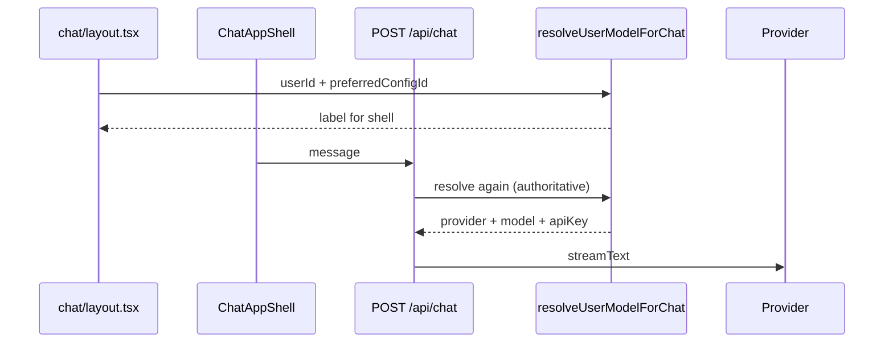

# Chat 模型集成 — 技术设计

> **English:** [chat-model-config.md](./chat-model-config.md)  
> **中文：** [chat-model-config-cn.md](./chat-model-config-cn.md)  
> **总纲：** [02-technical-design-cn.md](../02-technical-design-cn.md)  
> **PRD：** [prd/chat-model-config-cn.md](../prd/chat-model-config-cn.md)  
> **迭代：** iter-05

---

## 1. 设计目标

- Chat `modelLabel` 来自 Profile 所选配置（含平台默认）
- `POST /api/chat` 使用对应 provider + model + Key（用户解密 Key 或 env `BAILIAN_API_KEY`）
- 服务端强制 `test_status === passed`；移除 `NEXT_PUBLIC_LLM_PROVIDER` 对 UI 的驱动

---

## 2. 配置解析

### 2.1 `lib/llm/resolve-user-model.ts`（新建）

```typescript
export type ResolvedUserModel = {
  configId: string | null; // null = platform default
  provider: LlmProviderId;
  modelName: string;
  apiKey: string;
  label: string; // "qwen3.6-plus (bailian)"
};

export async function resolveUserModelForChat(
  userId: string,
  preferredConfigId: string | null,
): Promise<ResolvedUserModel | null>;
```

**算法:**

1. `preferredConfigId === null` → 平台默认
   - `apiKey = process.env.BAILIAN_API_KEY`
   - 无 Key → `null`（Chat 503）
2. `preferredConfigId === uuid` → 查 `user_model_configs`
   - 非本人 / 不存在 → `null`
   - `test_status !== 'passed'` → throw `ModelNotReadyError`（502 + 用户文案）
   - `service_role` 解密 secrets → `apiKey`
3. 构建 `label`: `` `${modelName} (${provider})` ``

### 2.2 `getChatModelForResolvedConfig`

```typescript
export function getChatModelForResolvedConfig(
  resolved: ResolvedUserModel,
): LanguageModel;
```

内部按 `resolved.provider` 选择 `createOpenAI` client，`baseURL` 来自 `PROVIDER_CONFIG`，`apiKey` 来自 resolved（非 env）。

---

## 3. `/api/chat` 变更

`app/api/chat/route.ts`:

```typescript
// Before
const profile = await getUserProfile(user.id);
model: getChatModel(assistant.model, profile?.preferred_model),

// After
const profile = await getUserProfile(user.id);
const resolved = await resolveUserModelForChat(
  user.id,
  profile?.preferred_model_config_id ?? null,
);
if (!resolved) {
  return new Response(
    "No model configured. Add and test a model in Console → Models.",
    { status: 503 },
  );
}
model: getChatModelForResolvedConfig(resolved),
```

`getLlmConfigError()` 修订：

- 移除全局 `LLM_PROVIDER` + 单 env Key 门禁
- 保留 Supabase env 检查
- 平台默认可用时仅需 `BAILIAN_API_KEY`（新用户路径）

---

## 4. 浏览器 modelLabel

### 4.1 Layout 注入

`app/chat/layout.tsx`:

```typescript
const resolved = await resolveUserModelForChat(
  user.id,
  profile?.preferred_model_config_id ?? null,
);
// Pass to ChatAppShell:
preferredModelLabel={resolved?.label ?? "qwen3.6-plus (bailian)"}
```

移除 `preferredModel` 字符串 prop。

### 4.2 `ChatAppShell` / session

`lib/services/browser/conversation-session.ts`:

```typescript
// Before: getDisplayModelLabel(assistantModel, preferredModel)
// After: preferredModelLabel from layout (constant per session switch)
modelLabel: preferredModelLabel,
```

切换对话**不**重新解析模型（与 iter-04 一致）；Preferences 变更后 `router.refresh()` 更新 layout。

### 4.3 废弃

| 模块 | 变更 |
|------|------|
| `lib/services/browser/model-label.ts` | 简化为 `formatModelLabel(provider, modelName)` 或删除 |
| `lib/constants/model-options.ts` | 移除 `getPublicLlmProviderId` 用于 UI；保留 provider 展示名 |
| `NEXT_PUBLIC_LLM_PROVIDER` | 从 UI 路径移除；`.env.example` 标注 deprecated |

---

## 5. 流程



**双次解析：** layout 为展示；chat route 为权威（防篡改 preference）。

---

## 6. 错误与降级

| 场景 | HTTP | 用户文案（English） |
|------|------|---------------------|
| 无配置 / 无平台 Key | 503 | No model configured. Add and test a model in Console → Models. |
| preference 指向 untested/failed | 502 | Selected model is not ready. Test it in Console → Models. |
| Provider 调用失败 | 502 | 现有 `toUserFacingLlmMessage` |

---

## 7. 文件清单

| 操作 | 路径 |
|------|------|
| 新增 | `lib/llm/resolve-user-model.ts` |
| 修改 | `lib/llm/provider.ts` — `getChatModelForResolvedConfig`, provider 扩展 |
| 修改 | `app/api/chat/route.ts` |
| 修改 | `app/chat/layout.tsx` |
| 修改 | `components/chat/chat-app-shell.tsx` — prop rename |
| 修改 | `lib/services/browser/conversation-session.ts` |
| 修改 | `lib/console/profile.ts` — server profile type |
| 修改 | `lib/data/types.ts` |

---

## 8. 测试计划

| AC    | 验证　　　　　　　　　　　　　　　　　　　　　　　　　　　　　　　　　 |
| -------| ------------------------------------------------------------------------|
| AC-46 | E2E: Profile 改 preference → chat header label 更新　　　　　　　　　　|
| AC-47 | 单测: platform default uses `BAILIAN_API_KEY`; user uses decrypted key |
| AC-48 | 单测 + E2E: untested config → chat 502　　　　　　　　　　　　　　　　 |

---

## 9. 修订记录

| 日期 | 变更 |
|------|------|
| 2026-06-17 | iter-05 初稿 |
