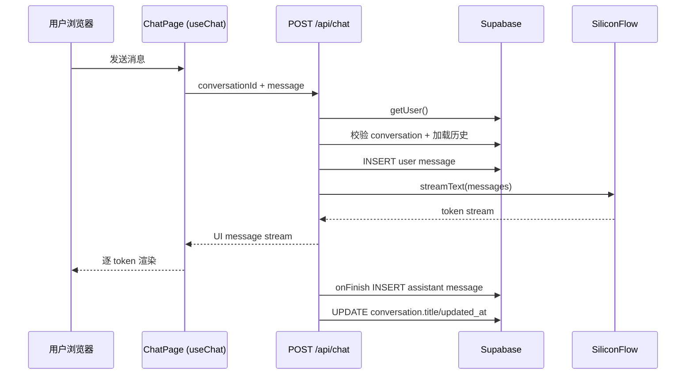
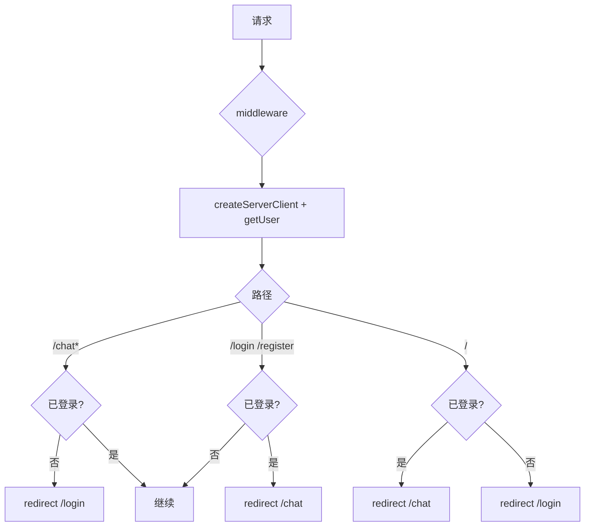
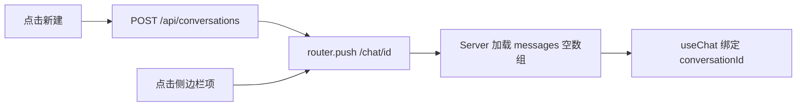

# MVP 聊天 — 核心实现（iter-01）

> **English:** [core-chat.md](./core-chat.md)  
> **中文：** [core-chat-cn.md](./core-chat-cn.md)  
> **设计总纲：** [02-technical-design-cn.md](../02-technical-design-cn.md)  
> **关联 PRD：** [prd/core-chat-cn.md](../prd/core-chat-cn.md)  
> **迭代：** iter-01  
> **状态：** 已确认  
> **技术设计确认日期：** 2026-06-14  
> **文档版本：** v0.1（自总纲迁入 `design/`）

---

## 1. 概述

### 1.1 设计目标

在 greenfield 仓库中脚手架 Next.js 应用，实现 PRD 定义的极简聊天闭环：

- Supabase Auth（邮箱/密码）+ middleware 路由保护
- 固定默认助理 + 对话/消息持久化（RLS 隔离）
- SiliconFlow OpenAI 兼容端点 + `Qwen/Qwen2.5-7B-Instruct` 流式回复
- Dark 主题聊天 UI（侧边栏历史 + 消息流）；**用户可见 UI 文案为 English**

### 1.2 架构对齐

| 项 | 选择 |
|----|------|
| 编排 | Vercel AI SDK `streamText` + `useChat`（方案 B，**不用** ToolLoopAgent） |
| 运行时 | `export const runtime = 'nodejs'` |
| 超时 | `maxDuration = 300`（Vercel Hobby） |
| LLM | `@ai-sdk/openai` + `createOpenAI` + **`siliconflow.chat()`**（Chat Completions，非 Responses API） |
| 数据 | Supabase PostgreSQL + RLS |
| 鉴权 | `@supabase/ssr` Cookie session + Route Handler `getUser()` |
| 前端 | Next.js App Router、Tailwind、shadcn/ui |
| 视觉 | `ui-ux-pro-max` → `design-system/MASTER.md` + `design-system/pages/chat.md` |

**本迭代不包含：** pgvector、MCP、Agent tools、后台任务。

---

## 2. 数据库设计

### 2.1 表结构

```sql
-- 扩展（阶段 2 预留，本迭代不建 vector 表）
-- CREATE EXTENSION IF NOT EXISTS vector;

-- 默认助理（MVP 仅 seed 一条，无管理 UI）
CREATE TABLE public.assistants (
  id            UUID PRIMARY KEY DEFAULT gen_random_uuid(),
  name          TEXT NOT NULL,
  system_prompt TEXT NOT NULL,
  model         TEXT NOT NULL DEFAULT 'Qwen/Qwen2.5-7B-Instruct',
  is_default    BOOLEAN NOT NULL DEFAULT false,
  created_at    TIMESTAMPTZ NOT NULL DEFAULT now(),
  updated_at    TIMESTAMPTZ NOT NULL DEFAULT now()
);

-- 每用户仅允许一个 is_default = true（应用层 + 部分索引约束）
CREATE UNIQUE INDEX assistants_single_default_idx
  ON public.assistants (is_default) WHERE is_default = true;

-- 对话
CREATE TABLE public.conversations (
  id            UUID PRIMARY KEY DEFAULT gen_random_uuid(),
  user_id       UUID NOT NULL REFERENCES auth.users(id) ON DELETE CASCADE,
  assistant_id  UUID NOT NULL REFERENCES public.assistants(id) ON DELETE RESTRICT,
  title         TEXT NOT NULL DEFAULT 'New Chat',
  created_at    TIMESTAMPTZ NOT NULL DEFAULT now(),
  updated_at    TIMESTAMPTZ NOT NULL DEFAULT now()
);

-- 消息（content 存纯文本；阶段 3 可扩展 parts/jsonb）
CREATE TABLE public.messages (
  id              UUID PRIMARY KEY DEFAULT gen_random_uuid(),
  conversation_id UUID NOT NULL REFERENCES public.conversations(id) ON DELETE CASCADE,
  role            TEXT NOT NULL CHECK (role IN ('user', 'assistant', 'system')),
  content         TEXT NOT NULL,
  created_at      TIMESTAMPTZ NOT NULL DEFAULT now()
);

-- updated_at 触发器（conversations）
CREATE OR REPLACE FUNCTION public.set_updated_at()
RETURNS TRIGGER AS $$
BEGIN
  NEW.updated_at = now();
  RETURN NEW;
END;
$$ LANGUAGE plpgsql;

CREATE TRIGGER conversations_updated_at
  BEFORE UPDATE ON public.conversations
  FOR EACH ROW EXECUTE FUNCTION public.set_updated_at();
```

### 2.2 Seed 数据

```sql
INSERT INTO public.assistants (name, system_prompt, model, is_default)
VALUES (
  '7ai Assistant',
  'You are the AI assistant for 7ai-club. Answer clearly and concisely. Match the language the user writes in.',
  'Qwen/Qwen2.5-7B-Instruct',
  true
);
```

### 2.3 关系说明

```
auth.users 1 ── * conversations * ── 1 assistants
conversations 1 ── * messages
```

- 每个对话绑定一个 `assistant_id`（MVP 均为默认助理）
- 消息仅通过 `conversation_id` 关联；用户归属由 `conversations.user_id` 间接保证

### 2.4 索引

| 表 | 索引 | 用途 |
|----|------|------|
| `conversations` | `(user_id, updated_at DESC)` | 侧边栏历史列表 |
| `messages` | `(conversation_id, created_at ASC)` | 加载对话消息 |
| `assistants` | `(is_default) WHERE is_default` | 快速取默认助理 |

### 2.5 RLS 策略

| 表 | 策略 | 说明 |
|----|------|------|
| `assistants` | `SELECT` 对已登录用户开放 | MVP 助理只读；`auth.uid() IS NOT NULL` |
| `assistants` | 无 INSERT/UPDATE/DELETE 给 authenticated | 仅 service_role / migration seed |
| `conversations` | `SELECT/INSERT/UPDATE/DELETE` | `user_id = auth.uid()` |
| `messages` | `SELECT/INSERT` | 存在关联 conversation 且 `conversations.user_id = auth.uid()` |
| `messages` | 无 UPDATE/DELETE | MVP 不可编辑历史消息 |

**messages INSERT 策略（示例）：**

```sql
CREATE POLICY "messages_insert_own"
  ON public.messages FOR INSERT TO authenticated
  WITH CHECK (
    EXISTS (
      SELECT 1 FROM public.conversations c
      WHERE c.id = conversation_id AND c.user_id = auth.uid()
    )
  );
```

### 2.6 pgvector

本迭代**不涉及**。阶段 2 新增 `knowledge_bases`、`document_chunks` 等表时再启用 `vector` 扩展。

---

## 3. API 设计

### 3.1 端点列表

| 方法 | 路径 | 说明 | 鉴权 |
|------|------|------|------|
| POST | `/api/chat` | 流式聊天（保存 user/assistant 消息） | Session JWT |
| POST | `/api/conversations` | 新建空白对话 | Session JWT |
| GET | `/api/conversations` | 当前用户对话列表 | Session JWT |

**Auth 页面**使用 Supabase Client 直调 `signUp` / `signInWithPassword` / `signOut`（Server Actions 封装），不单独建 REST API。

### 3.2 `POST /api/chat`

**Request:**

```json
{
  "conversationId": "uuid",
  "message": {
    "id": "client-generated-id",
    "role": "user",
    "parts": [{ "type": "text", "text": "你好" }]
  }
}
```

**Response:** `200` — `createUIMessageStreamResponse`（AI SDK UI message stream）

**处理流程：**

1. `getUser()` → 401
2. 校验 `conversationId` 归属当前用户
3. 加载默认/对话关联助理配置
4. 从 DB 加载历史 messages → 转为 ModelMessage[]
5. 持久化 user message
6. `streamText({ model, system, messages })`
7. `onFinish` 持久化 assistant 完整回复；更新 conversation.title（首条 user 消息时截取前 40 字）

**错误码：**

| 状态码 | 场景 |
|--------|------|
| 401 | 未登录 |
| 403 | 对话不属于当前用户 |
| 404 | 对话不存在 |
| 422 | 请求体无效 / 空消息 |
| 502 | SiliconFlow 调用失败 |

### 3.3 `POST /api/conversations`

**Request:** `{}` 或 `{ "assistantId": "uuid" }`（省略则用默认助理）

**Response:**

```json
{
  "id": "uuid",
  "title": "New Chat",
  "assistantId": "uuid",
  "createdAt": "ISO8601"
}
```

### 3.4 `GET /api/conversations`

**Response:**

```json
{
  "conversations": [
    {
      "id": "uuid",
      "title": "关于 Next.js 的问题",
      "updatedAt": "ISO8601"
    }
  ]
}
```

按 `updated_at DESC` 排序，限制默认 50 条。

---

## 4. 流程设计

### 4.1 聊天主流



### 4.2 认证与路由保护



### 4.3 新建 / 切换对话



---

## 5. 页面与路由

### 5.1 路由树

```
app/
  layout.tsx                 # 根布局、Dark 主题、字体
  page.tsx                   # / → 重定向
  login/page.tsx             # 登录
  register/page.tsx          # 注册
  chat/
    page.tsx                 # /chat → 重定向到最新对话或新建
    [conversationId]/
      page.tsx               # 聊天主界面（Server 预取 messages + 列表）
  api/
    chat/route.ts
    conversations/route.ts

middleware.ts                # session 刷新 + 路由保护

components/
  chat/
    chat-sidebar.tsx         # 历史列表 + 新建 + 登出
    chat-messages.tsx        # 消息列表 + 流式展示
    chat-input.tsx           # 输入框
  auth/
    auth-form.tsx            # 登录/注册共用表单壳
  ui/                        # shadcn 组件

lib/
  supabase/client.ts
  supabase/server.ts
  supabase/middleware.ts
  llm/siliconflow.ts
  chat/messages.ts           # DB ↔ AI SDK 消息转换
  chat/conversations.ts      # 对话 CRUD 查询
  constants.ts

supabase/migrations/
  20260614000000_mvp_chat.sql
```

### 5.2 页面职责

| 路由 | 组件 | Server/Client | 说明 |
|------|------|-------------|------|
| `/` | `page.tsx` | Server | `redirect` 基于 session |
| `/login` | `LoginPage` | Client 表单 | `signInWithPassword` |
| `/register` | `RegisterPage` | Client 表单 | `signUp` 后自动登录 |
| `/chat` | `ChatIndexPage` | Server | 取最新 conversation 或 POST 新建 |
| `/chat/[id]` | `ChatPage` | Server 壳 + Client 聊天区 | 预取 messages、sidebar 列表 |

---

## 6. 组件设计

### 6.1 组件树

```
ChatPage (Server)
└── ChatLayout (Client)
    ├── ChatSidebar
    │   ├── NewChatButton
    │   ├── ConversationList
    │   └── LogoutButton
    └── ChatPanel
        ├── ChatMessages          # useChat.messages
        ├── ChatEmptyState
        └── ChatInput               # useChat.sendMessage
```

### 6.2 关键组件

#### `ChatLayout`

**职责：** 持有 `useChat` 实例，向子组件传递 messages / status / sendMessage。

**Props:**

```typescript
interface ChatLayoutProps {
  conversationId: string;
  initialMessages: UIMessage[];
  conversations: ConversationSummary[];
}
```

**状态 / 数据来源：**

- `useChat({ id: conversationId, messages: initialMessages, transport: ... })`
- `DefaultChatTransport({ api: '/api/chat', body: { conversationId } })`

#### `ChatSidebar`

**职责：** 展示对话列表、高亮当前项、新建对话、登出。

#### `ChatMessages`

**职责：** 渲染 user/assistant 气泡；流式时末条 assistant 消息逐字更新；错误态展示 `error.message`。

---

## 7. 核心模块（lib）

| 路径 | 职责 |
|------|------|
| `lib/llm/siliconflow.ts` | `createOpenAI` 单例，读取 `SILICONFLOW_API_KEY` |
| `lib/chat/conversations.ts` | 对话 CRUD、消息 load/save、`getChatModel` 相关查询 |
| `lib/supabase/server.ts` | Route Handler / Server Component 用 client |
| `lib/supabase/client.ts` | 浏览器 Auth 表单用 client |
| `lib/supabase/middleware.ts` | middleware 专用 `createServerClient` |

### 7.1 LLM 集成

```typescript
// lib/llm/siliconflow.ts
import { createOpenAI } from '@ai-sdk/openai';

export const siliconflow = createOpenAI({
  baseURL: process.env.SILICONFLOW_BASE_URL ?? 'https://api.siliconflow.cn/v1',
  apiKey: process.env.SILICONFLOW_API_KEY,
});

export function getChatModel(model: string) {
  return siliconflow.chat(model); // Chat Completions only
}
```

```typescript
// app/api/chat/route.ts（概念）
const result = streamText({
  model: getChatModel(assistant.model),
  system: assistant.system_prompt,
  messages: await convertToModelMessages(validatedMessages),
  abortSignal: req.signal,
});

return result.toUIMessageStreamResponse({
  originalMessages: uiMessages,
  onFinish: async ({ responseMessage }) => {
    await saveAssistantMessage(conversationId, responseMessage);
  },
});
```

### 7.2 Agent / Tools

本迭代 **不使用** ToolLoopAgent / tools / MCP。阶段 3 在 `lib/agents/assistant-agent.ts` 扩展。

---

## 8. 后台任务

本迭代 **无**。文档上传与 Embedding 在阶段 2 引入 Inngest / Edge Functions。

---

## 9. 视觉 / 设计系统

编码阶段执行（Phase B）：

```bash
python3 .cursor/skills/ui-ux-pro-max/scripts/search.py \
  "SaaS AI chat assistant platform professional minimal dark" \
  --design-system --persist -p "7ai-club" -f markdown

python3 .cursor/skills/ui-ux-pro-max/scripts/search.py \
  "chat messaging streaming realtime dark sidebar" \
  --design-system --persist -p "7ai-club" --page "chat" -f markdown
```

实现前读取 `design-system/pages/chat.md`（或 `MASTER.md`）。主色、背景、字体按 **Minimal + Professional + Dark** 落地。

---

## 10. 文件变更清单

| 操作 | 路径 | 说明 |
|------|------|------|
| 新增 | `package.json` 等 | `create-next-app` + 依赖 |
| 新增 | `middleware.ts` | Auth 刷新 + 路由保护 |
| 新增 | `supabase/migrations/*.sql` | 表 + RLS + seed |
| 新增 | `app/api/chat/route.ts` | 流式聊天 |
| 新增 | `app/api/conversations/route.ts` | 对话 CRUD |
| 新增 | `app/chat/**` | 聊天页 |
| 新增 | `app/login/**`, `app/register/**` | Auth 页 |
| 新增 | `components/chat/**` | UI 组件 |
| 新增 | `lib/**` | Supabase、LLM、chat 逻辑 |
| 新增 | `.env.example` | 环境变量模板 |
| 新增 | `design-system/**` | UI skill 生成 |
| 修改 | `README.cn.md` | 本地开发步骤 |

---

## 11. 安全与降级

| 风险 | 缓解 |
|------|------|
| Serverless 超时 | 单轮 `streamText` 无 tools；`maxDuration=300` |
| SiliconFlow 不可用 | try/catch → 502 + 前端 error 展示；user message 已持久化 |
| API Key 泄露 | 仅 `SILICONFLOW_API_KEY` 服务端；不进 `NEXT_PUBLIC_*` |
| RLS 绕过 | Chat Route 用 user-scoped Supabase client，不用 service_role 读对话 |
| 重复提交 | `useChat` status !== `ready` 时禁用发送 |
| fetch  hang | `streamText` + `AbortSignal`；可选 60s upstream timeout（阶段 5 完善） |

---

## 12. 测试计划

- [ ] 注册 → 自动登录 → 进入 `/chat`
- [ ] 未登录访问 `/chat` → `/login`
- [ ] 发送消息 → 流式显示 → 刷新后消息仍在
- [ ] 新建对话 → URL 变化 → 空态
- [ ] 侧边栏切换对话 → 加载对应历史
- [ ] 两用户 RLS：A 无法 API 访问 B 的 conversationId
- [ ] 无效 API Key → 可读错误提示
- [ ] 移动端窄屏：侧边栏可折叠（sheet 或 drawer）

### 本地验证步骤

1. Supabase 项目创建；本地 `supabase db push` 或 MCP `apply_migration`
2. 配置 `.env.local`（Supabase + SiliconFlow）
3. `pnpm dev` → 注册 → 聊天
4. Supabase Dashboard 检查 `messages` 表写入

### 环境变量

| 变量 | 说明 |
|------|------|
| `NEXT_PUBLIC_SUPABASE_URL` | Supabase 项目 URL |
| `NEXT_PUBLIC_SUPABASE_ANON_KEY` | 匿名公钥 |
| `SILICONFLOW_API_KEY` | SiliconFlow API Key（服务端） |
| `SILICONFLOW_BASE_URL` | 可选，默认 `https://api.siliconflow.cn/v1` |

---

## 13. PRD 验收映射

| 验收标准 ID | 实现要点 | 验证方式 |
|-------------|----------|----------|
| AC-01 | middleware 保护 `/chat` | 未登录访问跳转 |
| AC-02 | register + `signUp` 后 redirect | 手动 E2E |
| AC-03 | `streamText` + `useChat` | 观察逐字输出 |
| AC-04 | messages 表持久化 + Server 预取 | 刷新页面 |
| AC-05 | `ChatSidebar` + GET conversations | 多对话切换 |
| AC-06 | POST conversations + 空 messages | 新建后空态 |
| AC-07 | API 502 + useChat error UI | 错误 Key 测试 |
| AC-08 | RLS + Route 归属校验 | 两账号 + 越权 ID |
| AC-09 | `getChatModel('Qwen/Qwen2.5-7B-Instruct')` | 日志/响应确认 |

---

## 14. 开放问题 / 技术债

| ID | 问题 | 决议 |
|----|------|------|
| TD-01 | 消息格式用 TEXT 还是 JSONB parts | MVP 用 TEXT；阶段 3 迁移 parts |
| TD-02 | `/chat` 无对话时自动新建 vs 空壳页 | **自动新建**并 redirect |
| TD-03 | 对话标题更新时机 | 首条 user 消息 onFinish 时截取 |
| TD-04 | shadcn 初始化方式 | `npx shadcn@latest init` dark theme |
| TD-05 | 消息 ID：客户端 AI SDK id vs DB UUID | DB 自动生成 UUID；不持久化客户端 id |
| TD-06 | LLM 调用方式 | `getChatModel()` → `siliconflow.chat()` |

---

## 15. 修订记录

| 日期 | 版本 | 迭代 | 变更 |
|------|------|------|------|
| 2026-06-14 | v0.1 | iter-01 | 初稿 |

---

*迭代索引：[`docs/iterations/iter-01/README-cn.md`](../../iterations/iter-01/README-cn.md)*
