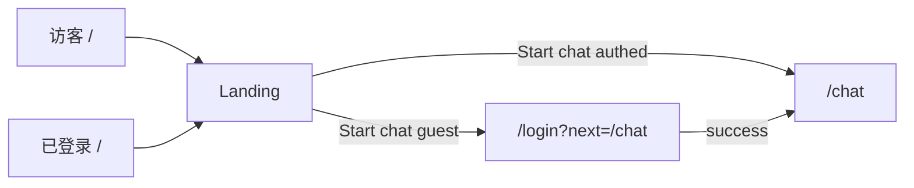

# Landing · 顶栏 · C2 视觉 — 技术设计

> **English:** [landing.md](./landing.md)  
> **中文：** [landing-cn.md](./landing-cn.md)  
> **设计总纲：** [02-technical-design-cn.md](../02-technical-design-cn.md)  
> **关联 PRD：** [prd/landing-cn.md](../prd/landing-cn.md)  
> **迭代：** iter-02  
> **状态：** 已实现（本地）  
> **文档版本：** v0.2

---

## 1. 设计目标

- 将 `app/page.tsx` 从 `redirect("/chat")` 改为公开 Landing
- 抽取共享 `SiteHeader`：Logo、Chat、Sign in/Register 或右上角用户
- 全局 CSS token 迁移至 **C2 Electric Ocean**；Chat 页同步换肤
- 产出 `design-system/MASTER.md`（C2 tokens）

---

## 2. 路由与页面

| 路由 | 变更 | 组件 |
|------|------|------|
| `/` | **重写** | `app/page.tsx`（Server） |
| `/login` | 支持 `?next=` | `AuthForm` 读取 `next` 回跳 |
| `/chat/*` | 换肤 + 共用 Header | `ChatLayout` 调整 |

### 2.1 `app/page.tsx`（Server Component）

```typescript
// 伪代码
const supabase = await createClient();
const { data: { user } } = await supabase.auth.getUser();

return (
  <div className="min-h-dvh bg-bg-base">
    <SiteHeader user={user} />
    <LandingHero user={user} />
    <CapabilityGrid />
    <LandingFooter />
  </div>
);
```

- **不**对已登录用户 redirect
- `LandingHero` 内 Start chat：`user ? "/chat" : "/login?next=/chat"`

---

## 3. 组件设计

### 3.1 组件树

```
app/page.tsx
├── SiteHeader
│   ├── LogoLink
│   ├── NavChatLink
│   └── UserArea
│       ├── GuestLinks (Sign in / Register)
│       └── UserMenu (client) — email / initials + Sign out
├── LandingHero
│   └── StartChatButton
├── CapabilityGrid — [01]..[04] 卡片
└── LandingFooter

components/chat/chat-layout.tsx
├── SiteHeader (variant="chat") — 与首页一致
├── ChatSidebar
└── ChatMessages + ChatInput
```

### 3.2 `SiteHeader`

| 属性 | 类型 | 说明 |
|------|------|------|
| `user` | `User \| null` | Server 传入 Supabase user |
| `variant` | `"marketing" \| "chat"` | chat 变体可隐藏部分 nav |

**用户展示（AC-13）：**

- `lib/auth/user-display.ts`：
  - `getUserInitials(email)` → 邮箱 local-part 前两字符大写
  - `getUserDisplayLabel(email)` → 完整邮箱或截断
- `UserMenu`（client）：圆形 avatar + 下拉 Sign out（`supabase.auth.signOut()`）

### 3.3 Landing 文案（English，常量）

`lib/constants/landing.ts`：

| 区块 | 内容（对齐 7ai.club/en 调性） |
|------|-------------------------------|
| Hero 标题 | `CRACK THE STACK` |
| Hero 副标 | `DECONSTRUCT · LEARN · BREAK THINGS` |
| 价值主张 | `Play first. Pitch never. Break things on purpose.` |
| CTA | `Start chat` |
| 模块 | `[01] Streaming & models` … `[04] Assistant & personas` |
| 页脚 | `SYS://local · learning mode · no warranty` |

Open console：**不展示**（PRD Out of Scope）。

---

## 4. 视觉 / Design System

### 4.1 CSS 变量（`app/globals.css`）

替换 iter-01 紫色系为 C2：

```css
:root {
  --bg-base: #0a0e27;
  --bg-elevated: #12183a;
  --neon-primary: #0080ff;
  --neon-secondary: #bf00ff;
  --accent-success: #22c55e;
  --text-primary: #f8fafc;
  --text-muted: #94a3b8;
}
```

`@theme inline` 映射 Tailwind 工具类：`bg-bg-base`、`text-neon-primary` 等。

### 4.2 字体

`app/layout.tsx` 增加：

```typescript
import { JetBrains_Mono, Inter } from "next/font/google";
```

- `--font-mono`：Hero、编号 `[01]`、代码感标题
- `--font-sans`：正文（保留 Inter）

### 4.3 背景与动效

- `components/ui/grid-background.tsx`：fixed 低 opacity 网格（CSS `background-image`）
- 按钮 hover：`box-shadow: 0 0 20px rgba(0,128,255,0.4)`
- 已有 `prefers-reduced-motion` 规则保留

### 4.4 `design-system/MASTER.md`

实现前运行（或手写等价 tokens）：

```bash
python3 .cursor/skills/ui-ux-pro-max/scripts/search.py \
  "AI learning developer dark electric blue neon" \
  --design-system --persist -p "7ai-club" -f markdown
```

覆盖为 PRD 已定 C2 值；另建 `design-system/pages/landing.md`、`chat.md` override。

### 4.5 Chat 换肤映射

| 旧类名 / 色 | 新 token |
|-------------|----------|
| `bg-[#0F0F23]` | `bg-bg-base` |
| `bg-[#1E1B4B]/80` 侧边栏 | `bg-bg-elevated/80` |
| `bg-[#4338CA]` 用户气泡 | `bg-neon-primary` 或渐变 |
| `text-[#22C55E]` AI | `text-accent-success` |

---

## 5. 鉴权与链接

| 链接 | 目标 |
|------|------|
| Start chat（未登录） | `/login?next=/chat` |
| Start chat（已登录） | `/chat` |
| 顶栏 Chat | `/chat`（middleware 未登录 → login） |
| Sign in | `/login` |
| Register | `/register` |

### `AuthForm` 修改

- props：`next?: string`（默认 `/chat`）
- 登录/注册成功后：`router.push(next)` + `router.refresh()`
- `app/login/page.tsx`：`searchParams.next` 传给 `AuthForm`

---

## 6. 文件变更清单

| 操作 | 路径 |
|------|------|
| 重写 | `app/page.tsx` |
| 修改 | `app/layout.tsx`（字体） |
| 修改 | `app/globals.css`（C2 tokens） |
| 修改 | `app/login/page.tsx`（next param） |
| 修改 | `components/auth/auth-form.tsx` |
| 新增 | `components/layout/site-header.tsx` |
| 新增 | `components/layout/user-menu.tsx` |
| 新增 | `components/landing/landing-hero.tsx` |
| 新增 | `components/landing/capability-grid.tsx` |
| 新增 | `components/landing/landing-footer.tsx` |
| 新增 | `components/ui/grid-background.tsx` |
| 新增 | `lib/auth/user-display.ts` |
| 新增 | `lib/constants/landing.ts` |
| 修改 | `components/chat/chat-layout.tsx`（SiteHeader + tokens） |
| 修改 | `components/chat/chat-sidebar.tsx`（tokens） |
| 新增/更新 | `design-system/MASTER.md`、`pages/landing.md`、`pages/chat.md` |

---

## 7. 流程图



---

## 8. 测试计划

- [ ] `/` 已登录/未登录均显示 Landing（AC-10）
- [ ] Start chat 路径（AC-11）
- [ ] 顶栏 Chat、用户区（AC-12、AC-13）
- [ ] Chat 与首页色板一致（AC-18）
- [ ] 375 / 768 / 1024 响应式
- [ ] `prefers-reduced-motion` 无强动画

---

## 9. PRD 验收映射

| AC | 实现要点 |
|----|----------|
| AC-10 | 移除 `redirect("/chat")` |
| AC-11 | Hero CTA + `AuthForm` next |
| AC-12 | `SiteHeader` Chat link |
| AC-13 | `UserMenu` + `user-display.ts` |
| AC-18 | globals.css + Chat 组件 token 统一 |

---

## 10. 修订记录

| 日期 | 版本 | 变更 |
|------|------|------|
| 2026-06-15 | v0.1 | iter-02 初稿 |
