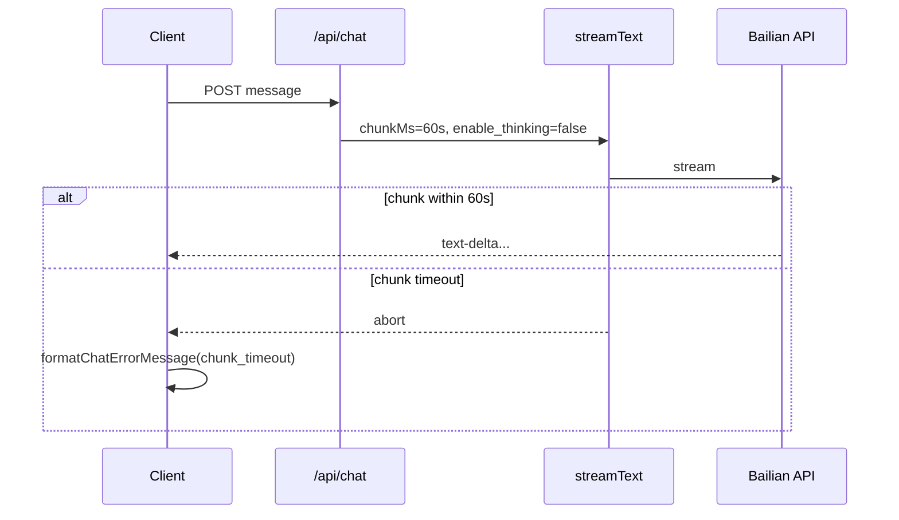

# LLM 可靠性 — 技术设计（百炼 · 超时 · 错误）

> **English:** [llm-reliability.md](./llm-reliability.md)  
> **中文：** [llm-reliability-cn.md](./llm-reliability-cn.md)  
> **设计总纲：** [02-technical-design-cn.md](../02-technical-design-cn.md)  
> **关联 PRD：** [prd/llm-reliability-cn.md](../prd/llm-reliability-cn.md)  
> **迭代：** iter-02  
> **状态：** 已实现（本地）  
> **文档版本：** v0.2

---

## 1. 设计目标

- 修复 `bailian` + `qwen3.6-plus` 流式 `abort`（无正文）
- 改进配置校验与用户可见错误文案（AC-19、AC-20）

---

## 2. 根因与策略

| 假设 | 依据 |
|------|------|
| `chunkMs: 15000` 过短 | 思考模型首 token 可能 >15s |
| `qwen3.6-plus` 默认思考 | 阿里云文档：混合思考默认开启 |

**组合修复（双轨，均实现）：**

1. **调大 chunk 超时** — 降低所有提供商误杀概率  
2. **百炼关闭思考** — `enable_thinking: false` 缩短首 token

---

## 3. 实现方案

### 3.1 `lib/llm/timeout.ts`

```typescript
/** Default chunk idle timeout — raised for thinking models (iter-02). */
export const CHAT_CHUNK_TIMEOUT_MS = 60_000;

/** Bailian-specific override if needed. */
export function getChatChunkTimeoutMs(): number {
  const raw = process.env.LLM_CHUNK_TIMEOUT_MS?.trim();
  const parsed = raw ? Number.parseInt(raw, 10) : Number.NaN;
  if (Number.isFinite(parsed) && parsed > 0) return parsed;
  return CHAT_CHUNK_TIMEOUT_MS;
}
```

- 默认 **60s**（原 15s）
- 可选 env `LLM_CHUNK_TIMEOUT_MS` 覆盖
- `.env.example` 补充说明

`app/api/chat/route.ts`：

```typescript
timeout: { totalMs: llmTimeoutMs, chunkMs: getChatChunkTimeoutMs() },
```

### 3.2 百炼 `enable_thinking: false`

新增 `lib/llm/stream-options.ts`：

```typescript
import { getLlmProviderId } from "./provider";

export function getStreamTextProviderOptions() {
  if (getLlmProviderId() === "bailian") {
    return {
      openai: { enable_thinking: false },
    };
  }
  return undefined;
}
```

`streamText` 调用：

```typescript
const result = streamText({
  model: getChatModel(assistant.model),
  system: assistant.system_prompt,
  messages: await convertToModelMessages(uiMessages),
  providerOptions: getStreamTextProviderOptions(),
  // ...
});
```

> DashScope OpenAI 兼容模式将 `enable_thinking` 作为非标准 body 字段；AI SDK 经 `providerOptions.openai` 透传。

若 SDK 版本不兼容，备选：在 `createChatCompletionsClient("bailian")` 使用自定义 `fetch` 合并 body（技术债 TD-01）。

### 3.3 配置校验 `getLlmConfigError()`

百炼分支增加地域提示（不阻断启动，仅 warning 级文档；可选在错误消息中提示）：

```typescript
if (provider === "bailian" && !process.env.BAILIAN_BASE_URL?.trim()) {
  // 默认北京 endpoint — 文档说明新加坡/美国 Key 需设 BAILIAN_BASE_URL
}
```

在 `README` / `.env.example` 已有注释；`getLlmConfigError` **不**强制 BASE_URL（有默认值）。

### 3.4 错误分类与日志

**`lib/llm/errors.ts`（新）：**

```typescript
export type LlmErrorKind =
  | "config"
  | "chunk_timeout"
  | "total_timeout"
  | "upstream_auth"
  | "upstream"
  | "client_abort"
  | "unknown";

export function classifyLlmError(error: unknown): LlmErrorKind { ... }
export function toUserFacingLlmMessage(kind: LlmErrorKind, provider: string): string;
```

| Kind | 用户文案（English） |
|------|---------------------|
| `chunk_timeout` | `The model took too long to respond. Try again or set LLM_CHUNK_TIMEOUT_MS higher.` |
| `total_timeout` | `Request timed out after {n}s. Try a faster model or increase LLM_TIMEOUT_MS.` |
| `upstream_auth` | `LLM API key rejected. Check {KEY_ENV} and BAILIAN_BASE_URL region, then redeploy.` |
| `client_abort` | `Request was cancelled.` |
| `config` | 沿用 `getLlmConfigError()` 原文 |

**`app/api/chat/route.ts` `onError`：**

```typescript
onError: ({ error }) => {
  const kind = classifyLlmError(error);
  console.error("LLM stream error:", { kind, error });
},
```

**`lib/chat/fetch-with-error.ts` `formatChatErrorMessage`：**

- 识别 `aborted` / `timeout` / `401` / `403` / `503`
- 调用 `toUserFacingLlmMessage` 或 provider 感知文案
- bailian 专用提示含 `BAILIAN_API_KEY` + `BAILIAN_BASE_URL`

---

## 4. 流程图



---

## 5. 文件变更清单

| 操作 | 路径 |
|------|------|
| 修改 | `lib/llm/timeout.ts` |
| 新增 | `lib/llm/stream-options.ts` |
| 新增 | `lib/llm/errors.ts` |
| 修改 | `lib/llm/provider.ts`（可选 export provider id 给 errors） |
| 修改 | `app/api/chat/route.ts` |
| 修改 | `lib/chat/fetch-with-error.ts` |
| 修改 | `.env.example`（`LLM_CHUNK_TIMEOUT_MS`） |

---

## 6. 测试计划

- [ ] `LLM_PROVIDER=bailian` 本地发消息：有 `text-delta`，无 15s abort（AC-19）
- [ ] 错误 API key：UI 显示 auth 类文案（AC-20）
- [ ] 断网 / 超时：非 "network error" 泛化句
- [ ] `siliconflow` / `nvidia` 回归：chunk 60s 不破坏现有流式

---

## 7. 开放问题 / 技术债

| ID | 问题 | 决议 |
|----|------|------|
| TD-01 | `providerOptions.openai.enable_thinking` 是否被 @ai-sdk/openai 透传 | 实现时验证；不通过则用 custom fetch |
| TD-02 | 流式中展示 reasoning_content | iter-02 不做 |

---

## 8. PRD 验收映射

| AC | 实现 |
|----|------|
| AC-19 | chunk 60s + `enable_thinking: false` |
| AC-20 | `errors.ts` + `formatChatErrorMessage` |

---

## 9. 修订记录

| 日期 | 版本 | 变更 |
|------|------|------|
| 2026-06-15 | v0.1 | iter-02 初稿 |
