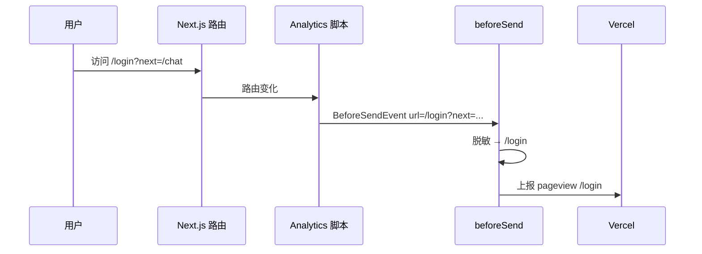

# Vercel Analytics 与 Speed Insights — 技术设计

> **English:** [vercel-analytics.md](./vercel-analytics.md)  
> **中文:** [vercel-analytics-cn.md](./vercel-analytics-cn.md)  
> **设计总纲:** [02-technical-design-cn.md](../02-technical-design-cn.md)  
> **关联 PRD:** [prd/vercel-analytics-cn.md](../prd/vercel-analytics-cn.md)  
> **迭代:** iter-11  
> **状态:** 草稿  
> **文档版本:** v0.1

---

## 1. 设计目标

- 单一 Client Component 挂载两个 Vercel 官方包
- URL 脱敏为纯函数 + 单元测试
- `trackProductEvent` 薄封装 + 环境守卫
- 最小改动接入现有 Auth / Chat 成功回调

---

## 2. 依赖

```bash
pnpm add @vercel/analytics @vercel/speed-insights
```

| 包 | 导入路径 | 用途 |
|----|----------|------|
| `@vercel/analytics` | `@vercel/analytics/next` | `<Analytics />` |
| `@vercel/analytics` | `@vercel/analytics` | wrapper 内 `track()` |
| `@vercel/speed-insights` | `@vercel/speed-insights/next` | `<SpeedInsights />` |

---

## 3. `lib/analytics/before-send.ts`

纯函数（无 React），仅由 Client Component 引用。

```typescript
import type { BeforeSendEvent } from "@vercel/analytics";

/** 剥离 event.url 的 search + hash；解析失败则丢弃事件。 */
export function redactAnalyticsEventUrl(event: BeforeSendEvent): BeforeSendEvent | null {
  try {
    const parsed = new URL(event.url, "https://placeholder.local");
    const pathname = parsed.pathname || "/";
    return { ...event, url: pathname };
  } catch {
    return null;
  }
}
```

**说明:**

- 相对 URL 用占位 origin 解析，仅保留 pathname
- 不修改 path 段（PRD 要求不过滤 `/console`）
- 导出供单元测试与 `beforeSend` 回调使用

---

## 4. `lib/analytics/events.ts`

```typescript
import { track } from "@vercel/analytics";

export const PRODUCT_ANALYTICS_EVENTS = {
  signUpComplete: "sign_up_complete",
  signInComplete: "sign_in_complete",
  conversationStarted: "conversation_started",
} as const;

export type ProductAnalyticsEvent =
  (typeof PRODUCT_ANALYTICS_EVENTS)[keyof typeof PRODUCT_ANALYTICS_EVENTS];

/** 仅在 Vercel 生产部署时为 true。 */
export function isAnalyticsEnabled(): boolean {
  return process.env.NODE_ENV === "production" && process.env.VERCEL === "1";
}

/** 非 Vercel production 时为 noop；不抛错。 */
export function trackProductEvent(name: ProductAnalyticsEvent): void {
  if (!isAnalyticsEnabled()) return;
  try {
    track(name);
  } catch {
    // 吞掉 — 埋点不得影响 UX
  }
}
```

**`isAnalyticsEnabled()` 理由:**

| 环境 | `NODE_ENV` | `VERCEL` | 上报? |
|------|------------|----------|-------|
| `pnpm dev` | development | undefined | 否 |
| 本地 `pnpm start` | production | undefined | 否 |
| Vercel Preview | production | 1 | 是* |
| Vercel Production | production | 1 | 是 |

\*Preview 按 PRD 上报；Dashboard 可按 deployment 过滤。`@vercel/analytics` 在非 Vercel 主机也会自限；双重守卫满足 AC-118。

**无事件 payload** — 仅事件名（PRD OQ-04）。

---

## 5. `components/analytics/vercel-observability.tsx`

```tsx
"use client";

import { Analytics } from "@vercel/analytics/next";
import { SpeedInsights } from "@vercel/speed-insights/next";
import { redactAnalyticsEventUrl } from "@/lib/analytics/before-send";

export function VercelObservability() {
  return (
    <>
      <Analytics beforeSend={redactAnalyticsEventUrl} />
      <SpeedInsights />
    </>
  );
}
```

**为何用 Client Component:**

- App Router 禁止从 Server Component 向 Client 子组件传递函数 prop（`beforeSend`）
- 保持 `app/layout.tsx` 为 Server Component（metadata、字体不变）

---

## 6. `app/layout.tsx` 变更

```tsx
import { VercelObservability } from "@/components/analytics/vercel-observability";

// <body> 内 {children} 之后:
{children}
<VercelObservability />
```

不改动 `<html lang="en">`、字体、metadata。

---

## 7. 自定义事件接入

### 7.1 `components/auth/auth-form.tsx`

| 分支 | 时机 | 事件 |
|------|------|------|
| 登录 | `signInWithPassword` 成功（无 error），`router.push` 之前 | `sign_in_complete` |
| 注册 + session | `signUp` 成功且有 `data.session`，`router.push` 之前 | `sign_up_complete` |
| 注册 + 邮箱确认 | `signUp` 成功、`!data.session`、展示 info 并 `return` 之前 | `sign_up_complete` |

```typescript
import { trackProductEvent, PRODUCT_ANALYTICS_EVENTS } from "@/lib/analytics";

// 登录成功:
trackProductEvent(PRODUCT_ANALYTICS_EVENTS.signInComplete);

// 注册成功（两条路径）:
trackProductEvent(PRODUCT_ANALYTICS_EVENTS.signUpComplete);
```

**不追踪:** catch 分支（失败 Auth）。

### 7.2 `components/chat/chat-app-shell.tsx`

在 `createConversationWithAssistant` 中，`createConversation(assistantId)` resolve 后：

```typescript
const id = await createConversation(assistantId);
trackProductEvent(PRODUCT_ANALYTICS_EVENTS.conversationStarted);
```

在导航 / 状态更新之前。**不追踪** catch（picker 保持打开）。

---

## 8. 组件树（增量）

```
app/layout.tsx (Server)
└── body
    ├── {children}
    └── VercelObservability (Client)
        ├── Analytics (beforeSend → redactAnalyticsEventUrl)
        └── SpeedInsights

components/auth/auth-form.tsx
└── handleSubmit → 成功时 trackProductEvent

components/chat/chat-app-shell.tsx
└── createConversationWithAssistant → 成功时 trackProductEvent
```

---

## 9. 时序 — 带脱敏的 page view



---

## 10. 单元测试

### `tests/unit/analytics/before-send.test.ts`

| 用例 | 输入 URL | 期望 |
|------|----------|------|
| 剥离 query | `/login?next=%2Fchat` | `/login` |
| 剥离 hash | `/chat/abc#msg` | `/chat/abc` |
| 保留 path | `/console/models` | `/console/models` |
| 非法 | `""` 或 malformed | `null` |

### `tests/unit/analytics/events.test.ts`

| 用例 | 环境 mock | 期望 |
|------|-----------|------|
| dev noop | `NODE_ENV=development` | 不调用 `track` |
| 本地 production noop | `NODE_ENV=production`，无 `VERCEL` | 不调用 `track` |
| Vercel prod | `NODE_ENV=production`，`VERCEL=1` | 调用 `track('sign_in_complete')` |

通过 `vi.mock` mock `@vercel/analytics` 的 `track`。

---

## 11. 运维手册（手工）

部署后：

1. Vercel 项目 → **Analytics** → 开启 Web Analytics
2. Vercel 项目 → **Speed Insights** → 开启
3. 若首次部署时开关未开，需重新部署
4. 在 Dashboard 验证路由与 Events（changelog §12）

仓库内无需新增 secret 或 env 变量。

---

## 12. PRD 验收映射（本模块）

| AC ID | 本模块对应 | 验证方式 |
|-------|------------|----------|
| AC-111 | §5–6 Analytics 挂载 | manual |
| AC-112 | §5 SpeedInsights 挂载 | manual |
| AC-113 | §7.1 注册分支 | manual |
| AC-114 | §7.1 登录分支 | manual |
| AC-115 | §7.2 createConversation | manual |
| AC-116 | §3 before-send | unit |
| AC-117 | §2 依赖 + §6 layout | static |
| AC-118 | §4 isAnalyticsEnabled | unit + manual |

---

## 13. 修订记录

| 日期 | 变更 |
|------|------|
| 2026-07-02 | iter-11 初稿 |
