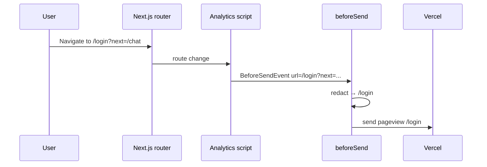

# Vercel Analytics & Speed Insights — Technical Design

> **English:** [vercel-analytics.md](./vercel-analytics.md)  
> **中文:** [vercel-analytics-cn.md](./vercel-analytics-cn.md)  
> **Overview:** [02-technical-design.md](../02-technical-design.md)  
> **PRD:** [prd/vercel-analytics.md](../prd/vercel-analytics.md)  
> **Iteration:** iter-11  
> **Status:** Draft  
> **Doc version:** v0.1

---

## 1. Design goals

- Single Client Component mounts both Vercel packages
- Pure-function URL redaction, unit-tested
- Thin `trackProductEvent` wrapper with environment guard
- Minimal touch points in existing auth and chat flows

---

## 2. Dependencies

```bash
pnpm add @vercel/analytics @vercel/speed-insights
```

| Package | Import path | Usage |
|---------|-------------|-------|
| `@vercel/analytics` | `@vercel/analytics/next` | `<Analytics />` |
| `@vercel/analytics` | `@vercel/analytics` | `track()` inside wrapper |
| `@vercel/speed-insights` | `@vercel/speed-insights/next` | `<SpeedInsights />` |

---

## 3. `lib/analytics/before-send.ts`

Pure functions (no React). Used by Client Component only.

```typescript
import type { BeforeSendEvent } from "@vercel/analytics";

/** Strip search + hash from event.url; drop event on parse failure. */
export function redactAnalyticsEventUrl(event: BeforeSendEvent): BeforeSendEvent | null {
  try {
    const parsed = new URL(event.url, "https://placeholder.local");
    const pathname = parsed.pathname || "/";
    return { ...event, url: pathname };
  } catch {
    return null;
  }
}
```

**Notes:**

- Relative URLs resolved against a dummy origin; only pathname kept
- Does not alter path segments (no `/console` filtering per PRD)
- Exported for unit tests and `beforeSend` callback

---

## 4. `lib/analytics/events.ts`

```typescript
import { track } from "@vercel/analytics";

export const PRODUCT_ANALYTICS_EVENTS = {
  signUpComplete: "sign_up_complete",
  signInComplete: "sign_in_complete",
  conversationStarted: "conversation_started",
} as const;

export type ProductAnalyticsEvent =
  (typeof PRODUCT_ANALYTICS_EVENTS)[keyof typeof PRODUCT_ANALYTICS_EVENTS];

/** True only on Vercel production deployment. */
export function isAnalyticsEnabled(): boolean {
  return process.env.NODE_ENV === "production" && process.env.VERCEL === "1";
}

/** No-op outside Vercel production; never throws. */
export function trackProductEvent(name: ProductAnalyticsEvent): void {
  if (!isAnalyticsEnabled()) return;
  try {
    track(name);
  } catch {
    // Swallow — telemetry must not break UX
  }
}
```

**Rationale for `isAnalyticsEnabled()`:**

| Environment | `NODE_ENV` | `VERCEL` | Sends? |
|-------------|------------|----------|--------|
| `pnpm dev` | development | undefined | No |
| `pnpm start` local | production | undefined | No |
| Vercel Preview | production | 1 | Yes* |
| Vercel Production | production | 1 | Yes |

\*Preview sends per PRD; Dashboard can filter by deployment. `@vercel/analytics` also self-limits on non-Vercel hosts; double guard satisfies AC-118.

**No event payload** — names only, per PRD OQ-04.

---

## 5. `components/analytics/vercel-observability.tsx`

```tsx
"use client";

import { Analytics } from "@vercel/analytics/next";
import { SpeedInsights } from "@vercel/speed-insights/next";
import { redactAnalyticsEventUrl } from "@/lib/analytics/before-send";

export function VercelObservability() {
  return (
    <>
      <Analytics beforeSend={redactAnalyticsEventUrl} />
      <SpeedInsights />
    </>
  );
}
```

**Why Client Component:**

- Next.js App Router forbids passing function props (`beforeSend`) from Server Components to Client children
- Keeps `app/layout.tsx` as Server Component (metadata, fonts unchanged)

---

## 6. `app/layout.tsx` change

```tsx
import { VercelObservability } from "@/components/analytics/vercel-observability";

// inside <body>, after {children}:
{children}
<VercelObservability />
```

No changes to `<html lang="en">`, fonts, or metadata.

---

## 7. Custom event integration

### 7.1 `components/auth/auth-form.tsx`

| Branch | When | Event |
|--------|------|-------|
| Login | After `signInWithPassword` succeeds (no error), before `router.push` | `sign_in_complete` |
| Register + session | After `signUp` succeeds with `data.session`, before `router.push` | `sign_up_complete` |
| Register + email confirm | After `signUp` succeeds, `!data.session`, before `return` (info message) | `sign_up_complete` |

```typescript
import { trackProductEvent, PRODUCT_ANALYTICS_EVENTS } from "@/lib/analytics";

// login branch, after success:
trackProductEvent(PRODUCT_ANALYTICS_EVENTS.signInComplete);

// register branch, after success (both session paths):
trackProductEvent(PRODUCT_ANALYTICS_EVENTS.signUpComplete);
```

**Not tracked:** catch block (failed auth).

### 7.2 `components/chat/chat-app-shell.tsx`

In `createConversationWithAssistant`, after `createConversation(assistantId)` resolves:

```typescript
const id = await createConversation(assistantId);
trackProductEvent(PRODUCT_ANALYTICS_EVENTS.conversationStarted);
```

Before navigation / state updates. **Not tracked** on catch (picker stays open).

---

## 8. Component tree (delta)

```
app/layout.tsx (Server)
└── body
    ├── {children}
    └── VercelObservability (Client)
        ├── Analytics (beforeSend → redactAnalyticsEventUrl)
        └── SpeedInsights

components/auth/auth-form.tsx
└── handleSubmit → trackProductEvent on success

components/chat/chat-app-shell.tsx
└── createConversationWithAssistant → trackProductEvent on success
```

---

## 9. Sequence — page view with redaction



---

## 10. Unit tests

### `tests/unit/analytics/before-send.test.ts`

| Case | Input URL | Expected |
|------|-----------|----------|
| Strips query | `/login?next=%2Fchat` | `/login` |
| Strips hash | `/chat/abc#msg` | `/chat/abc` |
| Keeps path | `/console/models` | `/console/models` |
| Invalid | `""` or malformed | `null` |

### `tests/unit/analytics/events.test.ts`

| Case | Env mock | Expect |
|------|----------|--------|
| Dev noop | `NODE_ENV=development` | `track` not called |
| Local prod noop | `NODE_ENV=production`, no `VERCEL` | `track` not called |
| Vercel prod | `NODE_ENV=production`, `VERCEL=1` | `track('sign_in_complete')` called |

Mock `@vercel/analytics` `track` via `vi.mock`.

---

## 11. Ops runbook (manual)

After deploy:

1. Vercel project → **Analytics** → Enable Web Analytics
2. Vercel project → **Speed Insights** → Enable
3. Redeploy if toggles were off during first deploy
4. Verify routes and events in Dashboard (changelog §12)

No new secrets or env vars in repo.

---

## 12. PRD acceptance mapping (module)

| AC ID | This module | Verification |
|-------|-------------|--------------|
| AC-111 | §5–6 Analytics mount | manual |
| AC-112 | §5 SpeedInsights mount | manual |
| AC-113 | §7.1 register branches | manual |
| AC-114 | §7.1 login branch | manual |
| AC-115 | §7.2 createConversation | manual |
| AC-116 | §3 before-send | unit |
| AC-117 | §2 deps + §6 layout | static |
| AC-118 | §4 isAnalyticsEnabled | unit + manual |

---

## 13. Revision history

| Date | Change |
|------|--------|
| 2026-07-02 | iter-11 initial |
