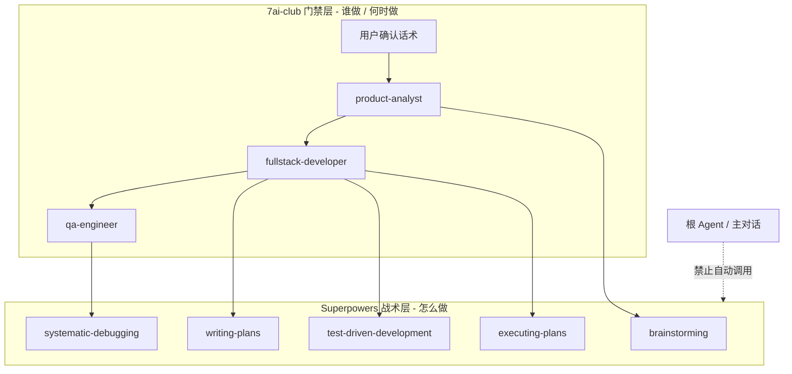

# Superpowers 与 7ai-club Subagent 整合

> **English:** [superpowers-subagent-integration.md](./superpowers-subagent-integration.md)  
> **中文:** [superpowers-subagent-integration-cn.md](./superpowers-subagent-integration-cn.md)

> **范围：** Cursor Agent 工作流 — subagent 门禁 + Superpowers 战术技能  
> **状态：** 已实施（CLI 安装 + bridge skill + subagent 白名单）  
> **相关规则：** [`.cursor/rules/7ai-club-workflow.mdc`](../.cursor/rules/7ai-club-workflow.mdc)

---

## 1. 核心原则



| 层级 | 职责 | 位置 |
|------|------|------|
| **Subagent** | 阶段编排 + 门禁（谁做 / 何时做） | `.cursor/agents/*.md` |
| **7ai-club skills** | 项目约定（架构、PRD、测试、UI） | `.cursor/skills/` |
| **Superpowers** | 阶段内方法论（怎么做） | `.agents/skills/`（CLI 安装） |
| **Bridge** | 白名单 + 冲突覆盖 | `.cursor/skills/7ai-club-superpowers-bridge/SKILL.md` |

- **Subagent = 阶段编排 + 门禁**，不替代 `docs/features/` 文档体系
- **Superpowers = 战术技能**（TDD、调试、计划拆分），不能替代 PRD / 技术设计 / AC 验收
- **根 Agent 不自动加载 Superpowers**；仅被 dispatch 的 subagent 在白名单内显式 Read

---

## 2. 阶段映射（白名单）

| 阶段 | Subagent | 允许的 Superpowers | 7ai-club 文档落点 | 禁止项 |
|------|----------|-------------------|------------------|--------|
| 需求对焦 | `product-analyst` | `brainstorming` | `01-product-requirements*.md`、`prd/`、`changelog/iter-NN*` | 代码/迁移；`writing-plans` 直接进编码；`docs/superpowers/` |
| 技术设计 | `fullstack-developer` Phase A | `brainstorming`、`writing-plans` | `02-technical-design*.md`、`design/` | `executing-plans`、`subagent-driven-development`、TDD 写实现 |
| 编码 | `fullstack-developer` Phase B | `test-driven-development`、`executing-plans` / `subagent-driven-development`、`using-git-worktrees`、`dispatching-parallel-agents` | 代码 + `changelog/iter-NN*` | 无「技术设计已确认」前的编码 skill |
| 测试验收 | `qa-engineer` | `systematic-debugging`、`requesting-code-review`、`receiving-code-review`、`finishing-a-development-branch` | changelog §5.1 Test Matrix + §12 + §5 AC 勾选 + 验收报告（**C0→C4**） | 改 PRD；勾选 PRD AC；未跑测试就标「已发布」 |

Superpowers skill 路径：`.agents/skills/<skill-name>/SKILL.md`

### 与现有 7ai-club skills 叠加（不替换）

| 用途 | 优先 skill |
|------|-----------|
| 架构 / 范围 | `.cursor/skills/7ai-club-architecture/reference.md` |
| PRD 模板 | `.cursor/skills/product-requirements/templates/` |
| 技术设计模板 | `.cursor/skills/technical-design/templates/` |
| UI 实现 | `.agents/skills/ui-ux-pro-max/SKILL.md`（Phase B） |
| 测试约定 | `.cursor/skills/7ai-club-testing/SKILL.md`（qa-engineer） |
| React 性能 | `.agents/skills/vercel-react-best-practices/SKILL.md`（Phase B，按需） |
| Supabase | `.agents/skills/supabase/SKILL.md`（Phase A/B，按需） |

---

## 3. 用户确认话术 ↔ 阶段

| 话术 | 允许进入 |
|------|---------|
| `PRD 已确认，可进入技术设计` | `fullstack-developer` Phase A |
| `技术设计已确认，可开始编码` | `fullstack-developer` Phase B + TDD / executing-plans |
| `测试已通过，可发布` | `qa-engineer` 标迭代已发布 |

无对应话术 → **停止**，提示用户完成上一阶段或调用正确 subagent。

### 3.1 门禁状态 ↔ 下一步提示（Agent 向用户说明时必须一致）

详见 [`.cursor/rules/7ai-club-workflow.mdc`](../.cursor/rules/7ai-club-workflow.mdc) §门禁状态。摘要：

| 当前状态 | 下一步 | 用户应回复 |
|----------|--------|-----------|
| PRD 已确认 | 技术设计 | `PRD 已确认，可进入技术设计` 或 dispatch fullstack-developer |
| 技术设计已确认 | 编码 | `技术设计已确认，可开始编码` |
| 编码完成 | 测试验收 | dispatch qa-engineer |
| 测试已通过 | 发布 | `测试已通过，可发布` |

**常见错误：** PRD 已确认后提示 `技术设计已确认，可开始编码` — **禁止**（该话术仅用于技术设计评审通过之后）。

---

## 4. 冲突覆盖规则

Superpowers 自带「无门禁工作流」。**冲突时 7ai-club 规则优先。**

1. **`brainstorming` 结束态**  
   - Superpowers 默认：approved → invoke `writing-plans`  
   - 7ai-club：`product-analyst` 中 approved → 写入 PRD → 等待 **「PRD 已确认，可进入技术设计」**

2. **`writing-plans` 输出路径**  
   - Superpowers 默认：`docs/superpowers/plans/`  
   - 7ai-club：Phase A → `design/` 或 `02-technical-design*.md`；Phase B → `changelog/iter-NN-cn.md` checkbox 任务

3. **`test-driven-development` vs qa-engineer**  
   - TDD 仅用于 Phase B 增量开发（单元/主路径 E2E）  
   - qa **C0→C4**：用例矩阵 → 补测试 code → 自动化+手工 → 勾选 changelog §5 AC  
   - **changelog AC 勾选与「已发布」仅 qa-engineer 可改**；PRD § 验收标准保持 `[ ]` 定义态

4. **Code review skills**  
   - 不替代 `qa-engineer`；Superpowers code-reviewer subagent 不替代 QA 验收

---

## 5. 安装与维护

### 5.1 安装方式

通过 **npx skills CLI**（SSH URL，团队可复现），**勿**同时安装 Cursor 插件版 Superpowers。

```bash
pnpm skills:install   # 从 skills-lock.json 恢复 + 自动 patch 门禁
pnpm skills:update    # 更新项目 skills + 自动 patch 门禁
```

手动安装 Superpowers 核心集（示例）：

```bash
npx skills add git@github.com:obra/superpowers.git \
  --skill brainstorming writing-plans test-driven-development \
         executing-plans subagent-driven-development systematic-debugging \
         requesting-code-review receiving-code-review \
         finishing-a-development-branch using-git-worktrees \
         dispatching-parallel-agents \
  --agent cursor -y
bash scripts/patch-superpowers-gating.sh
```

### 5.2 关键文件

| 文件 | 说明 |
|------|------|
| `skills-lock.json` | CLI 外部 skills 版本锁定（`.agents/skills/`） |
| `.agents/skills/` | Superpowers、Supabase、Vercel、ui-ux-pro-max 等外部 skills |
| `.cursor/skills/` | 7ai-club 项目自有 skills（架构、PRD 模板、测试、bridge 等，不在 lock 内） |
| `scripts/patch-superpowers-gating.sh` | 为 Superpowers 设置 `disable-model-invocation: true` |
| `.cursor/skills/7ai-club-superpowers-bridge/SKILL.md` | subagent 启动必读：白名单与覆盖规则 |
| `.cursor/agents/product-analyst.md` 等 | 各阶段 Superpowers 白名单 |

### 5.3 门禁机制

安装后，`scripts/patch-superpowers-gating.sh` 为所有来源 `obra/superpowers` 的 skill 增加：

```yaml
disable-model-invocation: true
```

根 Agent 不会因关键词自动加载 Superpowers；subagent 在其 prompt 中 **显式 Read** 白名单内 skill 时才生效。

---

## 6. 日常使用

| 你想做的事 | 正确入口 | Superpowers 如何参与 |
|-----------|---------|---------------------|
| 新功能立项 | `用 product-analyst 分析 …，slug: xxx，迭代: iter-NN` | 内部用 `brainstorming` 对焦，产出 PRD |
| 写技术方案 | `用 fullstack-developer …先做技术设计` | Phase A 用 `writing-plans` 拆任务，写入 `02-technical-design` |
| 开始编码 | 用户确认后 `用 fullstack-developer …开始编码` | Phase B 用 TDD + `executing-plans` 按 changelog 实施 |
| 测试发布 | `用 qa-engineer 对 iter-NN 执行测试验收` | `systematic-debugging` + review skills，勾选 AC |
| 探索性提问 | 主对话直接问 | **不**自动启用 Superpowers；必要时 dispatch subagent |

**主对话规则：** 用户说「写代码 / 加功能」时，先检查 PRD / 技术设计门禁，dispatch 对应 subagent；不得跳过门禁直接触发 Superpowers TDD 或 `executing-plans`。

---

## 7. 不建议的做法

- 同时安装 Cursor 插件版 Superpowers + CLI 版（易重复、难控版本）
- 用 Superpowers 的 `brainstorming → writing-plans → execute` 串行替代三 subagent（绕过 PRD/设计/QA 门禁）
- 把计划写到 `docs/superpowers/`，与 `docs/features/` 并行（单一事实来源分裂）
- **门禁话术混用：** PRD 已确认后提示 `技术设计已确认，可开始编码`（应提示进入技术设计，见 §3.1）

---

## 8. 验收自检

- [ ] `pnpm skills:install` 可恢复 Superpowers，patch 后全部为 `disable-model-invocation: true`
- [ ] 根 Agent 未 dispatch subagent 时，不会自动开始 TDD/写代码
- [ ] `product-analyst` 产出 PRD 后停止，不触发 `executing-plans`
- [ ] `fullstack-developer` 在无确认话术时不写 `.ts/.tsx/.sql`
- [ ] `qa-engineer` 仍为唯一 AC 勾选与「已发布」状态更新者
- [ ] `skills-lock.json` 与 `.agents/skills/` 已提交，团队 clone 后可复现

---

## 9. Agent 读文档顺序

1. [`.cursor/rules/7ai-club-workflow.mdc`](../.cursor/rules/7ai-club-workflow.mdc) — 门禁总览（always apply）
2. 被 dispatch 的 subagent 定义 — `.cursor/agents/<name>.md`
3. `.cursor/skills/7ai-club-superpowers-bridge/SKILL.md` — subagent 启动后第一件事 Read
4. 按需 Read 白名单内 `.agents/skills/<skill>/SKILL.md`
