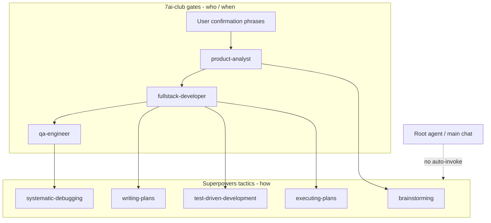

# Superpowers × 7ai-club Subagent Integration

> **English:** [superpowers-subagent-integration.md](./superpowers-subagent-integration.md)  
> **中文:** [superpowers-subagent-integration-cn.md](./superpowers-subagent-integration-cn.md)

> **Scope:** Cursor Agent workflow — subagent gates + Superpowers tactical skills  
> **Status:** Implemented (CLI install + bridge skill + subagent allowlists)  
> **Related rule:** [`.cursor/rules/7ai-club-workflow.mdc`](../.cursor/rules/7ai-club-workflow.mdc)

---

## 1. Core principles



| Layer | Responsibility | Location |
|-------|----------------|----------|
| **Subagent** | Phase orchestration + gates (who / when) | `.cursor/agents/*.md` |
| **7ai-club skills** | Project conventions (architecture, PRD, testing, UI) | `.cursor/skills/` |
| **Superpowers** | In-phase methodology (how) | `.agents/skills/` (CLI install) |
| **Bridge** | Allowlists + conflict overrides | `.cursor/skills/7ai-club-superpowers-bridge/SKILL.md` |

- **Subagents = gates**; they do not replace the `docs/features/` document system
- **Superpowers = tactical skills** (TDD, debugging, plan breakdown); they do not replace PRD, technical design, or AC sign-off
- **Root agent must not auto-load Superpowers**; only dispatched subagents may explicitly Read allowlisted skills

---

## 2. Phase mapping (allowlists)

| Phase | Subagent | Allowed Superpowers | 7ai-club doc targets | Forbidden |
|-------|----------|---------------------|----------------------|-----------|
| Requirements | `product-analyst` | `brainstorming` | `01-product-requirements*.md`, `prd/`, `changelog/iter-NN*` | Code/migrations; `writing-plans` for coding; `docs/superpowers/` |
| Technical design | `fullstack-developer` Phase A | `brainstorming`, `writing-plans` | `02-technical-design*.md`, `design/` | `executing-plans`, `subagent-driven-development`, TDD implementation |
| Implementation | `fullstack-developer` Phase B | `test-driven-development`, `executing-plans` / `subagent-driven-development`, `using-git-worktrees`, `dispatching-parallel-agents` | Code + `changelog/iter-NN*` task checkboxes | Any coding skill before design confirmation |
| QA / release | `qa-engineer` | `systematic-debugging`, `requesting-code-review`, `receiving-code-review`, `finishing-a-development-branch` | `changelog/iter-NN-cn.md` AC + report | PRD edits; marking “released” without tests |

Superpowers skill path: `.agents/skills/<skill-name>/SKILL.md`

### Stacking with existing 7ai-club skills (additive)

| Purpose | Primary skill |
|---------|---------------|
| Architecture / scope | `.cursor/skills/7ai-club-architecture/reference.md` |
| PRD templates | `.cursor/skills/product-requirements/templates/` |
| Tech design templates | `.cursor/skills/technical-design/templates/` |
| UI implementation | `.agents/skills/ui-ux-pro-max/SKILL.md` (Phase B) |
| Testing conventions | `.cursor/skills/7ai-club-testing/SKILL.md` (qa-engineer) |
| React performance | `.agents/skills/vercel-react-best-practices/SKILL.md` (Phase B, as needed) |
| Supabase | `.agents/skills/supabase/SKILL.md` (Phase A/B, as needed) |

---

## 3. User confirmation phrases ↔ phases

| Phrase | Unlocks |
|--------|---------|
| `PRD 已确认，可进入技术设计` | `fullstack-developer` Phase A |
| `技术设计已确认，可开始编码` | `fullstack-developer` Phase B + TDD / executing-plans |
| `测试已通过，可发布` | `qa-engineer` may mark iteration released |

Without the matching phrase → **stop** and prompt the user to complete the prior phase or dispatch the correct subagent.

### 3.1 Gate state ↔ next-step prompts (must stay consistent)

See [`.cursor/rules/7ai-club-workflow.mdc`](../.cursor/rules/7ai-club-workflow.mdc) §门禁状态. Summary:

| Current state | Next step | User should reply |
|---------------|-----------|-------------------|
| PRD confirmed | Technical design | `PRD 已确认，可进入技术设计` or dispatch fullstack-developer |
| Technical design confirmed | Implementation | `技术设计已确认，可开始编码` |
| Implementation done | QA | dispatch qa-engineer |
| Tests passed | Release | `测试已通过，可发布` |

**Common mistake:** After PRD is confirmed, prompting `技术设计已确认，可开始编码` — **forbidden** (that phrase is for after technical design sign-off only).

---

## 4. Conflict overrides

Superpowers ships a gate-free default workflow. **7ai-club rules win on conflict.**

1. **`brainstorming` terminal state**  
   - Superpowers default: approved → invoke `writing-plans`  
   - 7ai-club: under `product-analyst`, approved → write PRD → wait for **「PRD 已确认，可进入技术设计」**

2. **`writing-plans` output path**  
   - Superpowers default: `docs/superpowers/plans/`  
   - 7ai-club: Phase A → `design/` or `02-technical-design*.md`; Phase B → checkbox tasks in `changelog/iter-NN-cn.md`

3. **`test-driven-development` vs qa-engineer**  
   - TDD is for Phase B incremental development only  
   - **Only qa-engineer** may check changelog AC boxes and set iteration status to released

4. **Code review skills**  
   - Do not replace `qa-engineer`; Superpowers code-reviewer subagent does not replace QA sign-off

---

## 5. Installation and maintenance

### 5.1 Install method

Use **npx skills CLI** (SSH URLs, reproducible via lock file). **Do not** also install the Cursor plugin version of Superpowers.

```bash
pnpm skills:install   # Restore from skills-lock.json + auto patch gates
pnpm skills:update    # Update project skills + auto patch gates
```

Manual install of the Superpowers core set (example):

```bash
npx skills add git@github.com:obra/superpowers.git \
  --skill brainstorming writing-plans test-driven-development \
         executing-plans subagent-driven-development systematic-debugging \
         requesting-code-review receiving-code-review \
         finishing-a-development-branch using-git-worktrees \
         dispatching-parallel-agents \
  --agent cursor -y
bash scripts/patch-superpowers-gating.sh
```

### 5.2 Key files

| File | Purpose |
|------|---------|
| `skills-lock.json` | CLI external skill version lock (`.agents/skills/`) |
| `.agents/skills/` | Superpowers, Supabase, Vercel, ui-ux-pro-max, etc. |
| `.cursor/skills/` | 7ai-club project skills (architecture, PRD templates, testing, bridge — not in lock) |
| `scripts/patch-superpowers-gating.sh` | Sets `disable-model-invocation: true` on Superpowers skills |
| `.cursor/skills/7ai-club-superpowers-bridge/SKILL.md` | Subagent entry: allowlists and overrides |
| `.cursor/agents/product-analyst.md` etc. | Per-phase Superpowers allowlists |

### 5.3 Gate mechanism

After install, `scripts/patch-superpowers-gating.sh` adds to every skill sourced from `obra/superpowers`:

```yaml
disable-model-invocation: true
```

The root agent will not auto-load Superpowers from keyword matches; subagents take effect only when they **explicitly Read** allowlisted skills.

---

## 6. Daily usage

| Goal | Entry point | Superpowers role |
|------|-------------|------------------|
| New feature | `用 product-analyst 分析 …，slug: xxx，迭代: iter-NN` | `brainstorming` inside subagent → PRD |
| Technical design | `用 fullstack-developer …先做技术设计` | Phase A: `writing-plans` → `02-technical-design` |
| Start coding | After user confirms: `用 fullstack-developer …开始编码` | Phase B: TDD + `executing-plans` per changelog |
| Test & release | `用 qa-engineer 对 iter-NN 执行测试验收` | Debugging + review skills; AC checkboxes |
| Exploratory Q&A | Main chat | **No** auto Superpowers; dispatch subagent if needed |

**Main chat rule:** If the user says “write code / add feature”, check PRD and design gates first and **dispatch the subagent**; do not skip gates and trigger Superpowers TDD or `executing-plans` directly.

---

## 7. Anti-patterns

- Installing both Cursor plugin Superpowers and the CLI copy (duplication, version drift)
- Replacing the three subagents with Superpowers `brainstorming → writing-plans → execute` (bypasses PRD / design / QA gates)
- Writing plans under `docs/superpowers/` in parallel with `docs/features/` (split source of truth)
- **Mixed gate phrases:** After PRD is confirmed, prompting `技术设计已确认，可开始编码` instead of technical design entry (see §3.1)

---

## 8. Acceptance checklist

- [ ] `pnpm skills:install` restores Superpowers; after patch, all have `disable-model-invocation: true`
- [ ] Root agent does not auto-start TDD or coding without dispatching a subagent
- [ ] `product-analyst` stops after PRD; does not trigger `executing-plans`
- [ ] `fullstack-developer` does not write `.ts/.tsx/.sql` without confirmation phrase
- [ ] Only `qa-engineer` updates AC checkboxes and “released” iteration status
- [ ] `skills-lock.json` and `.agents/skills/` are committed for team reproducibility

---

## 9. Agent reading order

1. [`.cursor/rules/7ai-club-workflow.mdc`](../.cursor/rules/7ai-club-workflow.mdc) — gate overview (always apply)
2. Dispatched subagent definition — `.cursor/agents/<name>.md`
3. `.cursor/skills/7ai-club-superpowers-bridge/SKILL.md` — first Read after subagent starts
4. Allowlisted `.agents/skills/<skill>/SKILL.md` as needed
