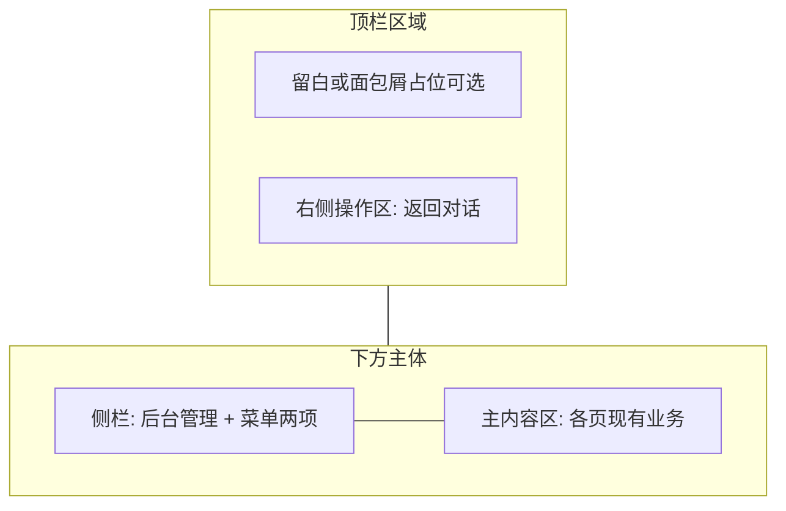

# 设计说明：后台管理 ProLayout（mix）与侧栏导航（version=0.0.8）

本文档承接 [`iterations/0.0.8/product/prd-console-pro-layout-mix.md`](../product/prd-console-pro-layout-mix.md)（同步至仓库根目录 [`docs/product/prd-console-pro-layout-mix.md`](../../../docs/product/prd-console-pro-layout-mix.md)），供 **frontend** 实现与验收对照；**本迭代无新增 API**，服务端阶段仅需确认无变更。

---

## 1. 设计目标与需求对应

| 需求 | 设计要点 |
|------|----------|
| US-1 / US-2 | 侧栏两项 + 图标 + 路径与选中态 |
| US-3 | `ProLayout` + `layout="mix"` + 品牌区「后台管理」 |
| US-4 | 顶栏右侧「返回对话」链接 |
| PRD 待设计项 | 见第 2～6 节 |

---

## 2. 信息架构（mix）

### 2.1 结构说明

- **`layout="mix"`**：**顶部区域**（全宽）+ **左侧边栏**（可折叠）+ **主内容区**。
- **品牌与产品名**：在 **侧栏顶部（Logo 区）** 展示主标题 **「后台管理」**（对应 ProLayout 的 `title` / logo 区域文案，实现时与组件 API 对齐即可，**用户可见文案固定为「后台管理」**）。
- **一级导航**：**仅侧边菜单**承载「应用配置」「日志」；**不再使用**原 `ConsoleChrome` 顶栏下方的**横向文字 Tab/链接**（避免与侧栏重复）。

### 2.2 菜单定义

| `path` | 菜单文案 | 图标（`@ant-design/icons`） | 说明 |
|--------|----------|----------------------------|------|
| `/console` | 应用配置 | **`SettingOutlined`** | 配置语义清晰 |
| `/console/logs` | 日志 | **`FileSearchOutlined`** | 检索/查阅日志隐喻 |

- 菜单项须 **icon + 文案** 同时可见（侧栏展开态）；折叠态仅图标，**`tooltip` 展示完整文案**（Pro Layout / Menu 默认能力，需开启或配置以保证可理解性）。
- **选中规则**：`pathname === '/console'` 时选中「应用配置」；`pathname === '/console/logs'` 或以其为前缀时选中「日志」（当前无子路径时可简化为精确匹配 `/console/logs`）。

**追溯**：US-1、US-2、PRD 待设计项「图标」。

---

## 3. 标题层级（后台管理 vs 页面标题）

- **全局品牌（侧栏顶）**：**「后台管理」** — 全 `/console` 路由下不变。
- **页面级标题（内容区）**：保留 **当前功能名**，便于扫视：在 **主内容区顶部** 展示 **「应用配置」** 或 **「日志」**（与侧栏选中项一致）。实现方式任选其一，需统一：
  - **推荐**：各页外包一层 **`PageContainer`**（Pro Components），`title` 取上表文案；或
  - 保留各页内部现有大标题，但须与侧栏语义一致、**不与「后台管理」重复在同一视觉层级**（避免两个 `h1` 抢焦点 — 全局一处 `h1` 可为「后台管理」的 sr-only 策略一般不采用；更稳妥为 **侧栏品牌为组件视觉标题、内容区用 `PageContainer` title 作为页面 `h1`**，具体由前端按语义化微调并记入实现说明）。

**追溯**：US-3、PRD 待设计项「内容区标题」。

---

## 4. 顶栏右侧：返回对话

- **位置**：**顶部区域最右侧**（`actionsRender` 或等价插槽）。
- **文案**：**「返回对话」**（与现有一致）。
- **行为**：导航至 **`/`**（项目当前对话首页）。
- **形态**：使用 **`Link`（Next.js）** 或等价可聚焦的 `<a href>`，**勿**用纯 `onClick` 无 `href` 的按钮作为主实现（满足键盘与辅助技术可发现性）。
- **样式**：`type="link"` 或文字链 + `text-violet` 等与现对话入口一脉的强调色（与 [`ConsoleProShell`](../../../src/components/console/ConsoleProShell.tsx) 中「返回对话」链一致即可）。

**追溯**：US-4。

---

## 5. 响应式与侧栏折叠

- **断点**：采用 **ProLayout 默认**折叠行为即可；**≤ `md` 左右**侧栏收为图标栏或抽屉式（以 ProLayout 实际表现为准）。
- **期望**：窄屏下 **菜单仍可访问两项**；折叠后通过 **图标 + Tooltip** 识别。
- **内容区**：现有 `max-w-7xl`、卡片内边距等 **尽量保留**；若 ProLayout `contentStyle` 需补水平内边距，与配置页、日志页现有留白对齐。

**追溯**：PRD 响应式、US-1/US-2。

---

## 6. 视觉与暗色模式

- **默认**：与 antd / Pro 默认浅色壳协调；外层 `layout.tsx` 若继续使用 **zinc 背景**，允许通过 **ProLayout `style` / `className` / `token`** 微调内容区背景，使侧栏与主区对比不过度突兀。
- **暗色**：若全站已在 `html` 等节点使用 **dark 类名或主题变量**，在 **`ConsoleAntdProvider` 内** 与 ProLayout **同树**注入 **`theme={{ algorithm: theme.darkAlgorithm }}`**（或项目既有主题对象），保证 **Menu/Sider/Header** 与表单、表格一致；若当前 Console 仅为灰底而非 antd dark，**本迭代以「不破坏现有夜间使用」为底线**，前端在 `implementation-notes` 中写明最终策略（例如仅 Pro 区域跟 token、或全局跟站点）。

**追溯**：PRD 待设计项「暗色模式」。

---

## 7. 状态与交互（壳层）

| 状态 | 行为 |
|------|------|
| 默认 | 展示 mix 布局、侧栏展开（桌面）、当前路由选中 |
| 切换路由 | 客户端导航，**不整页闪断**；选中态随 `pathname` 更新 |
| 侧栏折叠 | 动画以 Pro 默认为准；折叠后仍可通过图标切换路由 |
| 错误边界 | 本迭代不新增；各页既有错误表现保持不变 |

业务页的 **加载 / 空态 / 错误**（配置读写失败、日志空表等）**不改变**，仍由各页组件负责。

---

## 8. 可访问性

- 侧栏导航使用 **Ant Design Menu**，继承其 **键盘方向键、`aria-current`（若版本支持）** 等等行为；保证 **可见焦点环**。
- 「返回对话」为 **真实链接**，Tab 可达。
- 若折叠按钮为图标按钮，需 **`aria-label`**（如「展开菜单」「收起菜单」），文案中文。

**追溯**：PRD 待设计项「窄屏与可访问性」。

---

## 9. 与实现相关的边界

- **`ConsoleChrome`**：侧栏与顶栏能力由 **ProLayout 统一提供** 后，**移除或缩减**为不再渲染横向子导航；避免重复 DOM。具体删除/合并策略见前端实现说明。
- **客户端组件**：`ProLayout` 依赖路径、`window` 宽度等时，布局包装器为 **Client Component**；`layout.tsx` 组合方式遵循 Next.js App Router 惯例。
- **服务端**：**无新接口、无数据模型变更**；阶段 3 可产出简短「无后端变更」说明或跳过详述 API 文档。

---

## 10. 文档路径

- **主路径**：`iterations/0.0.8/design/spec-console-pro-layout-mix.md`
- **同步路径**：`docs/design/spec-console-pro-layout-mix.md`
