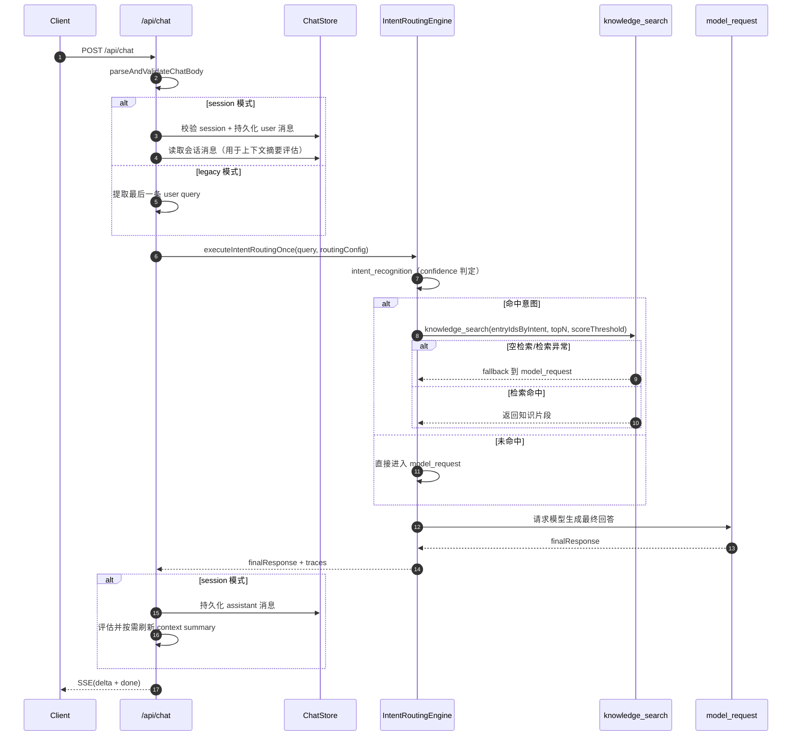

# Implementation Notes: Intent Routing Backend (v0.1.1)

## 架构说明

- 本次在服务端新增 `intent-routing` 领域模块，采用“配置 + 校验 + 执行器注册 + 单次执行引擎”分层：
  - 配置层：`read-write.ts` + `defaults.ts` + `paths.ts`
  - 校验层：`validate.ts`
  - 执行层：`executors.ts` + `engine.ts`
- 当前落地 4 节点最小可用流：
  - `intent_recognition` -> `knowledge_search` -> `model_request` -> `final_response`
  - 运行时根据命中结果执行条件分支（未命中跳过检索）。
- 扩展机制已预留：
  - `NodeType` 已包含 `skills/tools/mcp`
  - 执行器注册表已预置占位，后续可按类型新增执行器并接入。
- 检索复用已有向量能力：
  - 基于现有 `embed + sqlite vector scan` 流程扩展“按 entryId 白名单检索”。

## 数据结构

- 新增 `IntentRoutingConfig`（存储于 `data/intent-routing-config.json`）：
  - `confidenceThreshold`（默认 `0.7`）
  - `topN`（默认 `3`）
  - `scoreThreshold`（默认 `0.5`）
  - `defaultRouteNextNodes`
  - `chatRoute`（provider/model）
  - `nodes`（统一 `input/output/nextNodes`）
  - `routes`（意图路由、关键词、后续节点）
- `IntentRoutingNode` 统一契约：
  - `id`, `type`, `input`, `output`, `nextNodes`
- `knowledge_search` 节点输入：
  - `nodes[id=knowledge_search].input.selectedKnowledgeBaseEntryIdsByIntent: Record<intentId, string[]>`
- 关键校验规则：
  - 当某意图路由 `nextNodes` 包含 `knowledge_search` 时，必须存在 `selectedKnowledgeBaseEntryIdsByIntent[intentId]` 且至少 1 个。

## API

- `GET /api/console/intent-routing/config`
  - 读取当前配置与 warning。
- `PUT /api/console/intent-routing/config`
  - 保存配置（先校验，成功后版本号 +1）。
- `POST /api/console/intent-routing/config:validate`
  - 仅校验，不写入。
- `POST /api/console/intent-routing/execute-once`
  - 调试单次执行；输入 `intentId + query`，可选临时 `config` 覆盖。
  - 输出节点 traces、命中信息、fallback 原因、最终回答。

## `/api/chat` 服务端时序图（SD）

## 已知限制

1. `intent_recognition` 当前已改为大模型识别（输出 `intentId + confidence` 的 JSON）；若模型输出异常则按“未命中”回退，保障主流程可用。
2. 执行引擎当前是“固定 4 节点 + 条件分支”，尚未启用真正图调度（但数据结构已兼容）。
3. `skills/tools/mcp` 仅类型与注册位预留，执行时返回 unsupported。
4. `execute-once` 当前依赖现有模型 API key（Zhipu/DeepSeek）与 Embedding 配置可用。

## 测试建议

1. 配置校验：
  - 构造某意图 `nextNodes` 包含 `knowledge_search` 且 `selectedKnowledgeBaseEntryIdsByIntent[intentId]` 为空，应返回 `CFG_KB_ENTRY_REQUIRED`。
2. 命中分支：
  - 为某 intent 配置关键词 + entryIds，`query` 命中且有检索结果，应走检索增强并返回 `retrievalCount > 0`。
3. 空检索回退：
  - 命中但 `scoreThreshold` 调高到极值，确认 `fallbackReason=empty_retrieval` 且仍有最终回答。
4. 异常回退：
  - 故意使 embedding 配置不可用，命中后应回退 `model_request`（`fallbackReason=retrieval_error`）。
5. 未命中直答：
  - 无关键词命中时直接走 `model_request`，不执行知识检索。

